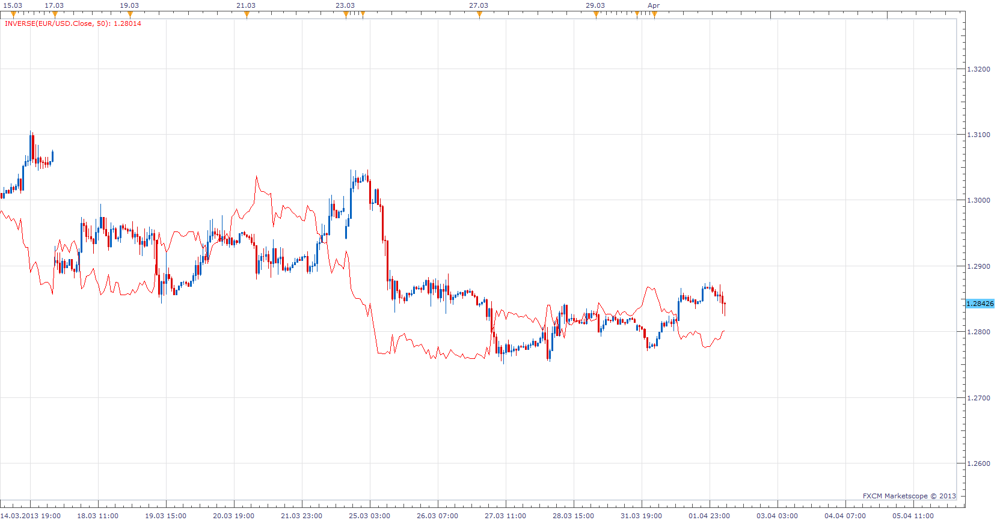

# Inverse direction indicator

> Source: https://fxcodebase.com/code/viewtopic.php?f=17&t=34005  
> Forum: 17 · Topic 34005 · 2 post(s)

---

## Inverse direction indicator

**Apprentice** · Tue Apr 02, 2013 6:23 am

This indicator can do two things.
Invert any data source.
Source 2
Inverted Source = 1 / Source
Inverted Source = 1/2 = 0.5

And normalize Inverted Source based on initial data.

 Source and Source Inverted, can now be comparable,
shown on the same chart.

 [Inverse.lua](files/57805/Inverse.lua)

---

## Re: Inverse direction indicator

**Apprentice** · Mon Feb 19, 2018 8:27 am

The Indicator was revised and updated.
