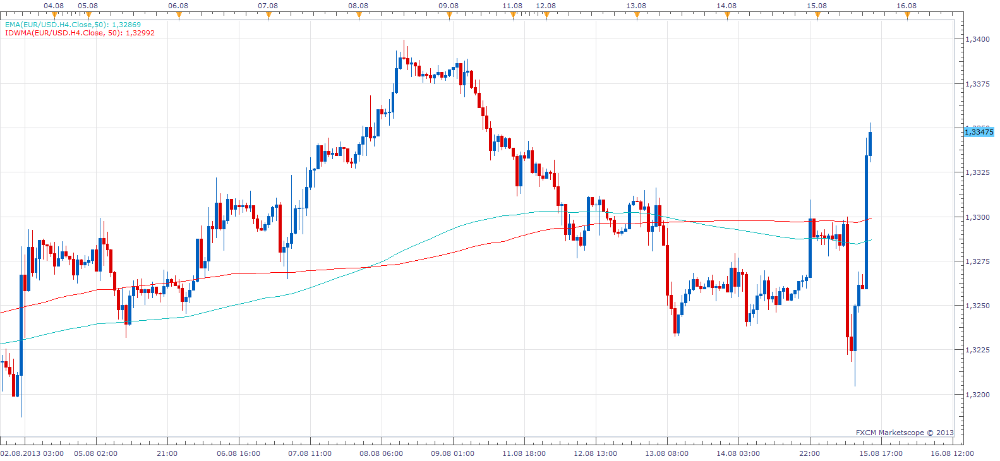

# Inverse Distance Weighted Moving Average

> Source: https://fxcodebase.com/code/viewtopic.php?f=17&t=59165  
> Forum: 17 · Topic 59165 · 3 post(s)

---

## Inverse Distance Weighted Moving Average

**Apprentice** · Thu Aug 15, 2013 2:01 pm

This multi-timeframe capable moving average discounts prices far from the average.

Compared to other moving averages.
Underperform on Chart Time Frame.
Overperforming if applied to Higher Time Frames.

 [IDWMA.lua](files/88647/IDWMA.lua)

The indicator was revised and updated

---

## Re: Inverse Distance Weighted Moving Average

**Alexander.Gettinger** · Fri Sep 12, 2014 4:55 pm

MQL4 version of Inverse Distance Weighted Moving Average (IDWMA): [viewtopic.php?f=38&t=61138](https://fxcodebase.com/code/viewtopic.php?f=38&t=61138).

---

## Re: Inverse Distance Weighted Moving Average

**Apprentice** · Mon Jun 26, 2017 4:34 am

The indicator was revised and updated.
