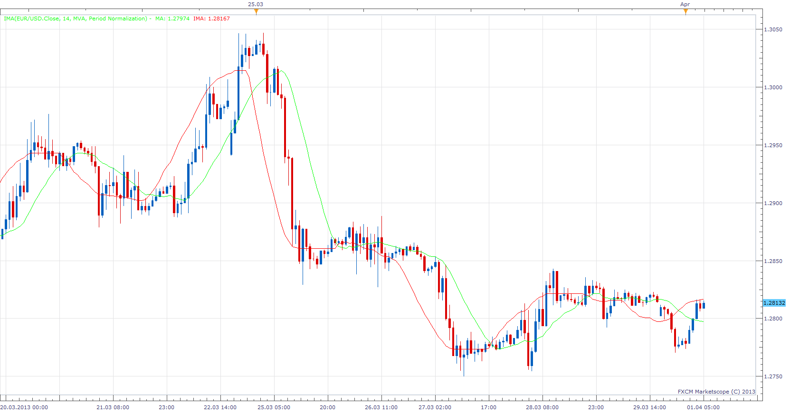

# Inverse MA

> Source: https://fxcodebase.com/code/viewtopic.php?f=17&t=33995  
> Forum: 17 · Topic 33995 · 6 post(s)

---

## Inverse MA

**Apprentice** · Mon Apr 01, 2013 6:09 am

To be Able to do this,
I added four filters for normalization.
1) Difference with normalization
 Takes into account the whole period
  Normalization is applied from first to last period
2) Difference with Period normalization
Takes account last n periods
  Normalization is applied from current -Period to current period
4) Anchored difference
 Takes account last n periods
 Caclulates difference for all period from current - period to current period
5) Anchored difference with Period Normalization
 Takes account last n periods
  Normalization is applied from current - period, current period.

 [IMA.lua](files/57758/IMA.lua)

---

## Re: Inverse MA

**virgilio** · Fri Nov 01, 2013 4:10 pm

Hello Apprentice, do you know if the Inverse MA indicator repaint? Is it supposed to repaint?

---

## Re: Inverse MA

**Apprentice** · Sat Nov 02, 2013 2:42 am

Unfortunately yes.
This is the core of this indicator.

---

## Re: Inverse MA

**Alexander.Gettinger** · Fri Nov 29, 2013 2:16 pm

MQL4 version of Inverse MA: [viewtopic.php?f=38&t=60022](https://fxcodebase.com/code/viewtopic.php?f=38&t=60022).

---

## Re: Inverse MA

**Apprentice** · Sat Aug 13, 2016 6:38 am

Minor Update.

---

## Re: Inverse MA

**Apprentice** · Fri Aug 31, 2018 5:19 am

The indicator was revised and updated.
