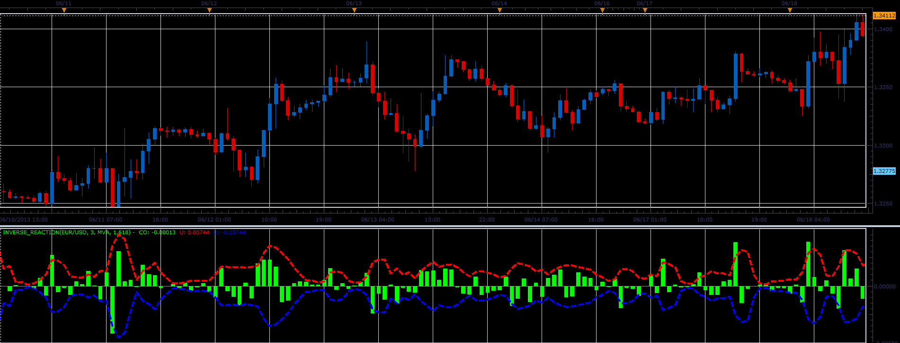

# Inverse reaction oscillator

> Source: https://fxcodebase.com/code/viewtopic.php?f=17&t=41462  
> Forum: 17 · Topic 41462 · 11 post(s)

---

## Inverse reaction oscillator

**Alexander.Gettinger** · Wed Jun 19, 2013 3:18 pm

This indicator is a ported MQL5 indicator from [http://www.mql5.com/en/code/1741](http://www.mql5.com/en/code/1741).

Formulas:
CO[i] = Close[i]-Open[i],
U[i] = Coeff(MA(Abs(CO))),
D[i] = -U[i].

 

Download:

 [Inverse_Reaction.lua](files/67713/Inverse_Reaction.lua)

 [Inverse_Reaction with Alert.lua](files/67713/Inverse_Reaction%20with%20Alert.lua)

Dec 14, 2015: Compatibility issue Fixed. _Alert helper is not longer needed.

For this indicator must be installed Averages indicator ([viewtopic.php?f=17&t=2430](https://fxcodebase.com/code/viewtopic.php?f=17&t=2430)).

---

## Re: Inverse reaction oscillator

**Alexander.Gettinger** · Wed Jun 19, 2013 3:20 pm

MQL4 version of Inverse reaction oscillator: [viewtopic.php?f=38&t=41463](https://fxcodebase.com/code/viewtopic.php?f=38&t=41463)

---

## Re: Inverse reaction oscillator

**Coondawg71** · Fri Oct 25, 2013 1:26 pm

Can we please request the conversion of Inverse Reaction Strategy.

[http://www.mql5.com/en/code/1805](http://www.mql5.com/en/code/1805)

Please see attached mql5 code.

Thanks,

sjc

---

## Re: Inverse reaction oscillator

**Apprentice** · Sat Oct 26, 2013 1:21 am

Your request is added to the development list.

---

## Re: Inverse reaction oscillator

**Coondawg71** · Sun Oct 27, 2013 6:04 pm

Can we please add to development que a Signal Alert which is triggered upon the breach of user set threshold.

Please see attached image for illustration example.

Thanks,

sjc

---

## Re: Inverse reaction oscillator

**Apprentice** · Mon Oct 28, 2013 2:25 am

Your request is added to the developmental list.

---

## Re: Inverse reaction oscillator

**Coondawg71** · Thu Apr 09, 2015 9:54 am

> **Coondawg71 wrote:**
> Can we please add to development que a Signal Alert which is triggered upon the breach of user set threshold.
>
> Please see attached image for illustration example.
>
> Thanks,
>
> sjc

----------------------------------------------

please bump up, great indicator!

Thank You!

sjc

---

## Re: Inverse reaction oscillator

**Apprentice** · Sun Apr 12, 2015 8:59 am

Inverse_Reaction with Alert.lua Added.

---

## Re: Inverse reaction oscillator

**Apprentice** · Mon Dec 14, 2015 4:41 am

Dec 14, 2015: Compatibility issue Fixed. _Alert helper is not longer needed.

If you want to use updated version of this indicator,
please make sure to use TS Version 01.14.101415. or higher.

---

## Re: Inverse reaction oscillator

**Apprentice** · Sat Sep 15, 2018 5:15 am

The indicator was revised and updated.

---

## Re: Inverse reaction oscillator

**Alexander.Gettinger** · Tue Jan 08, 2019 6:52 pm

Please try this MQL4 strategy:

 [InverseReaction_Str.mq4](files/123268/InverseReaction_Str.mq4)
