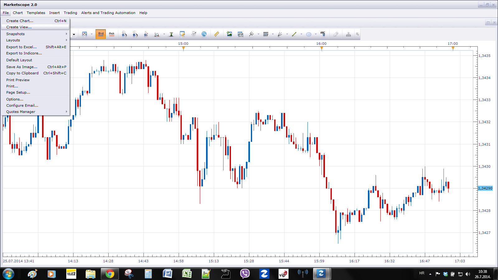
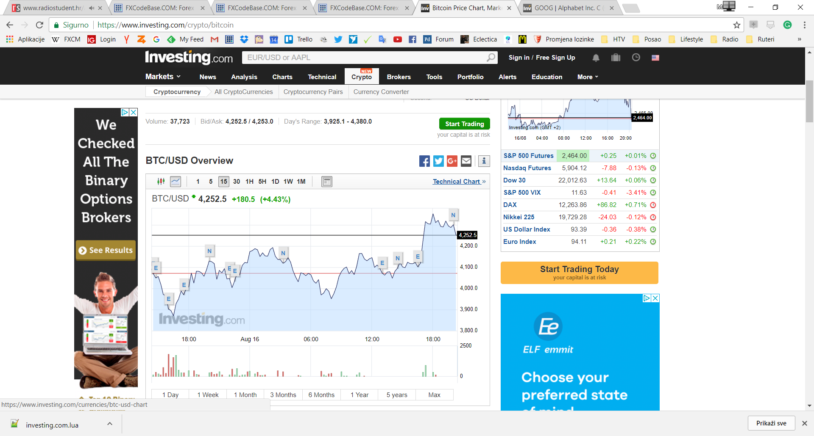
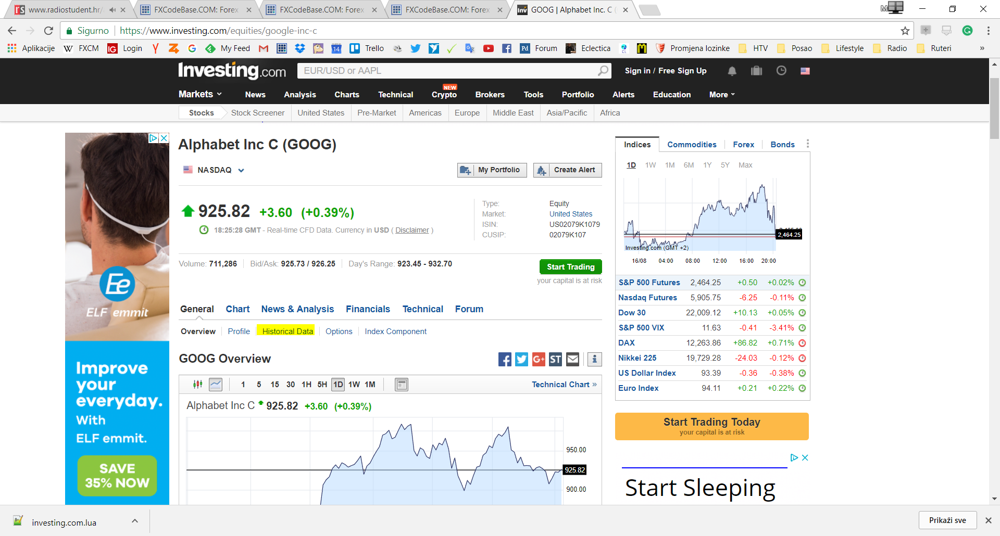
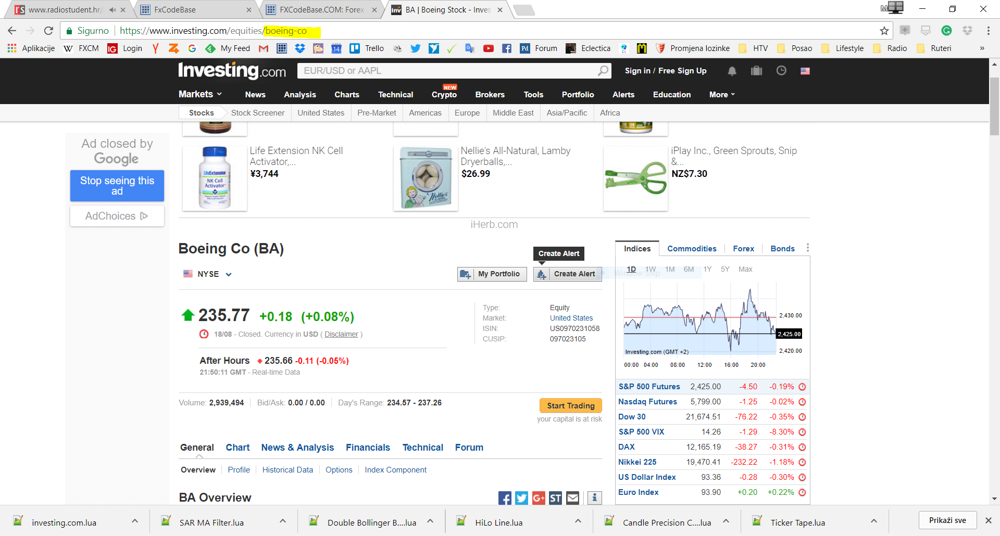

# Investing.com View

> Source: https://fxcodebase.com/code/viewtopic.php?f=17&t=64988  
> Forum: 17 · Topic 64988 · 20 post(s)

---

## Investing.com View

**Apprentice** · Sun Aug 13, 2017 5:29 am

Based on the request.
[viewtopic.php?f=27&t=64912&p=114146#p114146](https://fxcodebase.com/code/viewtopic.php?f=27&t=64912&p=114146#p114146)

Use File-> Create View

 [investing.com.lua](files/114145/investing.com.lua)

 

For Boeing CO (BA) u will use boeing-co
See stock page url, bit colored with yellow.

---

## Re: Investing.com View

**quantumfx** · Mon Aug 14, 2017 6:54 am

Doesn't appear in the indicator list after import. Is there another file that has to be imported first?

---

## Re: Investing.com View

**Apprentice** · Mon Aug 14, 2017 9:37 am

Use File-> Create View

---

## Re: Investing.com View

**fxcrust** · Mon Aug 14, 2017 5:27 pm

I am so dependent on ts2 and lua for my indicators and also just staying organized watching all of my investments. I tried to change the investing.com view to show the new crypto section on their site by adding that sections url to the local patterns url list in the investing.com view lua file but i got an error that says unexpected symbol near "i"... can you please fix so that we can pull that crypto section as well. Thank you!

---

## Re: Investing.com View

**quantumfx** · Wed Aug 16, 2017 12:42 am

Thanks!

---

## Re: Investing.com View

**Apprentice** · Wed Aug 16, 2017 3:18 pm

Historical data is NOT available.

 

Historical data is available for Google.

---

## Re: Investing.com View

**Mohamed85** · Sat Aug 19, 2017 4:16 pm

Hi apprentice, thanks for this awesome tool,
can you please explain how to change the default instrument from the default "Apple" to any other instrument that Investing is providing the data for.

Thanks again for all your efforts.

---

## Re: Investing.com View

**Apprentice** · Sat Aug 19, 2017 4:40 pm

For Boeing CO (BA) u will use boeing-co
See stock page url bit colored with yellow.

---

## Re: Investing.com View

**Mohamed85** · Sun Aug 20, 2017 5:32 am

Now that's 100% clear,
Thank you so much.

---

## Re: Investing.com View

**fxcrust** · Tue Aug 22, 2017 1:57 pm

> **Apprentice wrote:**
>
>
> 1.PNG
>
>
> Historical data is NOT available.
>
>
> Capture.PNG
>
>
> Historical data is available for Google.

i am trying BTC and the google view still is not pulling it up

---

## Re: Investing.com View

**fxcrust** · Tue Aug 22, 2017 2:07 pm

Maybe we can get a tradingview.com view and data feed plugin, tradingview tracks everthing and is already a part of fxcm

---

## Re: Investing.com View

**Apprentice** · Tue Aug 22, 2017 3:01 pm

Will investigate this.
As far as I can see tradingview.com does not provide the historical data.

---

## Re: Investing.com View

**fxcrust** · Tue Aug 22, 2017 8:25 pm

I understand the views are based on historical data but if we had the live data feed from tradingview and all the markets it shows in fxcm that would make TS2 quite powerful. Just saying

---

## Re: Investing.com View

**fxcrust** · Wed Aug 23, 2017 2:04 pm

I spent all day looking and i cannot find anyway to watch bitcoin and the other cryptos. its a big deal right now and the other systems that show cryptos are trash compared to TS2 so I hope we can get them in soon.

---

## Re: Investing.com View

**Apprentice** · Wed Aug 23, 2017 3:14 pm

Historical data for Bit Coin is NOT available on Investing.com.
In an ideal world, FXCM would offer BitCoin trading.
Ask your FXCM representative.

---

## Re: Investing.com View

**fxcrust** · Wed Aug 23, 2017 10:13 pm

> **Apprentice wrote:**
> Historical data for Bit Coin is NOT available on Investing.com.
> In an ideal world, FXCM would offer BitCoin trading.
> Ask your FXCM representative.

Oh I would never trade it. It is a big story in finance so I want to track it bc it is affecting what I trade through FXCM and having all my data in one system just makes more sense to me. I have found plenty of services that offer historical data on all of the major cryptos in the last few days but I cannot get them to code right. Thank you for helping me with my trading experience with FXCM. It is appreciated or I would not be on here in the first place.

---

## Re: Investing.com View

**Apprentice** · Mon Feb 05, 2018 10:01 am

The Indicator was revised and updated.

---

## Re: Investing.com View

**mayk01** · Sun Oct 17, 2021 9:06 am

Hi,
Does it work now? I tried but it shows nothing.

M.

---

## Re: Investing.com View

**Apprentice** · Wed Oct 20, 2021 6:17 am

Your request is added to the development list.
Development reference 930.

---

## Re: Investing.com View

**Apprentice** · Sun Oct 31, 2021 3:08 am

Try it now.
