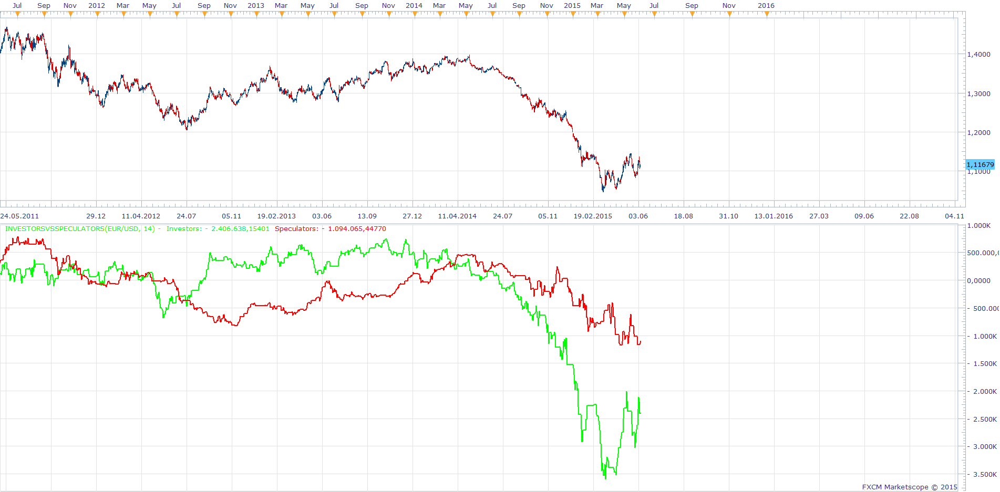

# InvestorsVsSpeculators

> Source: https://fxcodebase.com/code/viewtopic.php?f=17&t=62294  
> Forum: 17 · Topic 62294 · 17 post(s)

---

## InvestorsVsSpeculators

**Apprentice** · Mon Jun 08, 2015 3:34 am

Based on request.
[viewtopic.php?f=27&t=60740&p=100802#p100802](https://fxcodebase.com/code/viewtopic.php?f=27&t=60740&p=100802#p100802)

A. Smart money traders (Investors)

IF volume>SMA(X PERIOD) THEN
SM= SM + A/D change.
ELSE
SM= SM (no change, it uses the last value)

B. Retails traders (Speculators)
IF volume<SMA(X PERIOD) THEN
Retail= Retail + A/D change.
ELSE
Retail= Retail. (no change, it uses the last value).

 [InvestorsVsSpeculators.lua](files/100805/InvestorsVsSpeculators.lua)

 

Delta = Investors + Speculators

 [InvestorsVsSpeculators Delta.lua](files/100805/InvestorsVsSpeculators%20Delta.lua)

MT4/MQ4 version.
[viewtopic.php?f=38&t=65325&p=115810#p115810](https://fxcodebase.com/code/viewtopic.php?f=38&t=65325&p=115810#p115810)

---

## Re: InvestorsVsSpeculators

**Stance** · Tue Jun 09, 2015 8:36 pm

This looks good. Can you create an alert for this for when the 2 crosses over?

---

## Re: InvestorsVsSpeculators

**Apprentice** · Wed Jun 10, 2015 4:16 am

Your request is added to the development list.

---

## Re: InvestorsVsSpeculators

**NotSoAlien** · Wed Jun 10, 2015 7:54 am

Thank you for this.

---

## Re: InvestorsVsSpeculators

**Tigre3** · Sun Jul 12, 2015 6:50 am

Good morning,

1. Dear Stance,
It's useless have a signal which tells you when the lines cross because the crossover depends on when the platform starts calculate the indicator.

2. Dear Apprentice,
I'd like a new version.

Output= (Investors + speculators*-1)/2

It's an average between investors and the opposite of speculators (so speculators * -1).

Thank you so much.

---

## Re: InvestorsVsSpeculators

**Apprentice** · Mon Jul 13, 2015 7:43 am

InvestorsVsSpeculators Delta.lua Added

---

## Re: InvestorsVsSpeculators

**Thecity** · Sun Oct 18, 2015 3:46 pm

Could I have the MT4 version of the delta?
I'd prefer to have it with the line instead of the histogram.

Thank you!

---

## Re: InvestorsVsSpeculators

**Apprentice** · Mon Oct 19, 2015 3:29 am

Requested MT4 version can be found here.
[viewtopic.php?f=38&t=62794](https://fxcodebase.com/code/viewtopic.php?f=38&t=62794)

---

## Re: InvestorsVsSpeculators

**Apprentice** · Wed Jul 26, 2017 9:40 am

The indicator was revised and updated.

---

## Re: InvestorsVsSpeculators

**Se7enTrader** · Wed Nov 01, 2017 2:22 pm

These indicators looks good and they seem to be made properly. Unfortunately only own metatrader4. Could I have the MT4 version of both indi?
I'd prefer to have it with the histogram, like the original Delta.

---

## Re: InvestorsVsSpeculators

**Apprentice** · Sat May 05, 2018 6:22 am

The indicator was revised and updated.

---

## Re: InvestorsVsSpeculators

**enotikos** · Fri Sep 13, 2019 7:45 am

HI APPRENTICE,
FROM THIS INDICATOR I HAVE CHOSEN TO APPEAR ON THE DIAGRAM ONLY THE OPTION INVESTORS.
CAN YOU ADD IN THIS INDICATOR AN EMAIL NOTICE WHEN THE PRICE CHANGES PER X AMOUNT? (X = ONE AMOUNT THAT I CAN CHOOSE)

THANK YOU

---

## Re: InvestorsVsSpeculators

**Apprentice** · Mon Sep 16, 2019 3:38 am

Alert for change in InvestorsVsSpeculators
Or
Alert for change in Price

---

## Re: InvestorsVsSpeculators

**enotikos** · Mon Sep 16, 2019 4:12 am

Hi,
Alert for change in Price in real time.

Thank you

---

## Re: InvestorsVsSpeculators

**enotikos** · Mon Sep 16, 2019 12:08 pm

Hi,
if you can add the two alerts and so i can choose one of the two

Thank you

---

## Re: InvestorsVsSpeculators

**Apprentice** · Wed Sep 18, 2019 6:25 am

Your request is added to the development list.
Development reference 101.

---

## Re: InvestorsVsSpeculators

**Apprentice** · Wed Nov 13, 2019 2:16 pm

Try this version.
[viewtopic.php?f=17&t=69124](https://fxcodebase.com/code/viewtopic.php?f=17&t=69124)
