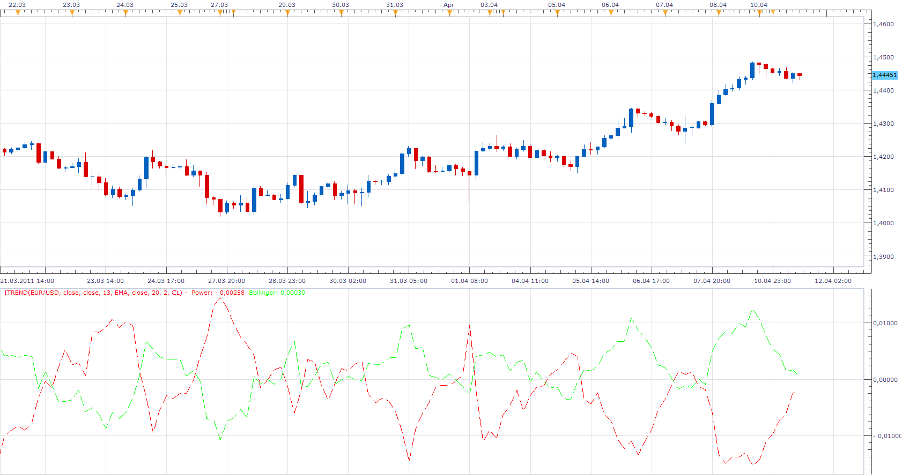

# iTrend

> Source: https://fxcodebase.com/code/viewtopic.php?f=17&t=3880  
> Forum: 17 · Topic 3880 · 9 post(s)

---

## iTrend

**Apprentice** · Mon Apr 11, 2011 10:41 am

The indicator has two components.
Sum of Bull and Bear Power.
Power[period] = -((High[period] - MA[period])+ (Low[period] - MA[period]));

Difference between price and a selected component of Bollinger Bend.
Bollinger[period]= Price[period] - BANDS[Bollinger_Mode][period];

 [iTREND.lua](files/9560/iTREND.lua)

 [Tick iTREND.lua](files/9560/Tick%20iTREND.lua)

 

 [MTF MCP iTrend Heat Map.lua](files/9560/MTF%20MCP%20iTrend%20Heat%20Map.lua)

MT4/MQ4 version
[viewtopic.php?f=38&t=65972](https://fxcodebase.com/code/viewtopic.php?f=38&t=65972)
Indicator-based strategy.
[viewtopic.php?f=31&t=66124](https://fxcodebase.com/code/viewtopic.php?f=31&t=66124)

---

## Re: iTrend

**jackfx09** · Mon Nov 28, 2011 7:05 am

Another great indicator! Can this be used with a previously built strategy? Or could one be built please if not already available... very simple parameter needed

Open Long when Bollinger signal crosses UP through "0" center line and closes when crossing back DOWN through "0".

Open Short when Bollinger signal crosses DOWN through "0" center line and closes when crossing back UP through "0".

Thanks!

sjc

---

## Re: iTrend

**Apprentice** · Mon Nov 28, 2011 6:27 pm

Do you think about, Bollinger or iTrend.

---

## Re: iTrend

**jackfx09** · Tue Nov 29, 2011 9:42 am

If I understand your reply correctly, you are asking if I would prefer a strategy to be created pertaining to the iTrend indicator OR the Bollinger portion of the indicator.

I did not find any strategies pertaining to the iTrend. But I was not sure if there is a strategy already built that would support the iTrend indicator. That seems to make more sense to me, but I could be wrong.

I have not used Bollinger Bands signals with past trading and since the indicator does use a bollinger signal I was not knowledgeable if any of the several BB signals/strategies support the iTrend.

Thanks again to all the FXcodebase staff for all your efforts, great work!!!

sjc

---

## Re: iTrend

**Apprentice** · Mon Apr 30, 2018 5:05 pm

Indicator was revised and updated.

---

## Re: iTrend

**swnlobo** · Tue Jul 20, 2021 1:11 pm

> **Apprentice wrote:**
> Indicator was revised and updated.

May I ask for an indicator applied to tickcharts

Many thanks

Regards

---

## Re: iTrend

**Apprentice** · Wed Jul 21, 2021 1:20 am

Tick iTREND.lua added.

---

## Re: iTrend

**swnlobo** · Thu Jul 22, 2021 7:31 am

Thank You So Much

All the best,
S.

---

## Re: iTrend

**Apprentice** · Fri Jun 03, 2022 8:39 am

MTF MCP iTrend Heat Map added.
