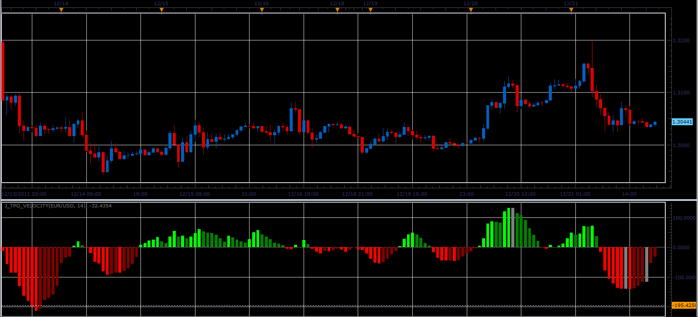

# J_TPO_Velocity indicator

> Source: https://fxcodebase.com/code/viewtopic.php?f=17&t=10251  
> Forum: 17 · Topic 10251 · 3 post(s)

---

## J_TPO_Velocity indicator

**Alexander.Gettinger** · Wed Dec 21, 2011 8:47 pm

This indicator is a ported MQL5 indicator from [http://www.mql5.com/ru/code/763](http://www.mql5.com/ru/code/763) (in Russian).

 

Download:

 [J_TPO_Velocity.lua](files/21389/J_TPO_Velocity.lua)

 

 [MTF MCP Heat Map J_TPO_Velocity.lua](files/21389/MTF%20MCP%20Heat%20Map%20J_TPO_Velocity.lua)

---

## Re: J_TPO_Velocity indicator

**Apprentice** · Tue Mar 13, 2018 11:23 am

The Indicator was revised and updated.

---

## Re: J_TPO_Velocity indicator

**Apprentice** · Mon Aug 15, 2022 8:12 am

MTF MCP Heat Map J_TPO_Velocity.lua added.
