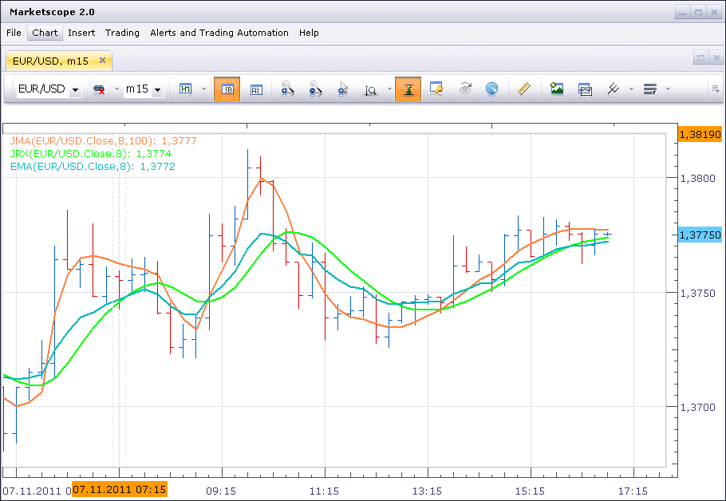
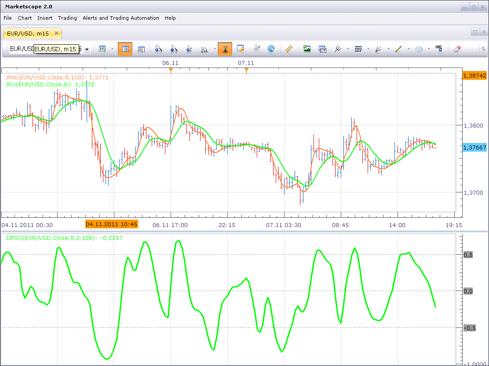

# JMA and JurX smooth algorithm

> Source: https://fxcodebase.com/code/viewtopic.php?f=17&t=7895  
> Forum: 17 · Topic 7895 · 21 post(s)

---

## JMA and JurX smooth algorithm

**Nikolay.Gekht** · Mon Nov 07, 2011 4:59 pm

These two indicators are ports of JJMA and JurX smoothing methods from NK (Nikolay Kositsin's) library for MT4's. The original algorithms were developed by Jurik Research's.

 

The Nikolay Kositsin's article which describes usage of these algorithms can be found here:
[Effective Averaging Algorithms with Minimal Lag: Use in Indicators](http://articles.mql4.com/310)

Download:
DLL

 [jmalua.dll](files/17500/jmalua.dll)

JRX indicator

 [jrx.lua](files/17500/jrx.lua)

JMA indicator

 [jma.lua](files/17500/jma.lua)

How to install:

1) Save jmalua.dll file to the Trading Station folder:
* for production version: C:\Program Files\CandleWorks\FXTS2
* for beta version: C:\Program Files\CandleWorks\FXTS2.Dev
* on 64-bit version of Windows use C:\Program Files (x64)\CandleWorks\FXTS2 and C:\Program Files (x64)\CandleWorks\FXTS2.Dev
* for using indicators in Indicore SDK save dll to C:\Gehtsoft\IndicoreSDK folder too.

2) Install jrx.lua and jma.lua custom indicators.

Download Source Code of DLL:

 [cppsrc.zip](files/17500/cppsrc.zip)

To build the source code you need:
* Microsoft Visual C++ 2005 or newer
* The latest version of Indicore Integration SDK installed
* The environment variables (bin, include, lib) of MSVC set properly.
* You do NOT need to build code in order to use the indicator. The build version of DLL can be downloaded above in this post.

Note: At the moment of the post publication, these indicators can be used with the current BETA version only. DO NOT use it on the current production version!

---

## JJRSX

**Nikolay.Gekht** · Mon Nov 07, 2011 5:31 pm

The NK's article referenced above also demonstrates JJRSX indicator which uses both, JMA and JRX smoothing:

 

Here is the port of JJRSX indicator to Marketscope.

 [jjrsx.lua](files/17501/jjrsx.lua)

Please note that dll and both indicators from the first post must also be installed.

---

## Re: JMA and JurX smooth algorithm

**fx_wannabe** · Tue Nov 08, 2011 1:02 pm

Hi Nikolay,

Just downloaded the file and installed them!
WOW!
All I can say is WOW!
Don't know what else to say, except WOW!

I cannot tell you how happy I am at this moment.

 I would like to ask how long it will take to create the 3C_JJRSX1 indicator. Link here:
[http://articles.mql4.com/425](http://articles.mql4.com/425)

Its the last indicator I looking to get done.
My trading account is 'Live' and fully funded, just waiting on this indicator, and then chocks away...

I cannot thank you enough, I am forever grateful.
fx_wannabe

---

## Re: JMA and JurX smooth algorithm

**Nikolay.Gekht** · Tue Nov 08, 2011 3:03 pm

You are welcome

3C_JJRSX1 is a colorizer over JJRSX so somebody of my guys will do it this week.

---

## Re: JMA and JurX smooth algorithm

**Apprentice** · Wed Nov 09, 2011 10:00 am

Coloring to JJRSX added.

 [jjrsx.lua](files/17621/jjrsx.lua)

---

## Re: JMA and JurX smooth algorithm

**fx_wannabe** · Thu Nov 10, 2011 5:29 am

Hi Apprentice,

I really love this indicator , may I ask if a colour-change histogram bars could be added so this indicator resembles the original 3C_JJRSX1 indicator??

Many - MANY - thank-you's.

fx_wannabe

---

## Re: JMA and JurX smooth algorithm

**Apprentice** · Thu Nov 10, 2011 5:06 pm

Bar Option Added.

 [jjrsx.lua](files/17701/jjrsx.lua)

---

## Re: JMA and JurX smooth algorithm

**fx_wannabe** · Wed Nov 16, 2011 2:41 pm

**UPDATED:**

Hello Apprentice,

May I request a strategy based upon the indicator "JJRSX" (LINE version, not bar) with the following parameters/rules to be applied:

Parameters to be added (In addition to the regular stratagy parameters):
-Allow strategy to trade?
-Allow Long/Short/Both positions?
-Colour change trading\Zero Line Crossover trading?

Trading Rule:
-As the Line colour changes, from long to short (Green to Red), the long position is closed and a short position is opened; closing the previous position in the process.
-If the line crosses from bottom to top of the zero-line, a short position is closed and a long position is opened; closing the previous position in the process.

I hope that is clear.

This is one of the most profitable indicators I have come-across. However, I cannot sit at my computer 24 Hours a day and having a strategy would benefit me greatly.

Your knowledge and help has been greatly appreciated.
fx_wannabe

---

## Re: JMA and JurX smooth algorithm

**Apprentice** · Wed Nov 16, 2011 2:47 pm

Your request is added to the development queue.

---

## Re: JMA and JurX smooth algorithm

**fx_wannabe** · Mon Nov 21, 2011 11:10 am

Hello Apprentice,

I know it's not been a week since I requested a strategy for "JJRSX" (Line version), but could you tell me where I am in the queue?

This is the last piece of the puzzle I am looking for, the indicator is absolutely perfect - it works exactly as planned. The updated strategy request is here:
[http://www.fxcodebase.com/code/viewtopic.php?f=30&t=7895#p17998](http://www.fxcodebase.com/code/viewtopic.php?f=30&t=7895#p17998)

 Are writing strategies easier once you've written the indicator?

Many thank you's.
fx_wannabe

---

## Re: JMA and JurX smooth algorithm

**Apprentice** · Mon Nov 21, 2011 11:36 am

We have Pending over 500 request.
Some are old over a year and a half.
I have only so much time, what remains after my day job.
For me personally, persuasion does not work, on the contrary.
Be patient. We have not forgotten about you.

---

## Re: JMA and JurX smooth algorithm

**fx_wannabe** · Mon Nov 21, 2011 12:14 pm

Hi Apprentice,

> For me personally, persuasion does not work, on the contrary.

I was not trying to be persuasive, I was simply stating a fact.

> Be patient. We have not forgotten about you.

Will do, it's just the not knowing; thats all.

Many thanks again.
fx_wannabe

---

## Re: JMA and JurX smooth algorithm

**Apprentice** · Thu Nov 24, 2011 4:19 am

Moved From Beta Sub Forum.

---

## Re: JMA and JurX smooth algorithm

**vstrelnikov** · Fri Nov 25, 2011 5:31 pm

jma.lua and jrx.lua was replaced in the top post.
The defect related to price source shift fixed.

---

## Re: JMA and JurX smooth algorithm

**tradinc** · Thu Dec 22, 2011 4:17 am

the jmalua.dll file when loaded(imported) to the fxst2 folder gives an error as result what can i do? it only accept files that are under .lua non other for me

---

## Re: JMA and JurX smooth algorithm

**sunshine** · Tue Dec 27, 2011 12:44 am

Please read the top post on how to install the indicator in Marketscope.

> **top post wrote:**
> How to install:
>
> 1) Save jmalua.dll file to the Trading Station folder:
> * for production version: C:\Program Files\CandleWorks\FXTS2
> * for beta version: C:\Program Files\CandleWorks\FXTS2.Dev
> * on 64-bit version of Windows use C:\Program Files (x64)\CandleWorks\FXTS2 and C:\Program Files (x64)\CandleWorks\FXTS2.Dev
> * for using indicators in Indicore SDK save dll to C:\Gehtsoft\IndicoreSDK folder too.
>
> 2) Install jrx.lua and jma.lua custom indicators.

---

## Re: JMA and JurX smooth algorithm

**jamaal.rich** · Tue Jul 31, 2012 6:27 am

Programmers,

Would it possible to add a divergence function to the JJRX oscillator, similar to that of the CCI divergence oscillator here: [http://fxcodebase.com/code/viewtopic.php?f=17&t=21362](https://fxcodebase.com/code/viewtopic.php?f=17&t=21362), and possibly to develop an on-chart divergence indicator for the JJRX similar to RSI divergence indicator here: [http://fxcodebase.com/code/viewtopic.php?f=17&t=846&hilit=RSI+divergence](https://fxcodebase.com/code/viewtopic.php?f=17&t=846&hilit=RSI+divergence)?

---

## Re: JMA and JurX smooth algorithm

**Apprentice** · Wed Apr 12, 2017 5:43 am

Indicator was revised and updated.

---

## Re: JMA and JurX smooth algorithm

**Apprentice** · Fri Apr 28, 2017 10:30 am

Jurik Smoothed RSX indicator Strategy is available here.
[viewtopic.php?f=28&t=64627](https://fxcodebase.com/code/viewtopic.php?f=28&t=64627)

---

## Re: JMA and JurX smooth algorithm

**Apprentice** · Wed Feb 21, 2018 10:27 am

The Indicator was revised and updated.

---

## Re: JMA and JurX smooth algorithm

**RuptorGB** · Sun Jun 10, 2018 1:47 pm

Hi
The JMA in lua is nothing like on MT4 it is rough. The whole point of JMA is to be smooth so it seems to me the lua one is not correct.
