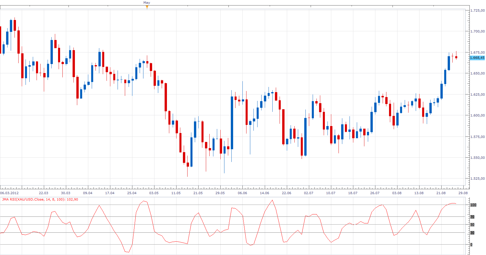

# JMA RSI

> Source: https://fxcodebase.com/code/viewtopic.php?f=17&t=22753  
> Forum: 17 · Topic 22753 · 2 post(s)

---

## JMA RSI

**Apprentice** · Mon Aug 27, 2012 8:54 am

This is the RSI indicator, which is used JMA for smoothing,
instead of MVA .

 [JMA RSI.lua](files/39261/JMA%20RSI.lua)

For this indicator, JMA Indicator and associated DLL library must be installed.
You can find them here.
[viewtopic.php?f=17&t=7895&hilit=JMA](https://fxcodebase.com/code/viewtopic.php?f=17&t=7895&hilit=JMA)

The indicator was revised and updated

---

## Re: JMA RSI

**Apprentice** · Tue Apr 11, 2017 4:39 am

Indicator was revised and updated.
