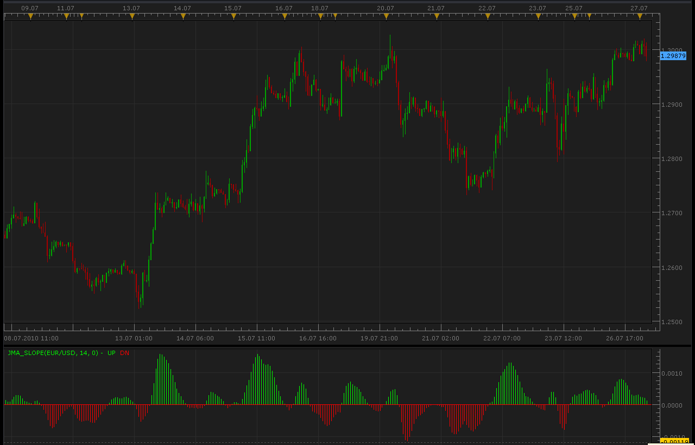
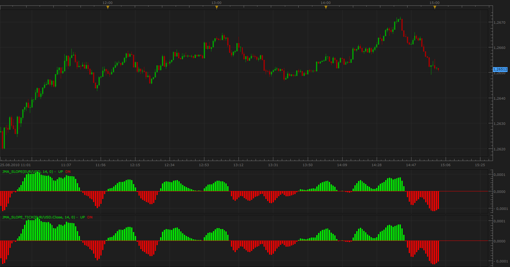

# JMA Slope indicator

> Source: https://fxcodebase.com/code/viewtopic.php?f=17&t=1591  
> Forum: 17 · Topic 1591 · 9 post(s)

---

## JMA Slope indicator

**Alexander.Gettinger** · Tue Jul 27, 2010 2:34 am

The indicator displays slope of Jurik Moving Average (the algorithm is published in [http://finance.groups.yahoo.com/group/TrendLaboratory](http://finance.groups.yahoo.com/group/TrendLaboratory)

 

Code: [Select all](https://fxcodebase.com/code/)
`function Init()
    indicator:name("JMA Slope");
    indicator:description("JMA Slope");
    indicator:requiredSource(core.Bar);
    indicator:type(core.Oscillator);
   
    indicator.parameters:addInteger("Length", "Length", "Length", 14);
    indicator.parameters:addInteger("Phase", "Phase", "Phase", 0);

    indicator.parameters:addColor("UPclr", "UP Color", "UP Color", core.rgb(0, 255, 0));
    indicator.parameters:addColor("DNclr", "DN Color", "DN Color", core.rgb(255, 0, 0));
end

local first;
local source = nil;
local Length;
local Phase;
local buffUP
local buffDN;
local limitValue;
local StartValue;
local JMAValueBuffer;
local fC0Buffer;
local fA8Buffer;
local fC8Buffer;
local list={};
local ring2={};
local ring1={};
local buffer={};
local initFlag;
local lengthParam;
local phaseParam;
local logParam;
local sqrtParam;
local lengthDivider;
local loopParam;
local counterA;
local counterB;
local cycleLimit;
local cycleDelta;
local s68,s58=0;
local lowDValue;
local loopCriteria;
local s40=32;
local s38=96;
local dValue=1.;

function Prepare()
    source = instance.source;
    Length=instance.parameters.Length;
    Phase=instance.parameters.Phase;
    JMAValueBuffer = instance:addInternalStream(0, 0);
    fC0Buffer = instance:addInternalStream(0, 0);
    fA8Buffer = instance:addInternalStream(0, 0);
    fC8Buffer = instance:addInternalStream(0, 0);
    first = source:first()+2;
    local name = profile:id() .. "(" .. source:name() .. ", " .. instance.parameters.Length .. ", " .. instance.parameters.Phase .. ")";
    instance:name(name);
    buffUP = instance:addStream("UP", core.Bar, name .. ".UP", "UP", instance.parameters.UPclr, first);
    buffDN = instance:addStream("DN", core.Bar, name .. ".DN", "DN", instance.parameters.DNclr, first);
    limitValue=63;
    StartValue=64;
    for i=0,limitValue,1 do
     list[i]=-1000000;
    end
    for i=0,11,1 do
     ring2[i]=0;
    end
    for i=StartValue,127,1 do
     list[i]=1000000;
    end
    initFlag=true;
    if Length<1.000000002 then
     lengthParam=0.0000000001;
    else
     lengthParam=(Length-1)/2.;
    end
    if Phase<-100 then
     phaseParam=0.5;
    else
     if Phase>100 then
      phaseParam=2.5;
     else
      phaseParam=Phase/100.+1.5;
     end
    end
    logParam=math.log(math.sqrt(lengthParam))/math.log(2.);
    if logParam<-2 then
     logParam=0.;
    else
     logParam=logParam+2.;
    end
    sqrtParam=math.sqrt(lengthParam)*logParam;
    lengthParam  =lengthParam*0.9;
    lengthDivider=lengthParam/(lengthParam+2.);
    loopParam=0;
    counterA=0;
    counterB=0;
    cycleLimit=0;
    cycleDelta=0;
    lowDValue=0;
    loopCriteria=0;
    buffer[1]=0;
end

function Update(period, mode)
    local paramA=0;
    local paramB=0;
    if (period>first) then
     local series=source.close[period];
     if loopParam<61 then
      loopParam=loopParam+1;
      buffer[loopParam]=series;
     end
     local highLimit=0;
     if loopParam>30 then
      if initFlag==true then
       initFlag=false;
       local diffFlag=0;
       for i=1,29,1 do
        if buffer[i+1]~=buffer[i] then
         diffFlag=1;
        end
       end
       highLimit=diffFlag*30;
       if highLimit==0 then
        paramB=series;
       else
        paramB=buffer[1];
       end
       paramA=paramB;
       if highLimit>29 then
        highLimit=29;
       end
      else
       highLimit=0;
      end
      for j=0,highLimit,1 do
       i=highLimit-j;
       local sValue;
       if i==0 then
        sValue=series;
       else
        sValue=buffer[31-i];
       end
       local absValue;
       if math.abs(sValue-paramA)>math.abs(sValue-paramB) then
        absValue=math.abs(sValue-paramA);
       else
        absValue=math.abs(sValue-paramB);
       end
       local dValue=absValue+0.0000000001;
       if counterA<=1 then
        counterA=127;
       else
        counterA=counterA-1;
       end
       if counterB<=1 then
        counterB=10;
       else
        counterB=counterB-1;
       end
       if cycleLimit<128 then
        cycleLimit=cycleLimit+1;
       end
       cycleDelta=cycleDelta+dValue-ring2[counterB];
       ring2[counterB]=dValue;
       local highDValue;
       if cycleLimit>10 then
        highDValue=cycleDelta/10.;
       else
        highDValue=cycleDelta/cycleLimit;
       end
       if cycleLimit>127 then
        dValue=ring1[counterA];
        ring1[counterA]=highDValue;
        s68=64;
        s58=s68;
        while s68>1 do
         if list[s58]<dValue then
          s68=s68/2.;
          s58=s58+s68;
         else
          if list[s58]<=dValue then
           s68=1;
          else
           s68=s68/2.;
           s58=s58-s68;
          end
         end
        end
       else
        ring1[counterA]=highDValue;
        if limitValue+StartValue>127 then
         StartValue=StartValue-1;
         s58=StartValue;
        else
         limitValue=limitValue+1;
         s58=limitValue;
        end
        if limitValue<=96 then
         s38=limitValue;
        end
        if StartValue>=32 then
         s40=StartValue;
        end
       end
       s68=64;
       s60=s68;
       while s68>1 do
        if list[s60]>=highDValue then
         if list[s60-1]<=highDValue then
          s68=1;
         else
          s68=s68/2.;
          s60=s60-s68;
         end
        else
         s68=s68/2.;
         s60=s60+s68;
        end
        if s60==127 and highDValue>list[127] then
         s60=128;
        end
       end
       
       if cycleLimit>127 then
        if s58>=s60 then
         if s38+1>s60 and s40-1<s60 then
          lowDValue=lowDValue+highDValue;
         elseif s40>s60 and s40-1<s58 then
          lowDValue=lowDValue+list[s40-1];
         end
        elseif s40>=s60 then
         if s38+1<s60 and s38+1>s58 then
          lowDValue=lowDValue+list[s38+1];
         end
        elseif s38+2>s60 then
    lowDValue=lowDValue+highDValue;
   elseif s38+1<s60 and s38+1>s58 then 
         lowDValue=lowDValue+list[s38+1];
        end
        if s58>s60 then
         if s40-1<s58 and s38+1>s58 then
          lowDValue=lowDValue-list[s58];
         elseif s38<s58 and s38+1>s60 then
          lowDValue=lowDValue-list[s38];
         end
        else
    if s38+1>s58 and s40-1<s58 then
     lowDValue=lowDValue-list[s58];
    elseif s40>s58 and s40<s60 then
     lowDValue=lowDValue-list[s40];
    end
        end
        if s58<=s60 then
         if s58>=s60 then
          list[s60]=highDValue;
         else
          for jj=s58+1,s60-1,1 do
           list[jj-1]=list[jj];
          end
          list[s60-1]=highDValue;
         end
        else
    for jjj=s60,s58-1,1 do
     jj=s58-1-jjj;
     list[jj+1]=list[jj];
    end
    list[s60]=highDValue;
        end
       end
       if cycleLimit<=127 then
        lowDValue=0;
        for jj=s40,s38,1 do
         lowDValue=lowDValue+list[jj];
        end
       end
       if loopCriteria+1>31 then
        loopCriteria=31;
       else
        loopCriteria=loopCriteria+1;
       end
       local JMATempValue;
       local sqrtDivider=sqrtParam/(sqrtParam+1);
       if loopCriteria<=30 then
        if sValue-paramA>0 then
         paramA=sValue;
        else
         paramA=sValue-(sValue-paramA)*sqrtDivider;
        end
        if sValue-paramB<0 then
         paramB=sValue;
        else
         paramB=sValue-(sValue-paramB)*sqrtDivider;
        end
        local JMATempValue=series;
        if loopCriteria==30 then
         fC0Buffer[period]=series;
         local intPart;
         if math.ceil(sqrtParam)>=1 then
          intPart=math.ceil(sqrtParam);
         else
          intPart=1;
         end
         local leftInt;
         if intPart>0 then
          leftInt=math.floor(intPart);
         else
          leftInt=math.ceil(intPart);
         end
         if math.floor(sqrtParam)>=1 then
          intPart=math.floor(sqrtParam);
         else
          intPart=1;
         end
         local rightPart;
         if intPart>0 then
          rightPart=math.floor(intPart);
         else
          rightPart=math.ceil(intPart);
         end
         local dValue;
         if leftInt==rightPart then
          dValue=1.;
         else
          dValue=(sqrtParam-rightPart)/(leftInt-rightPart);
         end
         local upShift;
         local dnShift;
         if rightPart<=29 then
          upShift=rightPart;
         else
          upShift=29;
         end
         if leftInt<=29 then
          dnShift=leftInt;
         else
          dnShift=29;
         end
         fA8Buffer[period]=(series-buffer[loopParam-upShift])*(1.-dValue)/rightPart+(series-buffer[loopParam-dnShift])*dValue/leftInt;
        end
       else
        local powerValue;
        local squareValue;
        dValue=lowDValue/(s38-s40+1);
        if 0.5<=logParam-2. then
         powerValue=logParam-2.;
        else
         powerValue=0.5;
        end
        if logParam>=math.pow(absValue/dValue,powerValue) then
         dValue=math.pow(absValue/dValue,powerValue);
        else
         dValue=logParam;
        end
        if dValue<1 then
         dValue=1;
        end
        powerValue=math.pow(sqrtDivider,math.sqrt(dValue));
        if sValue-paramA>0 then
         paramA=sValue;
        else
         paramA=sValue-(sValue-paramA)*powerValue;
        end
        if sValue-paramB<0 then
         paramB=sValue;
        else
         paramB=sValue-(sValue-paramB)*powerValue;
        end
       end
       
      end
      if loopCriteria>30 then
       JMATempValue=JMAValueBuffer[period-1];
       powerValue=math.pow(lengthDivider,dValue);
       squareValue=math.pow(powerValue,2);
       fC0Buffer[period]=(1.-powerValue)*series+powerValue*fC0Buffer[period-1];
       fC8Buffer[period]=(series-fC0Buffer[period])*(1.-lengthDivider)+lengthDivider*fC8Buffer[period-1];
       fA8Buffer[period]=(phaseParam*fC8Buffer[period]+fC0Buffer[period]-JMATempValue)*(powerValue*(-2.)+squareValue+1.)+squareValue*fA8Buffer[period-1];
       JMATempValue=JMATempValue+fA8Buffer[period];
      end
      JMAValue=JMATempValue;
     end
     if loopParam<=30 then
      JMAValue=0.;
     end
     JMAValueBuffer[period]=JMAValue;
     local rel;
     rel=JMAValueBuffer[period]-JMAValueBuffer[period-1];
     if rel>=0 then
      buffUP[period]=rel;
      buffDN[period]=nil;
     else
      buffUP[period]=nil;
      buffDN[period]=rel;
     end
    end
end`

 [JMA_Slope.lua](files/3134/JMA_Slope.lua)

 [JMA_Slope with Alert.lua](files/3134/JMA_Slope%20with%20Alert.lua)

---

## Re: JMA Slope indicator

**Chris33** · Wed Aug 25, 2010 11:24 am

Can this be modified to use other indicators as a source?

---

## Re: JMA Slope indicator

**Apprentice** · Wed Aug 25, 2010 2:03 pm

 [JMA_Slope_Tick.lua](files/3916/JMA_Slope_Tick.lua)

Done.

---

## Re: JMA Slope indicator

**Chris33** · Wed Aug 25, 2010 2:29 pm

Alright, Thanks!

---

## Re: JMA Slope indicator

**Apprentice** · Thu Jan 12, 2017 8:30 am

Indicator was revised and updated.

---

## Re: JMA Slope indicator

**Finny7** · Fri Jan 13, 2017 3:12 am

Can you create a signal for this?

---

## Re: JMA Slope indicator

**Apprentice** · Fri Jan 13, 2017 7:28 am

JMA_Slope with Alert.lua added.

---

## Re: JMA Slope indicator

**Finny7** · Fri Jan 13, 2017 2:02 pm

Thank you so much, Apprentice! I really appreciated it

---

## Re: JMA Slope indicator

**Apprentice** · Mon Feb 05, 2018 7:42 am

The Indicator was revised and updated.
