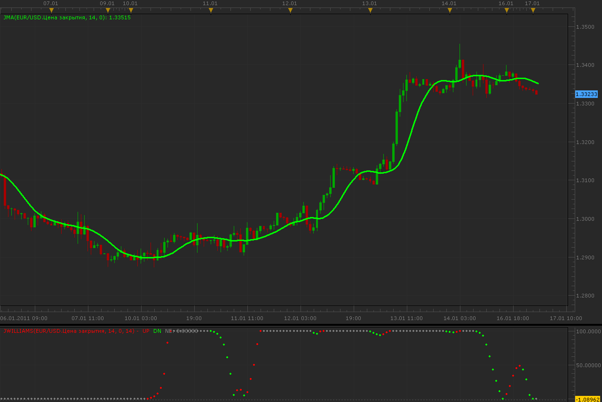

# JMA Williams Smoothed

> Source: https://fxcodebase.com/code/viewtopic.php?f=17&t=3189  
> Forum: 17 · Topic 3189 · 2 post(s)

---

## JMA Williams Smoothed

**Alexander.Gettinger** · Mon Jan 17, 2011 1:50 am

This indicator is a ported Ninja Trader indicator.
Request and source code here: [viewtopic.php?f=27&t=3009](https://fxcodebase.com/code/viewtopic.php?f=27&t=3009)

 

Downloads.
JMA:

 [JMA.lua](files/7508/JMA.lua)

JWilliams:

 [JWilliams.lua](files/7508/JWilliams.lua)

For JWilliams indicator must be installed JMA.

The indicator was revised and updated

---

## Re: JMA Williams Smoothed

**Apprentice** · Sun Feb 12, 2017 7:38 am

Indicator was revised and updated.
