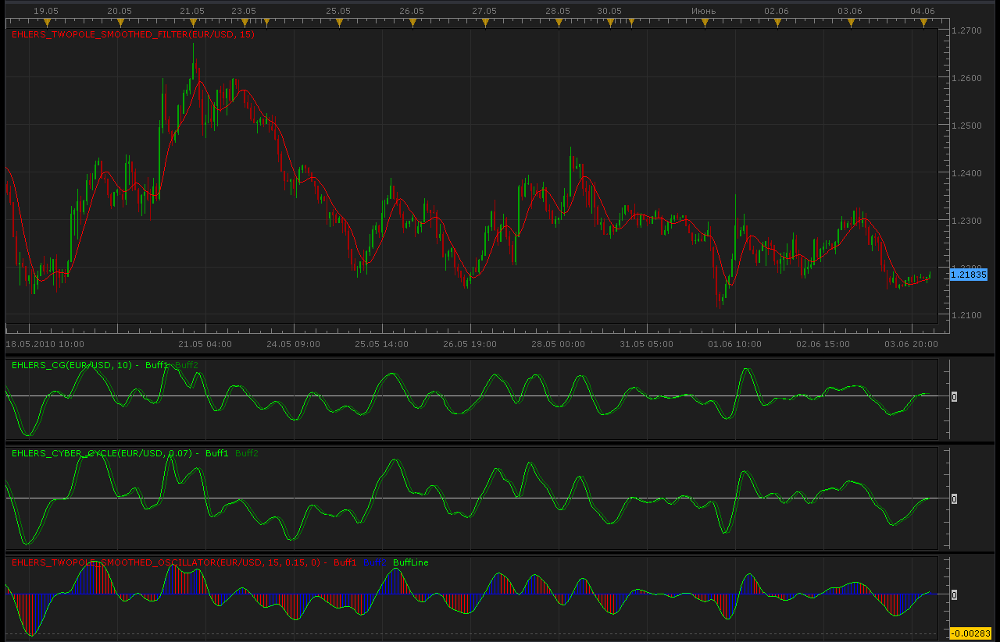

# John Ehler's indicators

> Source: https://fxcodebase.com/code/viewtopic.php?f=17&t=1262  
> Forum: 17 · Topic 1262 · 16 post(s)

---

## John Ehler's indicators

**Alexander.Gettinger** · Fri Jun 04, 2010 2:03 am

Original researches by John F. Ehlers, described in "Cybernetic Analysis for Stocks and Futures" (2004) ISBN: 0-471-46307-8

Center of Gravity I see also here: [viewtopic.php?f=17&t=366&p=605&hilit=Ehler#p605](https://fxcodebase.com/code/viewtopic.php?f=17&t=366&p=605&hilit=Ehler#p605)

 



Center of Gravity indicator:

```lua
function Init()
    indicator:name("Ehlers CG Oscillator");
    indicator:description("Ehlers CG Oscillator");
    indicator:requiredSource(core.Bar);
    indicator:type(core.Oscillator);
   
    indicator.parameters:addInteger("Length", "Length", "", 10);

    indicator.parameters:addColor("clr_buff1", "Color of Buff1", "Color of Buff1", core.rgb(0, 255, 0));
    indicator.parameters:addColor("clr_buff2", "Color of Buff2", "Color of Buff2", core.rgb(0, 128, 0));
end

local first;
local source = nil;
local Length;
local Price;
local Buff1=nil;
local Buff2=nil;

function Prepare()
    source = instance.source;
    Length=instance.parameters.Length;
    Price = instance:addInternalStream(0, 0);
    first = source:first()+2;
    local name = profile:id() .. "(" .. source:name() .. ", " .. instance.parameters.Length .. ")";
    instance:name(name);
    Buff1 = instance:addStream("Buff1", core.Line, name .. ".Buff1", "Buff1", instance.parameters.clr_buff1, first);
    Buff2 = instance:addStream("Buff2", core.Line, name .. ".Buff2", "Buff2", instance.parameters.clr_buff2, first);
    Buff1:addLevel(0);
end

function Update(period, mode)
    if (period>first+Length) then
     local Num=0.;
     local Demon=0.;
     Price[period]=(source.high[period]+source.low[period])/2.;
     for i=0,Length-1,1 do
      Num=Num+(i+1)*Price[period-i];
      Demon=Demon+Price[period-i];
     end
     if Demon~=0. then
      Buff1[period]=-Num/Demon+(Length+1.)/2.;
     else
      Buff1[period]=0.;
     end
     Buff2[period]=Buff1[period-1];
    end
end
```

Cyber cycle indicator:

```lua
function Init()
    indicator:name("Ehlers Cyber Cycle");
    indicator:description("Ehlers Cyber Cycle");
    indicator:requiredSource(core.Bar);
    indicator:type(core.Oscillator);
   
    indicator.parameters:addDouble("Alpha", "Alpha", "", 0.07);

    indicator.parameters:addColor("clr_buff1", "Color of Buff1", "Color of Buff1", core.rgb(0, 255, 0));
    indicator.parameters:addColor("clr_buff2", "Color of Buff2", "Color of Buff2", core.rgb(0, 128, 0));
end

local first;
local source = nil;
local Alpha;
local Price;
local Smooth;
local Buff1=nil;
local Buff2=nil;

function Prepare()
    source = instance.source;
    Alpha=instance.parameters.Alpha;
    Price = instance:addInternalStream(0, 0);
    Smooth = instance:addInternalStream(0, 0);
    first = source:first()+2;
    local name = profile:id() .. "(" .. source:name() .. ", " .. instance.parameters.Alpha .. ")";
    instance:name(name);
    Buff1 = instance:addStream("Buff1", core.Line, name .. ".Buff1", "Buff1", instance.parameters.clr_buff1, first);
    Buff2 = instance:addStream("Buff2", core.Line, name .. ".Buff2", "Buff2", instance.parameters.clr_buff2, first);
    Buff1:addLevel(0);
end

function Update(period, mode)
    Price[period]=(source.high[period]+source.low[period])/2.;
    if (period>first+4) then
     Smooth[period]=(Price[period]+2.*Price[period-1]+2.*Price[period-2]+Price[period-3])/6.;
     if period<first+8 then
      Buff1[period]=(Price[period]-2.*Price[period-1]+Price[period-2])/4.;
     else
      Buff1[period]=(1.-0.5*Alpha)*(1.-0.5*Alpha)*(Smooth[period]-2.*Smooth[period-1]+Smooth[period-2])+2.*(1.-Alpha)*Buff1[period-1]-(1.-Alpha)*(1.-Alpha)*Buff1[period-2];
     end
     Buff2[period]=Buff1[period-1];
   
    end
end
```

 [Ehlers_CG.lua](files/2398/Ehlers_CG.lua)

 [Ehlers_Cyber_Cycle.lua](files/2398/Ehlers_Cyber_Cycle.lua)

Ehlers_CG.lua based strategy.
[viewtopic.php?f=31&t=2420](https://fxcodebase.com/code/viewtopic.php?f=31&t=2420)

---

## Re: John Ehler's indicators

**Alexander.Gettinger** · Fri Jun 04, 2010 2:05 am

TwoPole smoothes oscillator:

```lua
function Init()
    indicator:name("Ehlers TwoPole smoothes oscillator");
    indicator:description("Ehlers TwoPole smoothes oscillator");
    indicator:requiredSource(core.Bar);
    indicator:type(core.Oscillator);
   
    indicator.parameters:addInteger("CuttOff", "CuttOff", "", 15);
    indicator.parameters:addDouble("alpha", "alpha", "", 0.15);
    indicator.parameters:addInteger("shift", "shift", "", 0);

    indicator.parameters:addColor("clr_Line", "Color of Line", "Color of Line", core.rgb(0, 255, 0));
    indicator.parameters:addColor("clr_buff1", "Color of Buff1", "Color of Buff1", core.rgb(255, 0, 0));
    indicator.parameters:addColor("clr_buff2", "Color of Buff2", "Color of Buff2", core.rgb(0, 0, 255));
end

local first;
local source = nil;
local CuttOff;
local alpha;
local shift;
local Buff1=nil;
local Buff2=nil;
local BuffLine=nil;
local Ind;

function Prepare()
    source = instance.source;
    CuttOff=instance.parameters.CuttOff;
    alpha=instance.parameters.alpha;
    shift=instance.parameters.shift;
    Ind = core.indicators:create("EHLERS_TWOPOLE_SMOOTHED_FILTER", source, CuttOff);
    first = Ind.DATA:first()+2;
    local name = profile:id() .. "(" .. source:name() .. ", " .. instance.parameters.CuttOff .. ", " .. instance.parameters.alpha .. ", " .. instance.parameters.shift .. ")";
    instance:name(name);
    Buff1 = instance:addStream("Buff1", core.Bar, name .. ".Buff1", "Buff1", instance.parameters.clr_buff1, first);
    Buff2 = instance:addStream("Buff2", core.Bar, name .. ".Buff2", "Buff2", instance.parameters.clr_buff2, first);
    BuffLine = instance:addStream("BuffLine", core.Line, name .. ".BuffLine", "BuffLine", instance.parameters.clr_Line, first);
    BuffLine:addLevel(0);
end

function Update(period, mode)
    if (period>first) then
     Ind:update(mode);
     local Val=Ind.DATA[period]-Ind.DATA[period-1];
     local Val1=Ind.DATA[period-1]-Ind.DATA[period-2];
     local Val2=Ind.DATA[period-2]-Ind.DATA[period-3];
     BuffLine[period]=(alpha-(alpha*alpha/4.))*Val+(alpha*alpha/2.)*Val1-(alpha-3.*alpha*alpha/4.)*Val2+2.*(1-alpha)*BuffLine[period-1]-(1-alpha)*(1-alpha)*BuffLine[period-2];
     if BuffLine[period]<BuffLine[period-1] then
      Buff1[period]=BuffLine[period];
      Buff2[period]=nil;
     else
      Buff1[period]=nil;
      Buff2[period]=BuffLine[period];
     end
     
    end
end
```

TwoPole smoothes filter:

```lua
function Init()
    indicator:name("Ehlers TwoPole smoothes filter");
    indicator:description("Ehlers TwoPole smoothes filter");
    indicator:requiredSource(core.Bar);
    indicator:type(core.Indicator);
   
    indicator.parameters:addInteger("CuttOffPeriod", "CuttOffPeriod", "", 15);

    indicator.parameters:addColor("clr_Line", "Color of Line", "Color of Line", core.rgb(255, 0, 0));
end

local first;
local source = nil;
local CuttOffPeriod;
local Price;
local BuffLine=nil;
local a1;
local b1;
local coeff1, coeff2, coeff3;

function Prepare()
    source = instance.source;
    CuttOffPeriod=instance.parameters.CuttOffPeriod;
    Price = instance:addInternalStream(0, 0);
    first = source:first()+2;
    local name = profile:id() .. "(" .. source:name() .. ", " .. instance.parameters.CuttOffPeriod .. ")";
    instance:name(name);
    BuffLine = instance:addStream("BuffLine", core.Line, name .. ".BuffLine", "BuffLine", instance.parameters.clr_Line, first);
    a1=math.exp(-math.sqrt(2.)*math.pi/CuttOffPeriod);
    b1=2.*a1*math.cos(math.pi*math.sqrt(2.)/CuttOffPeriod);
    coeff2=b1;
    coeff3=-a1*a1;
    coeff1=1.-coeff2-coeff3;
end

function Update(period, mode)
    Price[period]=(source.high[period]+source.low[period])/2.;
    if (period>first) then
     if period>first+4 then
      BuffLine[period]=coeff1*Price[period]+coeff2*BuffLine[period-1]+coeff3*BuffLine[period-2];
     else
      BuffLine[period]=Price[period];
     end
    end
end
```

---

## Re: John Ehler's indicators

**RJH501** · Mon Aug 22, 2011 3:56 am

Hi Alexander,

Would you please add line style and line width to your Ehlers Two Pole indicator when you have time.

Thank you,

Richard

---

## Re: John Ehler's indicators

**Apprentice** · Mon Aug 22, 2011 12:59 pm

Request is added to our database.

---

## Re: John Ehler's indicators

**Alexander.Gettinger** · Mon Sep 05, 2011 11:35 am

In the indicators added line style and line width.

Download:

 [Ehlers_TwoPole_Smoothed_Oscillator.lua](files/14546/Ehlers_TwoPole_Smoothed_Oscillator.lua)

 [Ehlers_CG.lua](files/14546/Ehlers_CG.lua)

 [Ehlers_Cyber_Cycle.lua](files/14546/Ehlers_Cyber_Cycle.lua)

 [Ehlers_TwoPole_Smoothed_Filter.lua](files/14546/Ehlers_TwoPole_Smoothed_Filter.lua)

---

## Re: John Ehler's indicators

**StefPasc** · Mon Sep 23, 2013 6:52 am

> **Alexander.Gettinger wrote:**
> In the indicators added line style and line width.
>
> Download:
>
>
> Ehlers_TwoPole_Smoothed_Oscillator.lua
>
>
>
>
> Ehlers_CG.lua
>
>
>
>
> Ehlers_Cyber_Cycle.lua
>
>
>
>
> Ehlers_TwoPole_Smoothed_Filter.lua

Recently I am testing Ehlers Leading Indicator found from
[http://fxcodebase.com/code/viewtopic.php?f=17&t=27612&p=48291&hilit=Ehlers+Leading+Indicator#p48291](https://fxcodebase.com/code/viewtopic.php?f=17&t=27612&p=48291&hilit=Ehlers+Leading+Indicator#p48291)
I have noticed that ELI can be applied not only to the price data but also to another indicator.
Would this be possible also for the above 4 Ehlers indicators ?
Current version of the above 4 indicators does not allow us to apply them on other indicators but only on price data.
Thank you in advance

---

## Re: John Ehler's indicators

**Apprentice** · Mon Sep 23, 2013 7:23 am

Possibly, if you do not mind a small change in the original algorithm.

---

## Re: John Ehler's indicators

**StefPasc** · Mon Sep 23, 2013 7:58 am

> **Apprentice wrote:**
> Possibly, if you do not mind a small change in the original algorithm.

Dear Apprentice thank you for your reply.
I am not familiar with programming.
Is it possible if you have some time to do this small change ?
Thank you again

---

## John Ehler's indicators (Tick based versions)

**Apprentice** · Mon Sep 23, 2013 11:31 am


Try this Tick based versions.

 [Tick Ehlers_CG.lua](files/89655/Tick%20Ehlers_CG.lua)

 [Tick Ehlers_Cyber_Cycle.lua](files/89655/Tick%20Ehlers_Cyber_Cycle.lua)

 [Tick Ehlers_TwoPole_Smoothed_Filter.lua](files/89655/Tick%20Ehlers_TwoPole_Smoothed_Filter.lua)

 [Tick Ehlers_TwoPole_Smoothed_Oscillator.lua](files/89655/Tick%20Ehlers_TwoPole_Smoothed_Oscillator.lua)

 [Tick Ehlers TwoPole smoothes filter with Alert.lua](files/89655/Tick%20Ehlers%20TwoPole%20smoothes%20filter%20with%20Alert.lua)

 [Tick Ehlers_TwoPole_Smoothed_Oscillator with Alert.lua](files/89655/Tick%20Ehlers_TwoPole_Smoothed_Oscillator%20with%20Alert.lua)

This indicator version will provides Audio / Email Alerts on Price/Tick Ehlers TwoPole smoothes filter cross.

Compatibility issue fixed.
_Alert Helper is not longer needed.

---

## Re: John Ehler's indicators

**StefPasc** · Wed Sep 25, 2013 2:10 am

thank you Apprentice !
they work fine..

---

## Re: John Ehler's indicators

**Apprentice** · Tue Oct 22, 2013 6:40 am

Tick Ehlers TwoPole smoothes filter with Alert added.

---

## Re: John Ehler's indicators

**StefPasc** · Sun Nov 17, 2013 11:29 am

Dear Apprentice,

would it be possible to have an Alert when Tick Ehlers_TwoPole_Smoothed_Oscillator crosses zero line ?
This will help me a lot when following different pairs on Trade Station.
Thank you in advance

---

## Re: John Ehler's indicators

**Apprentice** · Mon Nov 18, 2013 6:12 am

Tick Ehlers_TwoPole_Smoothed_Oscillator with Alert Added.

---

## Re: John Ehler's indicators

**StefPasc** · Mon Nov 18, 2013 7:45 am

thank you very much Apprentice

---

## Re: John Ehler's indicators

**Apprentice** · Thu Dec 10, 2015 3:26 pm

Compatibility issue fixed.
_Alert Helper is not longer needed.

---

## Re: John Ehler's indicators

**Apprentice** · Thu Jul 12, 2018 7:45 am

The indicator was revised and updated.
