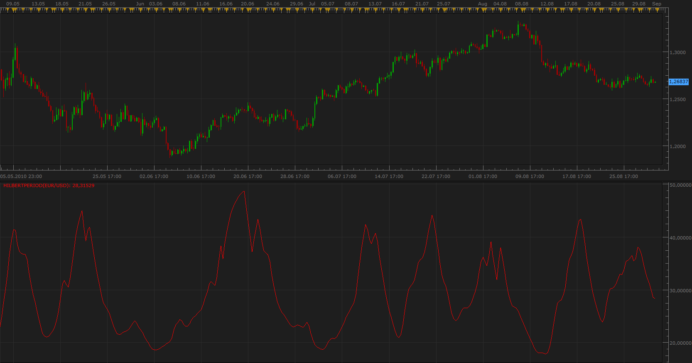
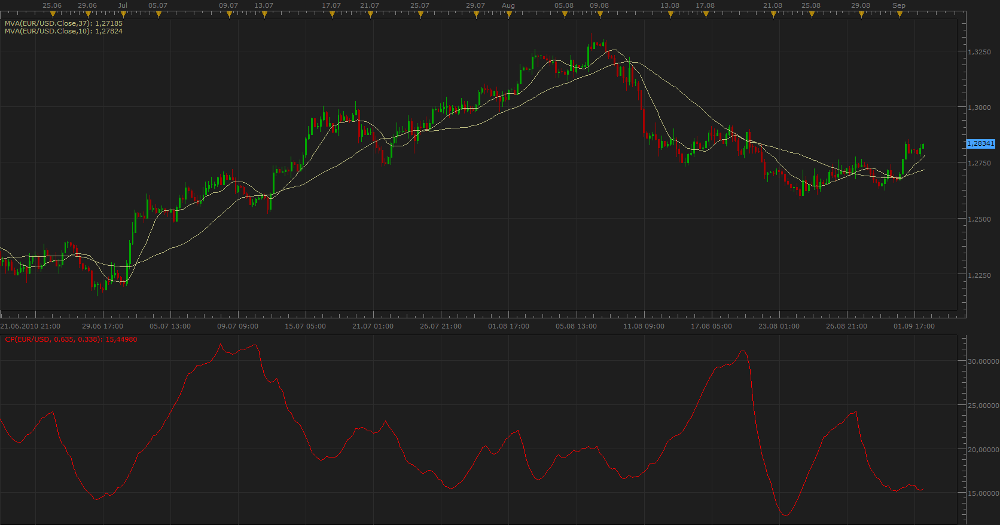

# John Ehler's

> Source: https://fxcodebase.com/code/viewtopic.php?f=17&t=1908  
> Forum: 17 · Topic 1908 · 5 post(s)

---

## John Ehler's

**Apprentice** · Mon Aug 23, 2010 12:20 pm

**John Ehler's Squelch**

 

 [JES.lua](files/3852/JES.lua)

 [Squelch Trend.lua](files/3852/Squelch%20Trend.lua)

Written on written request.

The indicator was revised and updated

---

## Re: John Ehler's Squelch

**jefftrader** · Tue Aug 24, 2010 8:14 am

I have tested it and it appears to be incorrect. since i don't know the lua language well enough i probably can't offer much help. I will take a look at the code anyway to see if something pops out at me.

jefftrader

---

## Re: John Ehler's

**Apprentice** · Tue Aug 31, 2010 5:57 pm

John Ehler's HilbertPeriod

 

 [HilbertPeriod.lua](files/4092/HilbertPeriod.lua)

---

## Re: John Ehler's Cycle Period

**Apprentice** · Thu Sep 02, 2010 4:47 am

According to references that I found.
John Ehler's Cycle Period (Measure) the number of bars between successive highs (or lows) in the waveform.

 [CP.lua](files/4123/CP.lua)

 [Tick_CP.lua](files/4123/Tick_CP.lua)

Could be used in the selection of period for the moving averages,
and within the algorithms fow detectind peaks, bottoms, wave cout.

---

## Re: John Ehler's

**Apprentice** · Sun Jan 29, 2017 6:19 am

Indicator was revised and updated.
