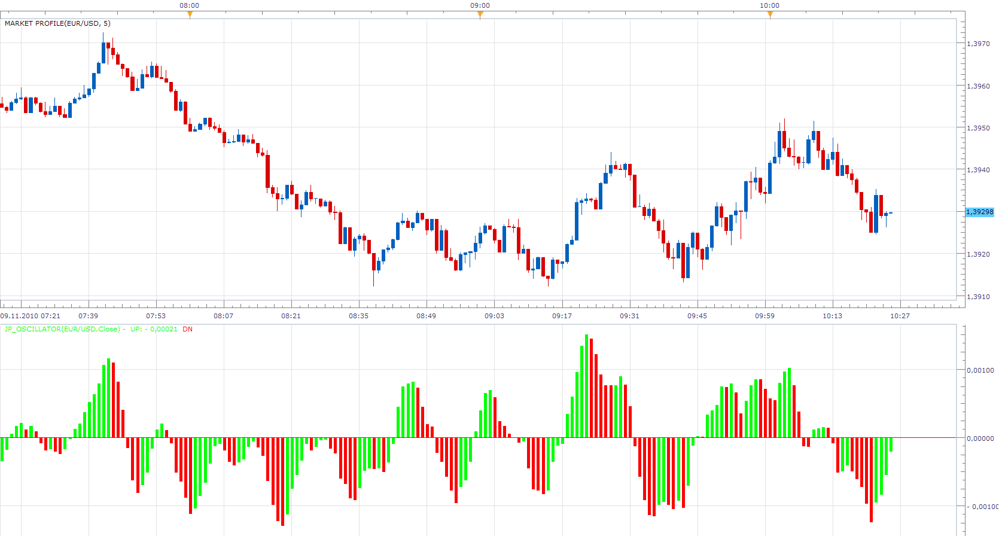

# JP Oscillator

> Source: https://fxcodebase.com/code/viewtopic.php?f=17&t=2637  
> Forum: 17 · Topic 2637 · 5 post(s)

---

## JP Oscillator

**Apprentice** · Tue Nov 09, 2010 10:29 am

This oscillator is written according to the formula given by users.

JPO = (source[period] - (source[period-1]/2 + source[period-2]/2)) - ( 0 - (source[period] - source[period-4]));

 [JP_Oscillator.lua](files/5948/JP_Oscillator.lua)

The indicator was revised and updated

---

## Re: JP Oscillator

**jay1994** · Thu Jul 25, 2013 6:29 am

Is there a mq4 or mt4 version of this indicator because it looks very promising. If so could you please share, thanks in advanced.

---

## Re: JP Oscillator

**Apprentice** · Sat Jul 27, 2013 3:19 am

Your request is added to the development list.

---

## Re: JP Oscillator

**Apprentice** · Sun Jul 28, 2013 6:46 am

Requested can be found here.
[viewtopic.php?f=38&t=57203](https://fxcodebase.com/code/viewtopic.php?f=38&t=57203)

---

## Re: JP Oscillator

**Apprentice** · Thu Jun 01, 2017 10:45 am

Indicator was revised and updated.
