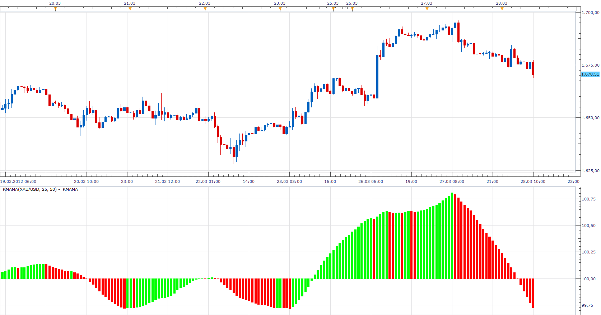

# Kairi (KMAMA)

> Source: https://fxcodebase.com/code/viewtopic.php?f=17&t=15310  
> Forum: 17 · Topic 15310 · 3 post(s)

---

## Kairi (KMAMA)

**Apprentice** · Wed Mar 28, 2012 9:40 am

This indicator is a derivative of the standard indicators, KRI.
The formula by which it is computed.

KMAMA = 100 * (Short SMA [Close] / Long SMA [Close])

 [KMAMA.lua](files/28888/KMAMA.lua)

The indicator was revised and updated

---

## Re: Kairi (KMAMA)

**Alexander.Gettinger** · Tue Nov 18, 2014 4:58 pm

MQL4 version of KMAMA: [viewtopic.php?f=38&t=61474](https://fxcodebase.com/code/viewtopic.php?f=38&t=61474).

---

## Re: Kairi (KMAMA)

**Apprentice** · Wed Jun 28, 2017 5:24 am

The indicator was revised and updated.
