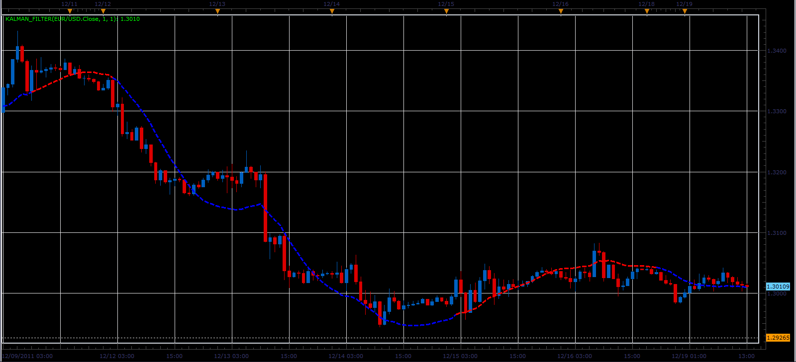

# Kalman filter

> Source: https://fxcodebase.com/code/viewtopic.php?f=17&t=10136  
> Forum: 17 · Topic 10136 · 30 post(s)

---

## Kalman filter

**Alexander.Gettinger** · Mon Dec 19, 2011 1:14 pm

The indicator implements Kalman filter ([http://en.wikipedia.org/wiki/Kalman_filter](https://en.wikipedia.org/wiki/Kalman_filter))

Formulas:
Kalman[i]=Error+Velocity[i], where
Error=Kalman[i-1]+Distance*ShK,
Velocity[i]=Velocity[i-1]+Distance*K/100,
Distance=Price[i]-Kalman[i-1],
ShK=sqrt(Sharpness*K/100).

if Velocity>0, Kalman have a UP color and if Velocity<0, Kalman have a DN color.

 



Download:

 [Kalman_Filter.lua](files/21234/Kalman_Filter.lua)

 [Kalman_Filter Overlay.lua](files/21234/Kalman_Filter%20Overlay.lua)

 [Kalman_Filter with Alert.lua](files/21234/Kalman_Filter%20with%20Alert.lua)

This indicator will provide Audio / Email Alert Kalman filter Lines color change.

 


This indicator will provide Audio / Email Alert on Cross of Two Kalman filter Lines.

 [Kalman_FilterCross Alert.lua](files/21234/Kalman_FilterCross%20Alert.lua)

Dec 25, 2015: Compatibility issue Fix. _Alert helper is not longer needed.

---

## Re: Kalman filter

**Coondawg71** · Fri Oct 11, 2013 8:36 am

Can we please request a Signal/Alert which acknowledges when two periods of the Kalman Filter cross. Indicator can plot a dot at point of cross with user parameters to select size and color or the alert.

buy: Fast Kalman Filter (2.0/2.0) crosses UP through Slow Kalman Filter (0.50/0.5).

sell: Fast Kalman Filter (2.0/2.0) crosses DOWN through Slow Kalman Filter (0.50/0.50).

thanks,

sjc

---

## Re: Kalman filter

**Apprentice** · Sat Oct 12, 2013 4:48 am

Your request is added to the development list.

---

## Re: Kalman filter

**Apprentice** · Sat Oct 12, 2013 6:36 am

Kalman_FilterCross Alert Added.

---

## Re: Kalman filter

**Patrick Sweet** · Thu Nov 14, 2013 4:39 am

Hi,

Quick question.

Below is code from Kalman filter.

Is 'K' updated with each new period close, or is 'K' held constant to the value we input at the start of the indie? Sorry I cannot tell. I add the code here so you do not have to look it up. Thank you!

```lua
local first;
local source = nil;
local K;
local Sharpness;
local ColorMode;
local KalmanFilter;
local Velocity;
local ShK;

function Prepare()
    source = instance.source;
    K=instance.parameters.K;
    Sharpness=instance.parameters.Sharpness;
    ColorMode=instance.parameters.ColorMode;
    first = source:first()+2;
    Velocity = instance:addInternalStream(first, 0);
    local name = profile:id() .. "(" .. source:name() .. ", " .. instance.parameters.K .. ", " .. instance.parameters.Sharpness .. ")";
    instance:name(name);
    KalmanFilter = instance:addStream("KalmanFilter", core.Line, name .. ".KalmanFilter", "KalmanFilter", instance.parameters.MainClr, first);
    KalmanFilter:setWidth(instance.parameters.widthLinReg);
    KalmanFilter:setStyle(instance.parameters.styleLinReg);
    ShK=math.sqrt(Sharpness*K/100);
end

function Update(period, mode)
   if (period>first) then
    local Distance=source[period]-KalmanFilter[period-1];
    local Error=KalmanFilter[period-1]+Distance*ShK;
    Velocity[period]=Velocity[period-1]+Distance*K/100;
    KalmanFilter[period]=Error+Velocity[period];
    if ColorMode then
     if Velocity[period]>=0 then
      KalmanFilter:setColor(period,instance.parameters.UPclr);
     else
      KalmanFilter:setColor(period,instance.parameters.DNclr);
     end
    end
   elseif period==first then
    Velocity[period]=0;
    KalmanFilter[period]=source[period];
   end
end
```

---

## Re: Kalman filter

**Apprentice** · Thu Nov 14, 2013 5:00 am

'K' is held constant to the value we input at the start of the indicator.

---

## Re: Kalman filter

**Patrick Sweet** · Thu Nov 14, 2013 7:08 pm

Thanks. Then I am confused.
The Filter here looks like it does adapt...that is it looks like the Filter adapts (even with K constant as you say). But my eyes may deceive me.

We input K and it remains constant.

It may be terminology and my ignorance. Likely the latter.

But I thought the adaptive part of the of the KF was 'K'.
I thought 'K' would adjust over time (please see text below). And the KF implementation is working pretty well, but I am wondering if we are missing something.

I am sorry to bother. But what is adapting if K is constant? I am not saying the implementation here is wrong. I am just curious about what is happening so I understand 'the hammer' I am using when I swing it.

This below is what I read recently about KAMA..................Whihc may have confused me.

Basically, we start out estimating our guess of the the average and covariance of the hidden series based upon measurements of the observable series, which in this case are simply the normal parameters N(mean, std) used to generate the random walk. From there, the linear matrix equations are used to estimate the values of cov x and x, using linear matrix operations. The key is that once an estimate is made, the value of the covariance of x is then checked against the actual observable time series value, y, and a parameter called K is adjusted to update the prior estimates. Each time K is updated, the value of the estimate of x is updated via:
xt_new_est=xt_est + K*(zt - H*x_est). The value of K generally converges to a stable value, when the underlying series is truly gaussian (as seen in fig 1. during the start of the series, it learns). After a few iterations, the optimal value of K is pretty stable, so the model has learned or adapted to the underlying series.

---

## Re: Kalman filter

**Apprentice** · Fri Nov 15, 2013 3:14 am

```lua
local Distance=source[period]-KalmanFilter[period-1];
    local Error=KalmanFilter[period-1]+Distance*ShK;
    Velocity[period]=Velocity[period-1]+Distance*K/100;
    KalmanFilter[period]=Error+Velocity[period];
```

Adjustment is based on the difference between the closing price and the previous values ​​of KalmanFilter.

---

## Re: Kalman filter

**Patrick Sweet** · Fri Nov 15, 2013 5:20 pm

Hi,

First, I like the implementation. It is good. And you guys are GREAT!

But I think we are missing something.

I see a nice updating in the code based on user constants that set the 'error'.

But I think Kalman is more than updating. I love what you do. I am not trying to start a debate. I sure I would lose rather quickly!

But what I see is updating based on a set of constants applied to the distance (and velocity) from the past periods to the current period at close. Correct?

Kalman uses a 'prediction' for the current value, then compares that prediction to the actual value after close, to adapt the error factor in the formula? I don't see this happening or am I missing this?

In short, Kalman in TStation (a GOOD implementation!) But I think is actually not maximising what Kalman does.

I think I see a real value for the current period being placed at close, when Kalman already has a number at OPEN for the current period and uses that. Then at close, it checks the 'error' in that estimate, then slowly adapts K or Shk to make better and better estimates for the current period. I think? And recurses forward (not backward like Hodrick-Prescott Filter) thus avoiding repainting troubles.

But the magnitude of the 'error' in any given period is mostly a function of the constants I put in and price movement and the constants that are entered never 'adapt' to real data.. ShK=math.sqrt(Sharpness*K/100) and these are constants. The only variable for error is 'Distance' and the last observation (I think I see below) but there is no 'adaptation' for the calculation of error based on previous errors...it is just a new value based on the most recent price move (and the constants applied to that).

 local Error=KalmanFilter[period-1]+Distance*ShK;
 Velocity[period]=Velocity[period-1]+Distance*K/100;
 KalmanFilter[period]=Error+Velocity[period];

So the new KalmanFilter value is an update based on what happened, whereas and the 'predictive' loop that would inform the 'kalman error term' is missing in this implementation?

If I actually understand Kalman correctly, it is entirely possible that I do not undersand the TS code and for this I apologise for taking your time to even read this. You guys are GREAT! But are we not missing something?

Below is an excerpt on Kalman......................Thanks Patrick

But are we not missing the true 'adaptiveness' of Kalman?

The Kalman filter can be written as a single equation, however it is most often conceptualized as two distinct phases: "Predict" and "Update". The predict phase uses the state estimate from the previous timestep to produce an estimate of the state at the current timestep. This predicted state estimate is also known as the a priori state estimate because, although it is an estimate of the state at the current timestep, it does not include observation information from the current timestep. In the update phase, the current a priori prediction is combined with current observation information to refine the state estimate. This improved estimate is termed the a posteriori state estimate

---

## Re: Kalman filter

**Apprentice** · Sat Nov 16, 2013 3:25 am

its entirety possible to have multiple versions ot this indicator.
As stated, this is a translation of MQ4 template.
If u have implementation, formula or description you want to use on MarketScope.
Please post it below.

---

## Re: Kalman filter

**Patrick Sweet** · Sat Nov 16, 2013 3:43 pm

Ok.
Here is one that purports to be correct. I have no idea how much work it is to convert from mq4 and I cannot read their code so I do not know if it achieves what I hope. It offers StdDev lines as well.

Can you try it?

---

## Re: Kalman filter

**Apprentice** · Sun Nov 17, 2013 3:30 am

It have very different code, it is also much more complex.
Added to the development list.

---

## Re: Kalman filter

**Patrick Sweet** · Mon Nov 18, 2013 8:34 am

Thank you!
It proposes to be a true Kalman and I think it would be a fantastic addition to the FXCODEBase if we brought it in a true adaptive Filter!
I am pretty certain others who understand adaptiveness will immediately put it to use!
I hold my breath hoping you get the time to add this valuable indicator to all or our toolboxes!
Keep up the great work!
P

---

## Re: Kalman filter

**StefPasc** · Mon Nov 18, 2013 10:44 am

> **Patrick Sweet wrote:**
> Thank you!
> It proposes to be a true Kalman and I think it would be a fantastic addition to the FXCODEBase if we brought it in a true adaptive Filter!
> I am pretty certain others who understand adaptiveness will immediately put it to use!
> I hold my breath hoping you get the time to add this valuable indicator to all or our toolboxes!
> Keep up the great work!
> P

+1

---

## Re: Kalman filter

**Coondawg71** · Mon Nov 18, 2013 2:51 pm

I am finding Kalman Filter of greater and greater use! It is one of the most widely used filter of data in industry, also one of the most confusing to understand. Another form of this great indicator would be of great interest to me!

Thanks for all your time and efforts!

sjc

+1

---

## Re: Kalman filter

**voodoopips** · Mon Dec 30, 2013 4:42 pm

I want an alert every time the filter changes colors. Thank You.

---

## Re: Kalman filter

**Apprentice** · Tue Dec 31, 2013 4:57 am

Kalman_Filter with Alert Added

---

## Re: Kalman filter

**Patrick Sweet** · Tue Dec 31, 2013 6:28 am

Happy end-of-year and thanks!
Is it possible to get the additional Kalman Filter implementation back on track, too?
The code provided above updates K which helps make Kalman truly adaptive and I am crossing my fingers and toes that we can try this new beauty soon?
Have great holidays!
All the very best to all!
Patrick

---

## Re: Kalman filter

**Apprentice** · Wed Jan 01, 2014 3:09 am

Please explain, I do not understand your request.

---

## Re: Kalman filter

**Patrick Sweet** · Wed Jan 01, 2014 1:05 pm

Happy New Year!
8 posts above this one I attached an MT4 alternative implementation of the Kalman Filter that I think actually has an adaptive 'K' as opposed to the current MScope Kalman implementation that only adapts by looking back (instead of using an adaptive K). YOu enthusiastically added it to the development que and I am hoping that its translation to lua could be done soon? When I requested an 'adaptive K'- based Kalman you had kindly asked me to provide some code....which is what is attached above (8 posts above). Again, happy new year and I hope all goes well! The adaptive K in the Kalman Filter is what really makes Kalman different than other MAs....in that it adjusts the *K* itself.
Patrick

---

## Re: Kalman filter

**Patrick Sweet** · Mon Mar 24, 2014 7:57 am

Adaptive K-based kalman....attached is a presentation and about half way into it it explains how a 'true' Kalman filter is created with emphasis on the adaptive K side and more.

 [Mesa Software, Predictive Indicators.pdf](files/93203/Mesa%20Software%20Predictive%20Indicators.pdf)

Perhaps this will help?

I hope so!

All the best! Patrick

---

## Re: Kalman filter

**southflm11** · Fri May 30, 2014 9:30 pm

I have been using the Kalman indicator for a few months know . what I would like to know if it can be added to a strategy or added to the averages indicator ?

 Thank you in advance
 Mark

---

## Re: Kalman filter

**Apprentice** · Sat May 31, 2014 7:47 am

Can you describe such a strategy.

---

## Re: Kalman filter

**southflm11** · Sat May 31, 2014 3:03 pm

Apprentice ,I am adding a picture of how the strategy will work .In the pic when the color changes from red to green it will take a long trade and when it goes green to red it takes a short trade .there will be no stops or limits it will just follow the market all week . I hope this picture helps . Mark

---

## Re: Kalman filter

**Apprentice** · Mon Jun 02, 2014 3:58 am

Requested can be found here.
[viewtopic.php?f=31&t=60754](https://fxcodebase.com/code/viewtopic.php?f=31&t=60754)

---

## Re: Kalman filter

**southflm11** · Mon Jun 02, 2014 2:24 pm

Apprentice,
 I would like to thank you very much for the Kalman strategy .I have only been on the forum for a few day .I didn't think I would get such a quick replay .This site is Awesome

 New Member
 Mark

---

## Re: Kalman filter

**Apprentice** · Tue Jul 18, 2017 6:48 am

The indicator was revised and updated.

---

## Re: Kalman filter

**easytrading** · Wed Aug 15, 2018 3:17 am

Hello Apprentice,

could we please , have price overlay for Kalman_Filter with Alert.lua based on every time line change his color with my appreciation. (and if you please, to add this kind of price overlay to Generic Overlay Indicator filter types of overlay .that will be great help to us with many many thanks) .

---

## Re: Kalman filter

**Apprentice** · Wed Aug 15, 2018 5:55 am

Kalman_Filter Overlay.lua added.

---

## Re: Kalman filter

**Apprentice** · Wed Aug 15, 2018 6:11 am

Line color option added for Generic Overlay.lua
[viewtopic.php?f=17&t=62211](https://fxcodebase.com/code/viewtopic.php?f=17&t=62211)
