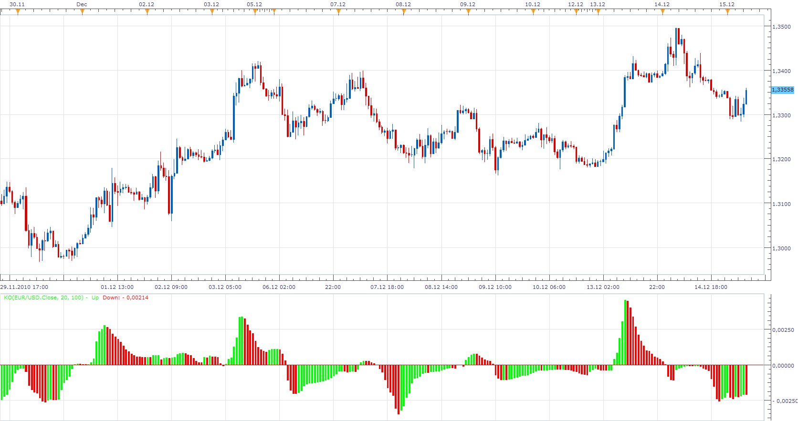

# KAMA Oscillator

> Source: https://fxcodebase.com/code/viewtopic.php?f=17&t=2961  
> Forum: 17 · Topic 2961 · 5 post(s)

---

## KAMA Oscillator

**Apprentice** · Wed Dec 15, 2010 7:22 am

KO= KAMA(100) - KAMA (20)

 [KO.lua](files/6782/KO.lua)

---

## Re: KAMA Oscillator

**Apprentice** · Wed Feb 01, 2017 7:32 am

Indicator was revised and updated.

---

## Re: KAMA Oscillator

**Cuchulain** · Thu Oct 12, 2017 3:50 pm

Hello,

i try this, but when i change the kama 100 value, the graph dont change (when the kama 20 yes)

It is normal?

thx for alllllll your works.
regards

---

## Re: KAMA Oscillator

**Apprentice** · Fri Oct 13, 2017 2:18 am

Fixed.

---

## Re: KAMA Oscillator

**Apprentice** · Sat Sep 08, 2018 9:54 am

The Indicator was revised and updated.
