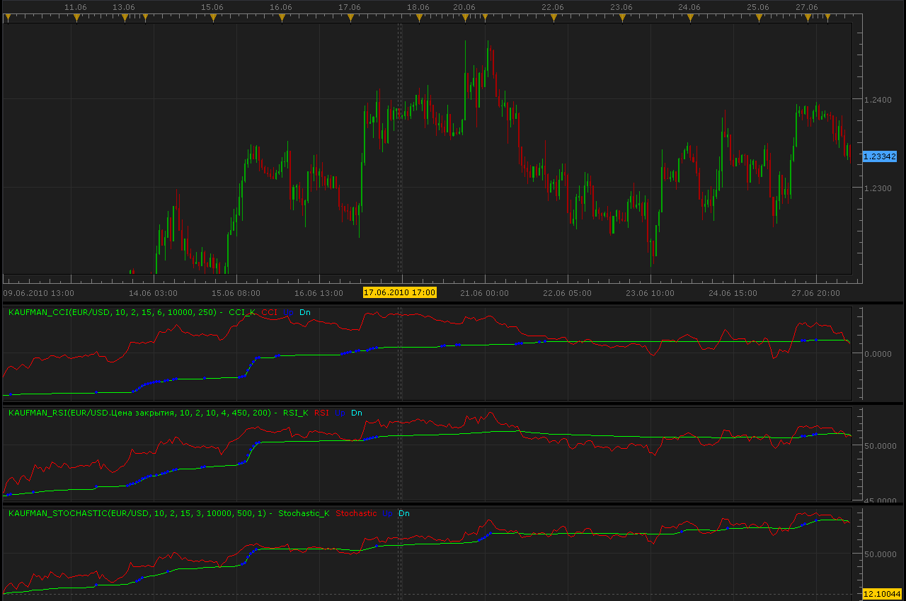

# Kaufman RSI,CCI and Stochastic

> Source: https://fxcodebase.com/code/viewtopic.php?f=17&t=1418  
> Forum: 17 · Topic 1418 · 4 post(s)

---

## Kaufman RSI,CCI and Stochastic

**Alexander.Gettinger** · Mon Jun 28, 2010 8:12 am

Developed by Perry Kaufman, this indicators using an Efficiency Ratio to modify the smoothing constant, which ranges from a minimum of Fast Length to a maximum of Slow Length.

Formulas:
Ind - indicator (CCI, RSI, Stochastic)
AMA0=Ind(current-1);
signal=Abs(Ind(current)-Ind(current-periodAMA));
noise=SUM(Abs(Ind(current-i)-Ind(current-i-1)));
ER=signal/noise;
ERSC=ER/(fast-slow);
SSC=ERSC+slow;
AMA=AMA0+SSC^G*(Ind(current)-AMA0);
Caufman_Ind=AMA;

 

Kaufman CCI:

Code: [Select all](https://fxcodebase.com/code/)
`function Init()
    indicator:name("Kaufman CCI");
    indicator:description("Kaufman CCI");
    indicator:requiredSource(core.Bar);
    indicator:type(core.Oscillator);
   
    indicator.parameters:addInteger("periodAMA", "periodAMA", "period of AMA", 10);
    indicator.parameters:addInteger("nfast", "nfast", "nfast", 2);
    indicator.parameters:addInteger("nslow", "nslow", "nslow", 15);
    indicator.parameters:addDouble("G", "G", "G", 6);
    indicator.parameters:addDouble("dK", "dK", "dK", 10000);
    indicator.parameters:addInteger("CCI", "CCI", "CCI", 250);

    indicator.parameters:addColor("clr1", "Color of CCI_K", "Color of CCI_K", core.rgb(0, 255, 0));
    indicator.parameters:addColor("clr2", "Color of CCI", "Color of CCI", core.rgb(255, 0, 0));
    indicator.parameters:addColor("clr3", "Up Color", "Up Color", core.rgb(0, 0, 255));
    indicator.parameters:addColor("clr4", "Dn Color", "Dn Color", core.rgb(0, 255, 255));
end

local first;
local source = nil;
local periodAMA;
local nfast;
local nslow;
local G;
local dK;
local CCI;
local CCI_Ind;
local buff1;
local buff2;
local buff3;
local buff4;
local AMA0;

function Prepare()
    source = instance.source;
    periodAMA=instance.parameters.periodAMA;
    nfast=instance.parameters.nfast;
    nslow=instance.parameters.nslow;
    G=instance.parameters.G;
    dK=instance.parameters.dK;
    CCI=instance.parameters.CCI;
    CCI_Ind = core.indicators:create("CCI", source, CCI);
    first = CCI_Ind.DATA:first()+2;
    local name = profile:id() .. "(" .. source:name() .. ", " .. instance.parameters.periodAMA .. ", " .. instance.parameters.nfast .. ", " .. instance.parameters.nslow .. ", " .. instance.parameters.G .. ", " .. instance.parameters.dK .. ", " .. instance.parameters.CCI .. ")";
    instance:name(name);
    buff1 = instance:addStream("buff1", core.Line, name .. ".CCI_K", "CCI_K", instance.parameters.clr1, first);
    buff2 = instance:addStream("buff2", core.Line, name .. ".CCI", "CCI", instance.parameters.clr2, first);
    buff3 = instance:createTextOutput ("Up", "Up", "Wingdings", 10, core.H_Center, core.V_Center, instance.parameters.clr3, first);
    buff4 = instance:createTextOutput ("Dn", "Dn", "Wingdings", 10, core.H_Center, core.V_Center, instance.parameters.clr4, first);
end

function Update(period, mode)
    CCI_Ind:update(mode);
    if (period>first+periodAMA) then
     local slowSC=2./(nslow+1.);
     local fastSC=2./(nfast+1.);
     buff2[period]=CCI_Ind.DATA[period];
     local signal=math.abs(CCI_Ind.DATA[period]-CCI_Ind.DATA[period-periodAMA]);
     local noise=0.000000001;
     for i=period-periodAMA+1,period,1 do
      noise=noise+math.abs(CCI_Ind.DATA[i]-CCI_Ind.DATA[i-1]);
     end
     local ER=signal/noise;
     local dSC=fastSC-slowSC;
     local ERSC=ER*dSC;
     local SSC=ERSC+slowSC;
     local AMA=AMA0+math.pow(SSC,G)*(CCI_Ind.DATA[period]-AMA0);
     buff1[period]=AMA;
     local ddK=AMA-AMA0;
     if math.abs(ddK)>dK*source:pipSize() and ddK>0. then
      buff3:set(period, AMA, "\159", "");
     end
     if math.abs(ddK)>dK*source:pipSize() and ddK<0. then
      buff4:set(period, AMA, "\159", "");
     end
     AMA0=AMA;
    else
     AMA0=CCI_Ind.DATA[period-1];
    end
end`

Kaufman RSI:

Code: [Select all](https://fxcodebase.com/code/)
`function Init()
    indicator:name("Kaufman RSI");
    indicator:description("Kaufman RSI");
    indicator:requiredSource(core.Tick);
    indicator:type(core.Oscillator);
   
    indicator.parameters:addInteger("periodAMA", "periodAMA", "period of AMA", 10);
    indicator.parameters:addInteger("nfast", "nfast", "nfast", 2);
    indicator.parameters:addInteger("nslow", "nslow", "nslow", 10);
    indicator.parameters:addDouble("G", "G", "G", 4);
    indicator.parameters:addDouble("dK", "dK", "dK", 450);
    indicator.parameters:addInteger("RSI", "RSI", "RSI", 200);

    indicator.parameters:addColor("clr1", "Color of RSI_K", "Color of RSI_K", core.rgb(0, 255, 0));
    indicator.parameters:addColor("clr2", "Color of RSI", "Color of RSI", core.rgb(255, 0, 0));
    indicator.parameters:addColor("clr3", "Up Color", "Up Color", core.rgb(0, 0, 255));
    indicator.parameters:addColor("clr4", "Dn Color", "Dn Color", core.rgb(0, 255, 255));
end

local first;
local source = nil;
local periodAMA;
local nfast;
local nslow;
local G;
local dK;
local RSI;
local RSI_Ind;
local buff1;
local buff2;
local buff3;
local buff4;
local AMA0;

function Prepare()
    source = instance.source;
    periodAMA=instance.parameters.periodAMA;
    nfast=instance.parameters.nfast;
    nslow=instance.parameters.nslow;
    G=instance.parameters.G;
    dK=instance.parameters.dK;
    RSI=instance.parameters.RSI;
    RSI_Ind = core.indicators:create("RSI", source, RSI);
    first = RSI_Ind.DATA:first()+2;
    local name = profile:id() .. "(" .. source:name() .. ", " .. instance.parameters.periodAMA .. ", " .. instance.parameters.nfast .. ", " .. instance.parameters.nslow .. ", " .. instance.parameters.G .. ", " .. instance.parameters.dK .. ", " .. instance.parameters.RSI .. ")";
    instance:name(name);
    buff1 = instance:addStream("buff1", core.Line, name .. ".RSI_K", "RSI_K", instance.parameters.clr1, first);
    buff2 = instance:addStream("buff2", core.Line, name .. ".RSI", "RSI", instance.parameters.clr2, first);
    buff3 = instance:createTextOutput ("Up", "Up", "Wingdings", 10, core.H_Center, core.V_Center, instance.parameters.clr3, first);
    buff4 = instance:createTextOutput ("Dn", "Dn", "Wingdings", 10, core.H_Center, core.V_Center, instance.parameters.clr4, first);
end

function Update(period, mode)
    RSI_Ind:update(mode);
    if (period>first+periodAMA) then
     local slowSC=2./(nslow+1.);
     local fastSC=2./(nfast+1.);
     buff2[period]=RSI_Ind.DATA[period];
     local signal=math.abs(RSI_Ind.DATA[period]-RSI_Ind.DATA[period-periodAMA]);
     local noise=0.000000001;
     for i=period-periodAMA+1,period,1 do
      noise=noise+math.abs(RSI_Ind.DATA[i]-RSI_Ind.DATA[i-1]);
     end
     local ER=signal/noise;
     local dSC=fastSC-slowSC;
     local ERSC=ER*dSC;
     local SSC=ERSC+slowSC;
     local AMA=AMA0+math.pow(SSC,G)*(RSI_Ind.DATA[period]-AMA0);
     buff1[period]=AMA;
     local ddK=AMA-AMA0;
     if math.abs(ddK)>dK*source:pipSize() and ddK>0. then
      buff3:set(period, AMA, "\159", "");
     end
     if math.abs(ddK)>dK*source:pipSize() and ddK<0. then
      buff4:set(period, AMA, "\159", "");
     end
     AMA0=AMA;
    else
     AMA0=RSI_Ind.DATA[period-1];
    end
end`
MT4/Mq4 version.
[viewtopic.php?f=38&t=63899](https://fxcodebase.com/code/viewtopic.php?f=38&t=63899)

---

## Re: Kaufman RSI,CCI and Stochastic

**Alexander.Gettinger** · Mon Jun 28, 2010 8:13 am

KAufman Stochastic:

Code: [Select all](https://fxcodebase.com/code/)
`function Init()
    indicator:name("Kaufman Stochastic");
    indicator:description("Kaufman Stochastic");
    indicator:requiredSource(core.Bar);
    indicator:type(core.Oscillator);
   
    indicator.parameters:addInteger("periodAMA", "periodAMA", "period of AMA", 10);
    indicator.parameters:addInteger("nfast", "nfast", "nfast", 2);
    indicator.parameters:addInteger("nslow", "nslow", "nslow", 15);
    indicator.parameters:addDouble("G", "G", "G", 3);
    indicator.parameters:addDouble("dK", "dK", "dK", 10000);
    indicator.parameters:addInteger("KPeriod", "KPeriod", "KPeriod", 500);
    indicator.parameters:addInteger("slowing", "slowing", "slowing", 1);

    indicator.parameters:addColor("clr1", "Color of Stochastic_K", "Color of Stochastic_K", core.rgb(0, 255, 0));
    indicator.parameters:addColor("clr2", "Color of Stochastic", "Color of Stochastic", core.rgb(255, 0, 0));
    indicator.parameters:addColor("clr3", "Up Color", "Up Color", core.rgb(0, 0, 255));
    indicator.parameters:addColor("clr4", "Dn Color", "Dn Color", core.rgb(0, 255, 255));
end

local first;
local source = nil;
local periodAMA;
local nfast;
local nslow;
local G;
local dK;
local KPeriod;
local slowing;
local Stochastic_Ind;
local buff1;
local buff2;
local buff3;
local buff4;
local AMA0;

function Prepare()
    source = instance.source;
    periodAMA=instance.parameters.periodAMA;
    nfast=instance.parameters.nfast;
    nslow=instance.parameters.nslow;
    G=instance.parameters.G;
    dK=instance.parameters.dK;
    KPeriod=instance.parameters.KPeriod;
    slowing=instance.parameters.slowing;
    Stochastic_Ind = core.indicators:create("STOCHASTIC", source, KPeriod,slowing,1);
    first = Stochastic_Ind.DATA:first()+2;
    local name = profile:id() .. "(" .. source:name() .. ", " .. instance.parameters.periodAMA .. ", " .. instance.parameters.nfast .. ", " .. instance.parameters.nslow .. ", " .. instance.parameters.G .. ", " .. instance.parameters.dK .. ", " .. instance.parameters.KPeriod .. ", " .. instance.parameters.slowing .. ")";
    instance:name(name);
    buff1 = instance:addStream("buff1", core.Line, name .. ".Stochastic_K", "Stochastic_K", instance.parameters.clr1, first);
    buff2 = instance:addStream("buff2", core.Line, name .. ".Stochastic", "Stochastic", instance.parameters.clr2, first);
    buff3 = instance:createTextOutput ("Up", "Up", "Wingdings", 10, core.H_Center, core.V_Center, instance.parameters.clr3, first);
    buff4 = instance:createTextOutput ("Dn", "Dn", "Wingdings", 10, core.H_Center, core.V_Center, instance.parameters.clr4, first);
end

function Update(period, mode)
    Stochastic_Ind:update(mode);
    if (period>first+periodAMA) then
     local slowSC=2./(nslow+1.);
     local fastSC=2./(nfast+1.);
     buff2[period]=Stochastic_Ind.DATA[period];
     local signal=math.abs(Stochastic_Ind.DATA[period]-Stochastic_Ind.DATA[period-periodAMA]);
     local noise=0.000000001;
     for i=period-periodAMA+1,period,1 do
      noise=noise+math.abs(Stochastic_Ind.DATA[i]-Stochastic_Ind.DATA[i-1]);
     end
     local ER=signal/noise;
     local dSC=fastSC-slowSC;
     local ERSC=ER*dSC;
     local SSC=ERSC+slowSC;
     local AMA=AMA0+math.pow(SSC,G)*(Stochastic_Ind.DATA[period]-AMA0);
     buff1[period]=AMA;
     local ddK=AMA-AMA0;
     if math.abs(ddK)>dK*source:pipSize() and ddK>0. then
      buff3:set(period, AMA, "\159", "");
     end
     if math.abs(ddK)>dK*source:pipSize() and ddK<0. then
      buff4:set(period, AMA, "\159", "");
     end
     AMA0=AMA;
    else
     AMA0=Stochastic_Ind.DATA[period-1];
    end
end`

---

## Re: Kaufman RSI,CCI and Stochastic

**boursicoton** · Mon Jun 28, 2010 10:10 am

for me kaufman sto give a black screen...., cci and rsi are good...
a bug for france ?

edit : i understand the problem...data !!! it's ok now !

---

## Re: Kaufman RSI,CCI and Stochastic

**Apprentice** · Mon Feb 05, 2018 7:24 am

The Indicator was revised and updated.
