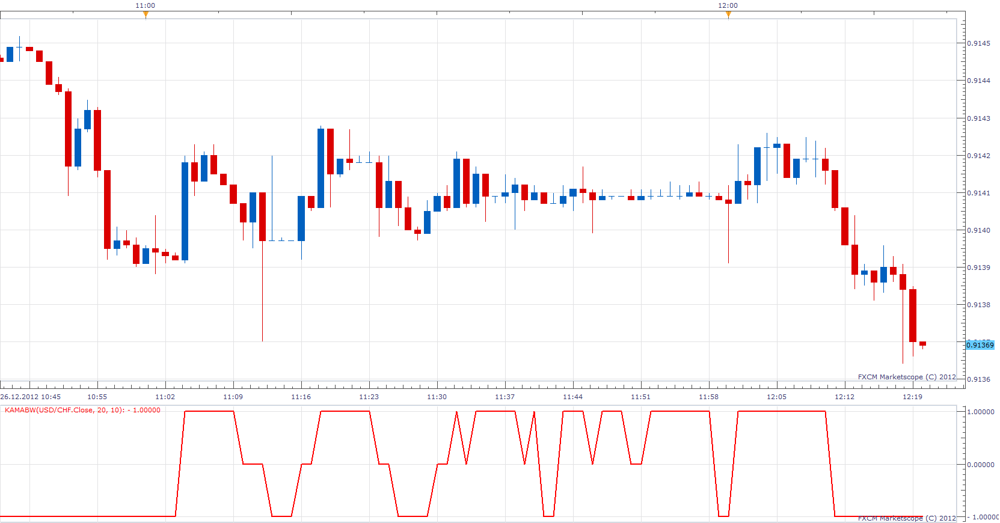

# Kaufman's Adaptive Moving Average Binary Wave

> Source: https://fxcodebase.com/code/viewtopic.php?f=17&t=27977  
> Forum: 17 · Topic 27977 · 2 post(s)

---

## Kaufman's Adaptive Moving Average Binary Wave

**Apprentice** · Wed Dec 26, 2012 6:14 am

 [KAMABW.lua](files/49092/KAMABW.lua)

The indicator was revised and updated

---

## Re: Kaufman's Adaptive Moving Average Binary Wave

**Apprentice** · Tue May 02, 2017 11:50 am

Indicator was revised and updated.
