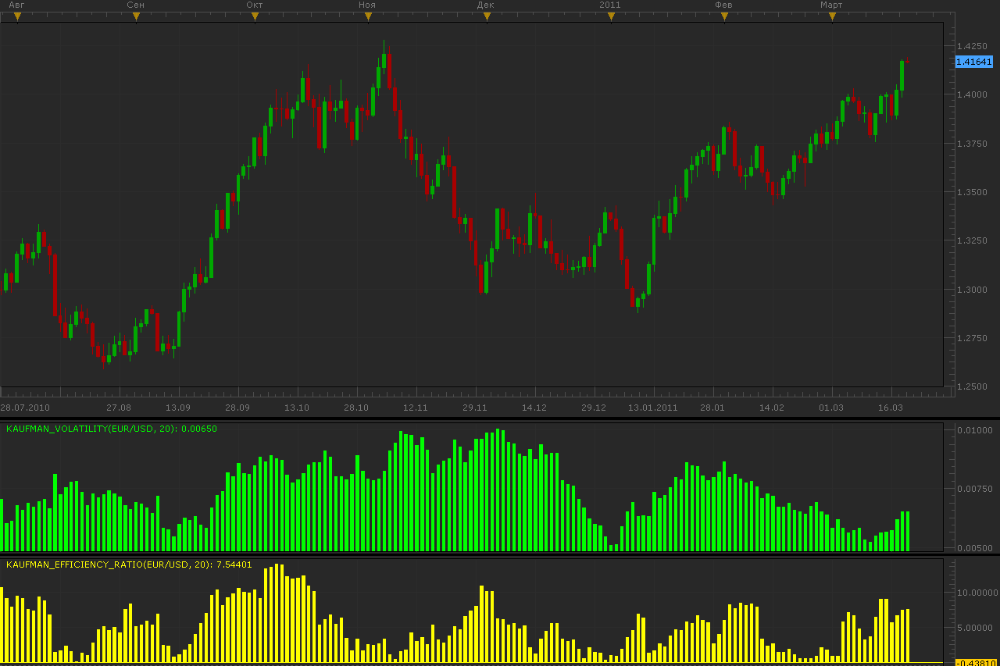
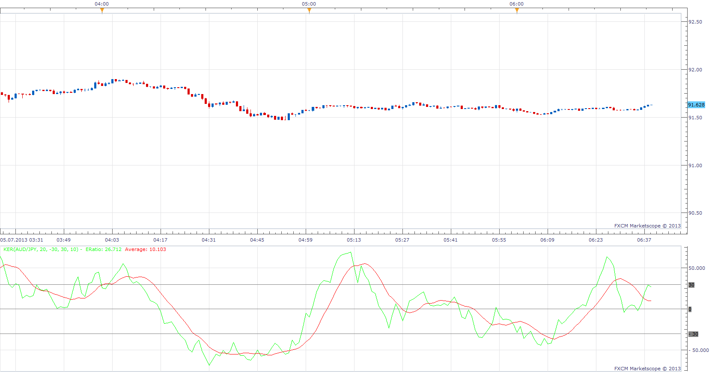

# Kaufman volatility and efficiency ratio indicators

> Source: https://fxcodebase.com/code/viewtopic.php?f=17&t=3683  
> Forum: 17 · Topic 3683 · 6 post(s)

---

## Kaufman volatility and efficiency ratio indicators

**Alexander.Gettinger** · Mon Mar 21, 2011 2:09 am

Indicators is written according to Perry Kaufman books "Smarter Trading" and "Trading Systems & Methods".

Formulas for volatility indicator:
Volatility[i]=(DiffPrice[i]+DiffPrice[i-1]+...+DiffPrice[i-Period])/Period, where
DiffPrice[i]=Abs(close[i]-close[i-1]).

Formulas for efficiency ratio indicators:
Ratio[i]=Abs(close[i]-close[i-Period])/Volatility(i).

 

Download Kaufman volatility indicator:

 [Kaufman_Volatility.lua](files/8911/Kaufman_Volatility.lua)

Download Kaufman efficiency ratio indicator:

 [Kaufman_Efficiency_Ratio.lua](files/8911/Kaufman_Efficiency_Ratio.lua)

---

## Re: Kaufman volatility and efficiency ratio indicators

**nazaar** · Tue Mar 06, 2012 12:53 am

hello,

any suggestion how to interpret and trade these indicators?

thank you.

---

## Re: Kaufman volatility and efficiency ratio indicators

**Coondawg71** · Thu Jul 04, 2013 10:23 am

Can we please request this version of Kaufman Efficiency Ratio Indicator converted to lua.

thanks,

sjc
[http://www.thinkscripter.com/indicator/ ... ncy-ratio/](http://www.thinkscripter.com/indicator/kaufman-efficiency-ratio/)

---

## Re: Kaufman volatility and efficiency ratio indicators

**Apprentice** · Fri Jul 05, 2013 6:01 am

incrementalTotalChang = math.abs(median - median[-1]);
NetChange =median -median[length];
TotalChange =sum(incrementalTotalChange, length);
ERatio = (NetChange/TotalChange) * 100;
Average = Avg of ERatio

 [KER.lua](files/71429/KER.lua)

---

## Re: Kaufman volatility and efficiency ratio indicators

**Apprentice** · Sun Mar 08, 2015 7:44 am

Bump Up.

---

## Re: Kaufman volatility and efficiency ratio indicators

**Apprentice** · Mon Oct 29, 2018 7:23 am

The indicator was revised and updated.
