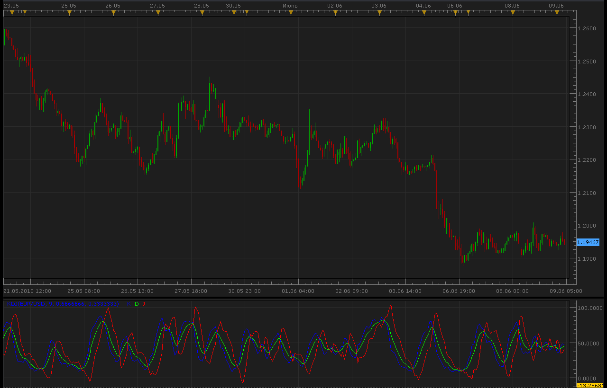

# KDJ Indicator

> Source: https://fxcodebase.com/code/viewtopic.php?f=17&t=1290  
> Forum: 17 · Topic 1290 · 8 post(s)

---

## KDJ Indicator

**Alexander.Gettinger** · Wed Jun 09, 2010 4:11 am

K line is :
K = ((Current Close – Lowest Low) / (Highest high – Lowest low))* 100

D is simple moving average of the K line. Usually D is 3 day simple moving average of K line but it depends on what trader wants to choose. We have used exponential average.
D = N day simple moving average of K line

‘J’ is the divergence of ‘D’ value from the ‘K’ value.
J = (3*D) – (2*K)

An example of a strategy rules:

Buy – When ‘J’ line crosses above the 50 mark
Sell – When the ‘J’ line crosses below the 50 mark

 

 [KDJ.lua](files/2462/KDJ.lua)

 [KDJ Averages.lua](files/2462/KDJ%20Averages.lua)

Averages indicator can be found here.
[viewtopic.php?f=17&t=2430&hilit=averages](https://fxcodebase.com/code/viewtopic.php?f=17&t=2430&hilit=averages)

Indicator-Based strategy
[https://fxcodebase.com/code/viewtopic.php?f=31&t=71639](https://fxcodebase.com/code/viewtopic.php?f=31&t=71639)

---

## Re: KDJ Indicator

**leonala** · Fri Jun 03, 2011 2:11 am

Thanks very much. It's really useful.
Moreover, seems the J value calculated by the indicator is incorrect. J =3*K-2*D, but in lua file it's 3*D-2K.....

---

## Re: KDJ Indicator

**Apprentice** · Fri Jun 03, 2011 2:34 am

I checked.
The formula is same.

Mq4
 percentJ[i] = 3 * percentD[i] - 2 * percentK[i];

Lua
 buff_J[period]=3.*buff_D[period]-2.*buff_K[period];

---

## Re: KDJ Indicator

**leonala** · Fri Jun 03, 2011 4:17 am

Thanks for reply.
I misunderstand the definition of J value, both of 3K-2D and 3D-2K are okay, and the accuracy of each one depends on market.
Thanks again.

---

## Re: KDJ Indicator

**Apprentice** · Sun Mar 12, 2017 6:08 pm

Indicator was revised and updated.

---

## Re: KDJ Indicator

**weijing** · Fri Jul 02, 2021 11:44 pm

dear apprentice:
the indicator works abnormally. the reason is that the formula given is incorrect. will yoou please revise the indicator again? following this formula:

RSV = ((Current Close – Lowest Low<in 9 periods>) / (Highest high<9> – Lowest low<9>))* 100

K line is 3 periods simple averrage of the RSV data .
K = N day simple moving average of RSV

D line is simple moving average of the K line. Usually D is 3 day simple moving average of K line depends on what trader wants to choose.
D = N day simple moving average of K line

‘J’ line is the divergence of ‘D’ value from the ‘K’ value.
J = (3*K) – (2*D)

---

## Re: KDJ Indicator

**Apprentice** · Sun Jul 04, 2021 4:03 am

Your request is added to the development list.
Development reference 612.

---

## Re: KDJ Indicator

**Apprentice** · Sun Jul 04, 2021 4:29 am

Try this version.
[https://fxcodebase.com/code/viewtopic.php?f=17&t=71315](https://fxcodebase.com/code/viewtopic.php?f=17&t=71315)
