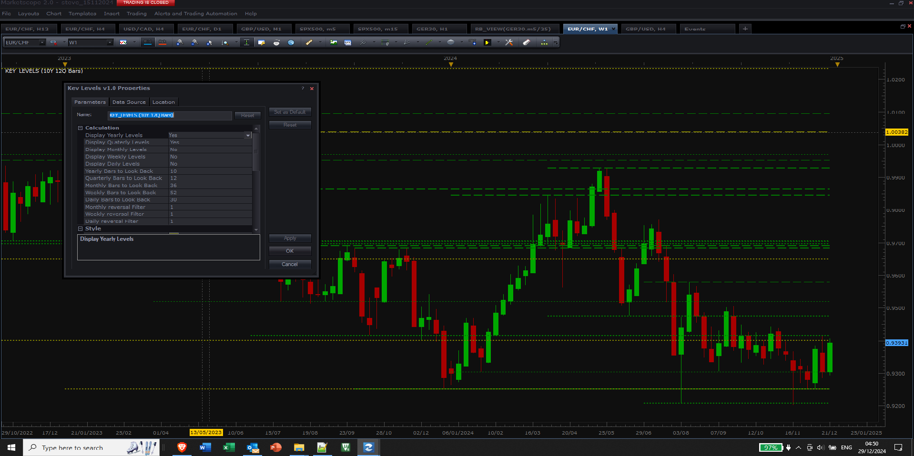
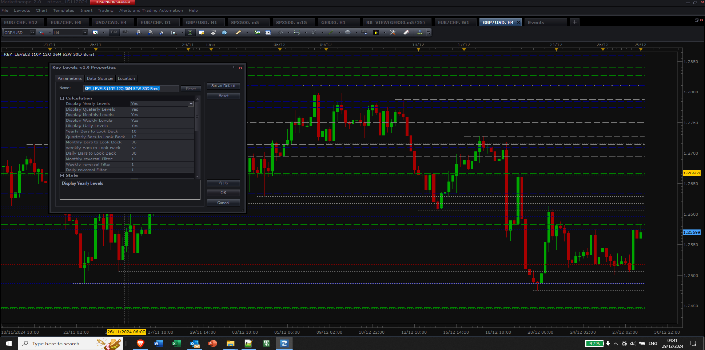
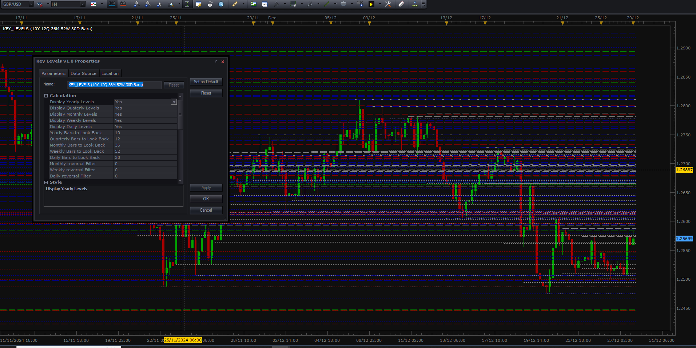
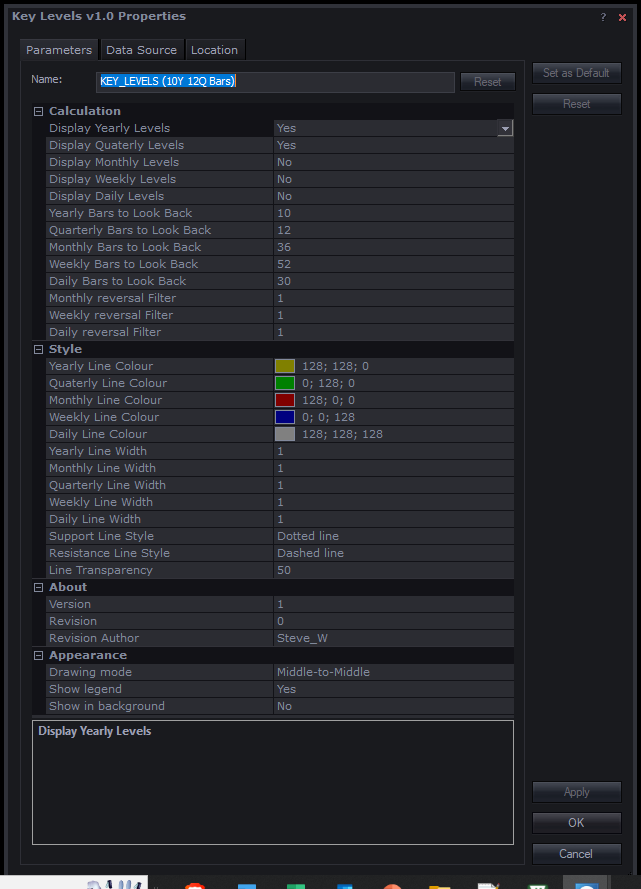

# Key Levels Indicator

> Source: https://fxcodebase.com/code/viewtopic.php?f=17&t=75447  
> Forum: 17 · Topic 75447 · 2 post(s)

---

## Key Levels Indicator

**Steve_W** · Sun Dec 29, 2024 12:48 am

Hi all,

This indicator helps to identify key levels that may act as future support or resistance based on reversals from Yearly, Quarterly, Monthly, Weekly and Daily candles. The main idea is that reversals from longer timeframe candles may be more important for future price action - for example big players position trading.

The calculation lookback period for each candle timeframe can be adjusted.
Reversals are calculated via fractals. For Monthly, Weekly and Daily candles, there is an optional filter setting to show lines with stronger reversal - this can reduce line clutter.

It's a remix of some old code I wrote. One issue/feature is you have to zoom out a bit to get the longer timeframe lines to first appear (historical data loading), but can zoom back in afterwards.

For more background, the general idea comes from Paul Langham of [http://www.exacttrading.com](http://www.exacttrading.com), but is further developed here with filters.

Steve

 [key_levels.lua](files/157620/key_levels.lua)

 

*EURCHF W1 with Yearly and Quarterly levels*

 

*GBPUSD H4 with all lines and filters*

 

*GBPUSD H4 with all lines and no filters*

 

*Indicator options*

---

## Re: Key Levels Indicator

**ahmedalhosenyy** · Sun Apr 06, 2025 10:58 am

NiceIndicator .

thanks
