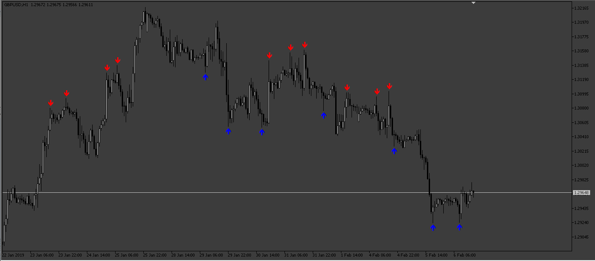

# Key Resistance Support Level

> Source: https://fxcodebase.com/code/viewtopic.php?f=17&t=74652  
> Forum: 17 · Topic 74652 · 11 post(s)

---

## Key Resistance Support Level

**Apprentice** · Thu Feb 29, 2024 10:56 am

Based on the request.
[https://fxcodebase.com/code/viewtopic.php?f=27&p=154514](https://fxcodebase.com/code/viewtopic.php?f=27&p=154514)
Advanced fractal on steroids.

 [Key Resistance Support Level.lua](files/154548/Key%20Resistance%20Support%20Level.lua)

MT5 version.
[https://fxcodebase.com/code/viewtopic.php?f=38&t=74782](https://fxcodebase.com/code/viewtopic.php?f=38&t=74782)

---

## Re: Key Resistance Support Level

**KissMyAce** · Sat Mar 30, 2024 5:00 pm

> **Apprentice wrote:**
>
>
> XAUUSD m5 (02-29-2024 1655).png
>
>
> Based on the request.
> [https://fxcodebase.com/code/viewtopic.php?f=27&p=154514](https://fxcodebase.com/code/viewtopic.php?f=27&p=154514)
> Advanced fractal on steroids.
>
>
> Key Resistance Support Level.lua

Have you got this for mt4

---

## Re: Key Resistance Support Level

**Apprentice** · Fri Apr 05, 2024 6:11 pm

We have added your request to the development list.
Development reference 293

---

## Re: Key Resistance Support Level

**giova90** · Mon Apr 08, 2024 5:29 am

Could you please convert this also for MT5?
Thanks

---

## Re: Key Resistance Support Level

**nsaale** · Tue Apr 09, 2024 7:07 am

Does it repaint?

---

## Re: Key Resistance Support Level

**Apprentice** · Sun Apr 14, 2024 11:17 am

No,
but signal is delayed by Confirmation Periods...

---

## Re: Key Resistance Support Level

**Apprentice** · Tue Apr 16, 2024 2:57 am

MT4/MT5 versions.
[https://fxcodebase.com/code/viewtopic.php?f=38&t=74782](https://fxcodebase.com/code/viewtopic.php?f=38&t=74782)

---

## Re: Key Resistance Support Level

**giova90** · Tue Apr 16, 2024 7:28 am

Thank you very much for mt4/mt5 conversion Apprentice, but it seems to me that there is an error for Buy signals: there are too many buy signals compared to the sell signals, and also sell signals are only on top of a trend, that's right, instead buy signals are during downtrend and not only on bottom of price and that's wrong for me. Could you please debug the buy signal in order to make the buy signal equivalent to sell signal?
Thank you

PS. See image attached

---

## Re: Key Resistance Support Level

**giova90** · Wed Apr 17, 2024 7:24 am

Unfortunately it does repaint (if you refresh the indicator)

---

## Re: Key Resistance Support Level

**Apprentice** · Mon Apr 22, 2024 11:23 am

We have added your request to the development list.
Development reference 326

---

## Re: Key Resistance Support Level

**Apprentice** · Mon Apr 29, 2024 9:56 am

Try this version.

 [Key_Resistance_Support_Level.mq5](files/155185/Key_Resistance_Support_Level.mq5)
