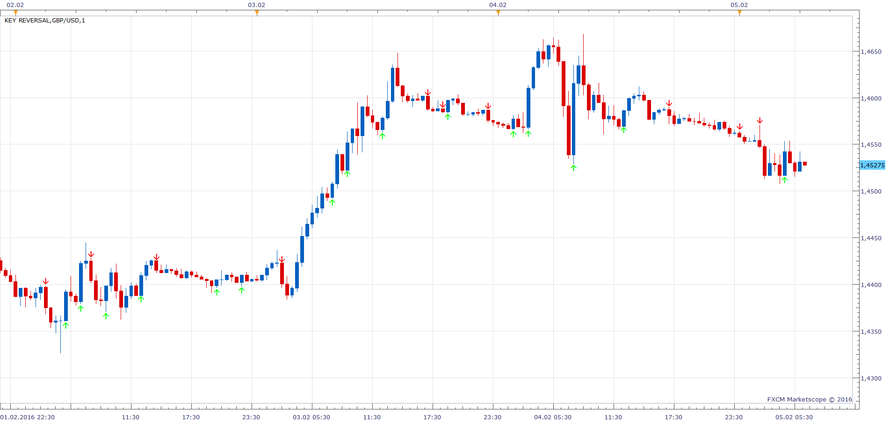
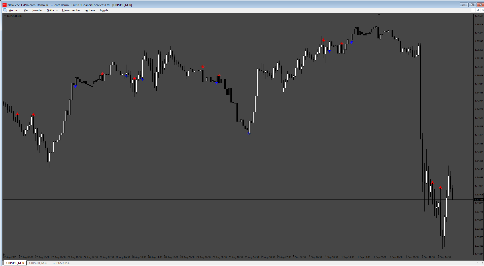

# Key Reversal

> Source: https://fxcodebase.com/code/viewtopic.php?f=17&t=63114  
> Forum: 17 · Topic 63114 · 23 post(s)

---

## Key Reversal

**Apprentice** · Fri Feb 05, 2016 7:05 am

 

Based on request.
[viewtopic.php?f=27&t=63104](https://fxcodebase.com/code/viewtopic.php?f=27&t=63104)

 [Key Reversal.lua](files/104632/Key%20Reversal.lua)

 [Key Reversal Signal.lua](files/104632/Key%20Reversal%20Signal.lua)

 

 [MTF MCP Key Reversal Dashboard.lua](files/104632/MTF%20MCP%20Key%20Reversal%20Dashboard.lua)

MT5 version
[https://fxcodebase.com/code/viewtopic.p ... 87#p160787](https://fxcodebase.com/code/viewtopic.php?f=38&t=76354&p=160787#p160787)

---

## Re: Key Reversal

**cave76** · Fri Feb 05, 2016 1:53 pm

thanks

can you add this to it or change it
 to this makes a higher high and closes below previous bars open for bearish
 makes a lower low and closes above previous bars open for bullish
thanks

---

## Re: Key Reversal

**Apprentice** · Sat Feb 06, 2016 10:43 am

Can you define, higher high , lower low
Can i use fractal?

---

## Re: Key Reversal

**cave76** · Sat Feb 06, 2016 5:00 pm

The higher high and lower low would be the extreme high or low of the candle before the signal candle
I don't think fractals would work because it take 5 candles to make a fractal

---

## Re: Key Reversal

**cave76** · Sat Feb 06, 2016 7:30 pm

higher high a candle that makes a new high higher then the previous one
lower low a candle that make a new low lower then the previous one
fractals require 5 candles so I don't think they will work

---

## Re: Key Reversal

**jrichardson83** · Sun Feb 07, 2016 12:34 pm

Could we have an MT4 version of this indicator?

Thanks

---

## Re: Key Reversal

**Apprentice** · Mon Feb 08, 2016 4:09 am

Your request is added to the development list.

---

## Re: Key Reversal

**Apprentice** · Sun Feb 14, 2016 11:15 am

Mq4 version can be found here.
[viewtopic.php?f=38&t=63151](https://fxcodebase.com/code/viewtopic.php?f=38&t=63151)

---

## Re: Key Reversal

**Apprentice** · Fri Feb 19, 2016 8:42 am

MTF MCP Key Reversal Dashboard Added.

---

## Re: Key Reversal

**Apprentice** · Sun Aug 27, 2017 6:13 am

The indicator was revised and updated.

---

## Re: Key Reversal

**vaguthun79** · Sat Mar 10, 2018 7:05 am

Nice job,
Now can we build a strategy for this indicator?

---

## Re: Key Reversal

**Apprentice** · Sun Mar 11, 2018 6:03 am

The strategy is available here.
[viewtopic.php?f=31&t=65823](https://fxcodebase.com/code/viewtopic.php?f=31&t=65823)

---

## Re: Key Reversal

**ahmedalhosenyy** · Thu Mar 13, 2025 1:39 pm

Nice indicators

Kindly can you make another options
1- normal engulfing candle " with gap or no gap "

2-New type of key reversal " Gap down then go up take previous day high then go down take previous low.

thanks a lot

---

## Re: Key Reversal

**ahmedalhosenyy** · Thu Mar 13, 2025 1:48 pm

key reversal conditions

---

## Re: Key Reversal

**Apprentice** · Sun Mar 16, 2025 3:08 pm

We have added your request to the development list.
Development reference 203

---

## Re: Key Reversal

**Apprentice** · Thu Jun 05, 2025 1:52 pm

 [Key_Reversal.lua](files/159499/Key_Reversal.lua)

Can you explain?

> 2-New type of key reversal " Gap down then go up take previous day high then go down take previous low.

Is it something like this?

1. candle close > 2. candle open
2. candle close > 2. candle open
candle close > 1. candle high

3. candle close < 2. candle low

---

## Re: Key Reversal

**khanatd** · Wed Aug 27, 2025 8:59 pm

hi sir kindly mt4 version with arrows at close of current candle

thanks
khan

---

## Re: Key Reversal

**Apprentice** · Sun Aug 31, 2025 3:37 am

We have added your request to the development list.
Development reference 555

---

## Re: Key Reversal

**Apprentice** · Fri Sep 05, 2025 3:29 am

 [Key_Reversal.mq4](files/160479/Key_Reversal.mq4)

---

## Re: Key Reversal

**khanatd** · Mon Sep 08, 2025 2:50 am

plz where is updated mt4 version sir

---

## Re: Key Reversal

**Josan70** · Sun Sep 28, 2025 5:10 am

Is it possible to code it for mt5

---

## Re: Key Reversal

**Apprentice** · Wed Oct 01, 2025 6:18 am

We have added your request to the development list.
Development reference 622

---

## Re: Key Reversal

**Apprentice** · Mon Oct 06, 2025 4:37 am

MT5 version
[https://fxcodebase.com/code/viewtopic.p ... 87#p160787](https://fxcodebase.com/code/viewtopic.php?f=38&t=76354&p=160787#p160787)
