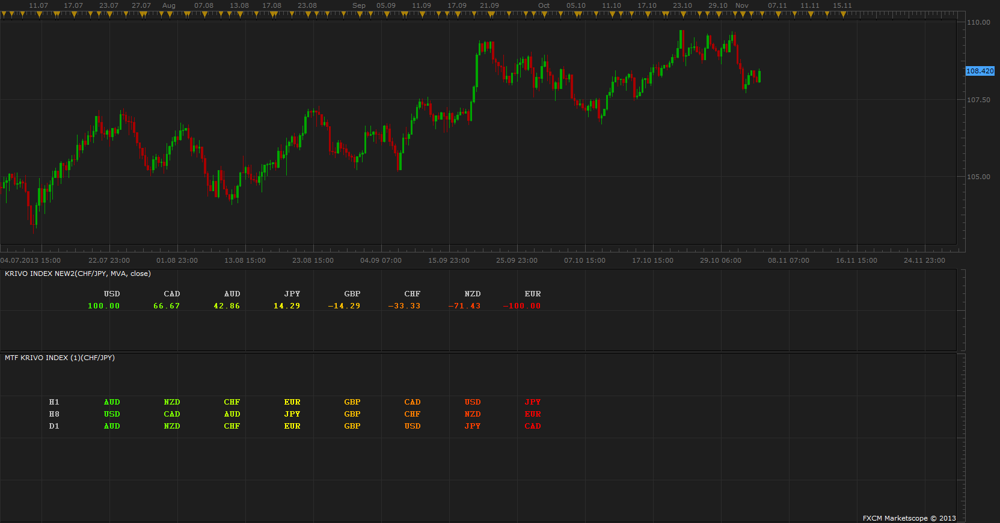
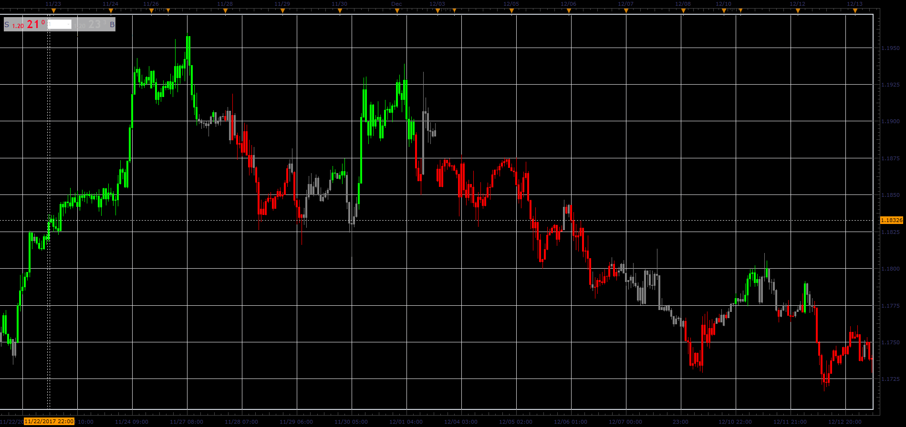

# Krivo Index

> Source: https://fxcodebase.com/code/viewtopic.php?f=17&t=59670  
> Forum: 17 · Topic 59670 · 18 post(s)

---

## Krivo Index

**Apprentice** · Mon Oct 14, 2013 12:35 pm

Based on the article by By Richard Krivo, DailyFX Trading Instructor
[http://www.dailyfx.com/forex/education/ ... ncies.html](http://www.dailyfx.com/forex/education/trading_tips/post_of_the_day/2011/06/15/How_to_Create_a_Trading_Edge_Know_the_Strong_and_the_Weak_Currencies.html)

Will give +1 if currency is above the moving average, and vice versa.

Parameters
Majors Only - Take into consideration currency pairs, consisting of two mojors.
Use Percentage-Show strength as a percentage of all considerations.

All other parameters are quite clear.

 [Krivo Index.lua](files/90047/Krivo%20Index.lua)

 [MTF Krivo Index.lua](files/90047/MTF%20Krivo%20Index.lua)

 [MTF Krivo Index with Sorting.lua](files/90047/MTF%20Krivo%20Index%20with%20Sorting.lua)

 

 [Krivo Index Line.lua](files/90047/Krivo%20Index%20Line.lua)

---

## Re: Krivo Index

**Coondawg71** · Mon Oct 14, 2013 1:45 pm

Can we request a MTF MCP Krivo Index List?

Thanks

Sjc

---

## Re: Krivo Index

**Apprentice** · Tue Oct 15, 2013 1:05 pm

MTF Krivo Added.

---

## Re: Krivo Index

**reysebello** · Wed Oct 16, 2013 1:02 am

Can you sort the results? Left =strong right= weak, And if possible the rainbow function to generate color gradient as in my original request?

Very Nice you named it Kirvo index because I was thinking to email him and comment about krivo indicator

---

## Krivo Index Original request

**reysebello** · Wed Oct 16, 2013 1:38 am

[viewtopic.php?f=27&t=59654](https://fxcodebase.com/code/viewtopic.php?f=27&t=59654)

---

## Re: Krivo Index

**Apprentice** · Wed Oct 16, 2013 4:04 am

I have the same thoughts, unfortunately I do not have his contact.
As for Sort function.
Remind me in a week, at the moment I'm quite busy.

---

## Re: Krivo Index

**Apprentice** · Mon Nov 04, 2013 3:26 pm

Sorting and Rainbow coloring added to the basic Krivo.
 MTF Krivo Index with Sorting Added.

---

## Re: Krivo Index

**Apprentice** · Sat Nov 09, 2013 4:29 pm

Updated.

---

## Re: Krivo Index

**haveforexfun** · Tue Nov 12, 2013 5:21 am

Hallo Apprentice,

thank you for your good job you are doing here. I would like to ask, if it would be possible to have the Krivo Index as a graphic, so that one can have a look about the changes of the last time. If this is possible please allow to select the colours and line wideness.

Thank you very much
Haveforexfun

---

## Re: Krivo Index

**Apprentice** · Wed Nov 13, 2013 4:16 am

Krivo Index Line Added.

---

## Re: Krivo Index

**oraclefusions** · Fri May 09, 2014 6:59 am

I am searching for same krivo strong weak for MT4 version, any one?

cheers

---

## Re: Krivo Index

**Apprentice** · Sat May 10, 2014 2:26 am

As far as I know MT4 version was never developed.

---

## Re: Krivo Index

**Stance** · Mon Nov 16, 2015 4:36 pm

Could you create an indicator for this that colours the candles if its stronger or weaker.

---

## Re: Krivo Index

**Apprentice** · Wed Nov 23, 2016 4:33 pm

Minor update.

---

## Re: Krivo Index

**jaricarr** · Thu Sep 28, 2017 8:52 pm

My Apprentice,

Is it possible to add a "Horizontal Shift" or similar so that we can align the currency list closer together.

---

## Re: Krivo Index

**Apprentice** · Fri Sep 29, 2017 5:30 am

The indicator was revised and updated.

---

## Re: Krivo Index

**Alexander.Gettinger** · Wed Jan 03, 2018 1:33 pm

Based on request: [viewtopic.php?f=27&t=62897](https://fxcodebase.com/code/viewtopic.php?f=27&t=62897)

 

Download:

 [Krivo Index Candles.lua](files/116749/Krivo%20Index%20Candles.lua)

---

## Re: Krivo Index

**Apprentice** · Thu Apr 26, 2018 7:00 am

The indicator was revised and updated.
