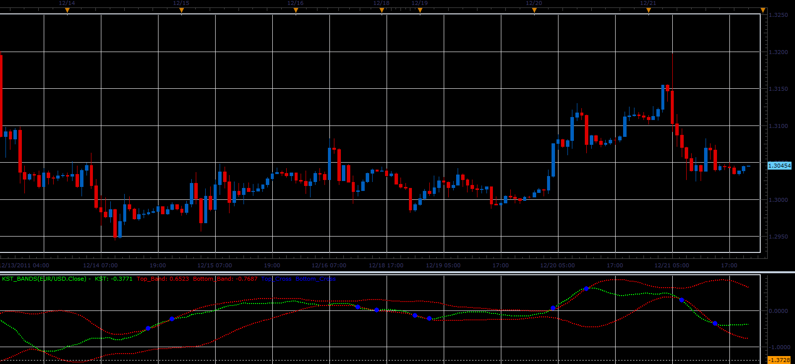

# KST indicator+bands

> Source: https://fxcodebase.com/code/viewtopic.php?f=17&t=10252  
> Forum: 17 · Topic 10252 · 3 post(s)

---

## KST indicator+bands

**Alexander.Gettinger** · Wed Dec 21, 2011 9:18 pm

This indicator is written on request: [viewtopic.php?f=27&t=9670](https://fxcodebase.com/code/viewtopic.php?f=27&t=9670)

The indicator draws a line KST, builds bands on it and show their points of intersection.

 

Download:

 [KST_Bands.lua](files/21394/KST_Bands.lua)

For this indicator must be installed KST indicator
[viewtopic.php?f=17&t=64518](https://fxcodebase.com/code/viewtopic.php?f=17&t=64518)

The indicator was revised and updated

---

## Re: KST indicator+bands

**amorgos89** · Thu Dec 22, 2011 4:14 pm

Thank you very much

---

## Re: KST indicator+bands

**Apprentice** · Thu Mar 23, 2017 2:33 pm

Indicator was revised and updated.
