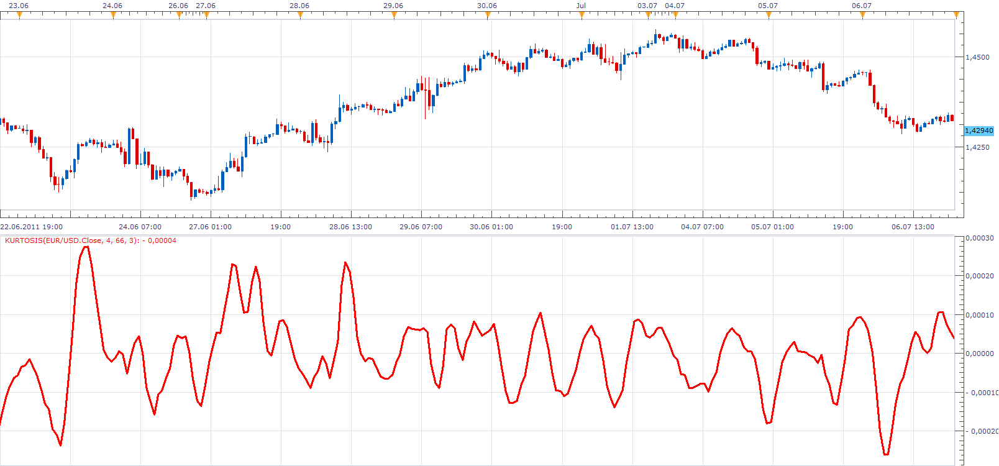

# Kurtosis

> Source: https://fxcodebase.com/code/viewtopic.php?f=17&t=5086  
> Forum: 17 · Topic 5086 · 3 post(s)

---

## Kurtosis

**Apprentice** · Thu Jul 07, 2011 5:34 am

The Kurtosis is a market sentiment indicator.
The formula for the Kurtosis is as follows:

MVA(3) of EMA (66) of ( Momentum[period] - Momentum[period-1] )

 [Kurtosis.lua](files/12446/Kurtosis.lua)

The indicator was revised and updated

---

## Re: Kurtosis

**Alexander.Gettinger** · Fri Jun 29, 2012 1:38 pm

MQL4 version of this indicator: [viewtopic.php?f=38&t=20677](https://fxcodebase.com/code/viewtopic.php?f=38&t=20677)

---

## Re: Kurtosis

**Apprentice** · Tue Apr 11, 2017 5:29 am

Indicator was revised and updated.
