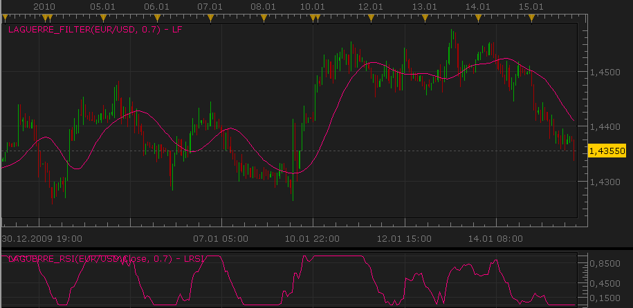

# Laguerre Relative Strength Index (RSI) and Filter

> Source: https://fxcodebase.com/code/viewtopic.php?f=17&t=331  
> Forum: 17 · Topic 331 · 21 post(s)

---

## Laguerre Relative Strength Index (RSI) and Filter

**Nikolay.Gekht** · Fri Feb 12, 2010 11:10 pm

The Laguerre RSI was introduced by John Ehlers in his book “Cybernetic Analysis for stocks and futures”. It uses a Laguerre filter to provide a “time warp” so that the low frequency components are delayed more than the high frequency components, enabling much smoother filters to be created using less data.

The typical usage the Laguerre RSI is to buy when the line crosses 0.15 and sell when price crosses 0.85. The price damping factor can be customized for optimal use to best suit the trade instruments data by altering the gamma factor usually between 0.55 and 0.85. The lower the Gamma factor the faster more aggressive the entry. The scale is -0.5 to 1.05.

Read also "Time warp - without space travel" by John F. Ehlers (just google "TimeWarp.doc").

 

Download:

 [Laguerre_RSI.lua](files/565/Laguerre_RSI.lua)

 [Laguerre_Filter.lua](files/565/Laguerre_Filter.lua)

The indicator was revised and updated

---

## Re: Laguerre Relative Strength Index (RSI) and Filter

**bluepip** · Sun Mar 06, 2011 10:53 am

Is it possible to get Signal and strategy of this Indicators?

LAGUERRE_FILTER and LAGUERRE_RSI (Parameter variable)

Thank you very very much for the service
bluepip

---

## Re: Laguerre Relative Strength Index (RSI) and Filter

**Apprentice** · Sun Mar 06, 2011 3:27 pm

It is possible.
However, can you give a little more information on the conditions that signal should be respected.
Do you want to separate or combined signals.
If you want a combo, I need to know how the two indicators complement each other.

---

## Re: Laguerre Relative Strength Index (RSI) and Filter

**bluepip** · Sun Mar 06, 2011 3:36 pm

Separate is perfect.

Thanks
bluepip

---

## Re: Laguerre Relative Strength Index (RSI) and Filter

**Apprentice** · Sun Mar 06, 2011 3:53 pm

Request added to the developmental cue.

---

## Re: Laguerre Relative Strength Index (RSI) and Filter

**zeuspower2012** · Tue Mar 29, 2011 4:20 pm

hello !
I love these indicators !
specially the one on the chart..
How about a MTF version of this,so I can put them some of them ,on the same
chart (like **5m chart** with 5m,15m,30m LF on it )

---

## Re: Laguerre Relative Strength Index (RSI) and Filter

**Apprentice** · Wed Mar 30, 2011 5:13 am

Your request has been added to developmental cue.

---

## Re: Laguerre Relative Strength Index (RSI) and Filter

**Apprentice** · Wed Mar 30, 2011 6:59 am

MFT Laguerre Filter is Posted here.
[viewtopic.php?f=17&t=3779&p=9194#p9194](https://fxcodebase.com/code/viewtopic.php?f=17&t=3779&p=9194#p9194)
MFT Laguerre RSI is Posted here.
[viewtopic.php?f=17&t=3780](https://fxcodebase.com/code/viewtopic.php?f=17&t=3780)

---

## Re: Laguerre Relative Strength Index (RSI) and Filter

**bluepip** · Sun Oct 30, 2011 3:00 am

There is already a strategy on this indicator LAGUERRE_RSI?

bluepip

---

## Re: Laguerre Relative Strength Index (RSI) and Filter

**Apprentice** · Sun Oct 30, 2011 7:13 am

As far as I know, does not exist.

---

## Re: Laguerre Relative Strength Index (RSI) and Filter

**bluepip** · Sun Oct 30, 2011 8:24 am

Can you make a strategy of LAGUERRE RSI?

If it possible the same Parameter like *Highly adaptable CCI Strategy* please.

Thanks bluepip

---

## Re: Laguerre Relative Strength Index (RSI) and Filter

**Apprentice** · Sun Oct 30, 2011 9:45 am

Requested can be found here.
[viewtopic.php?f=31&t=7702](https://fxcodebase.com/code/viewtopic.php?f=31&t=7702)

---

## Re: Laguerre Relative Strength Index (RSI) and Filter

**bluepip** · Sun Oct 30, 2011 12:58 pm

Wow ... so quickly ... Thank you so very much!!!

bluepip

---

## Re: Laguerre Relative Strength Index (RSI) and Filter

**Coondawg71** · Fri Feb 15, 2013 6:48 am

Can we please add color and line style options to this indicator.

thanks,

sjc

---

## Re: Laguerre Relative Strength Index (RSI) and Filter

**Apprentice** · Sat Feb 16, 2013 7:16 pm

Style Option Added.

---

## Re: Laguerre Relative Strength Index (RSI) and Filter

**Coondawg71** · Wed Jun 25, 2014 10:53 am

I have attempted to create a MACD indicator with Laguerre RSI as data source. The attempt failed.

I have attached the attempted code for review, perhaps the error is simple, perhaps it is not.

Error code appears when adding indicator to chart is "line 76:indicator with id Laguerre_RSI is not found".

thanks,

sjc

---

## Re: Laguerre Relative Strength Index (RSI) and Filter

**Apprentice** · Wed Jun 25, 2014 11:49 am

Fixed.

When you call an external indicators.
Make sure to use cap letters.
"LAGUERRE_RSI" instead of "Laguerre_RSI"
LAGUERRE_RSI, GAMMA parameter was not defined as well.

---

## Re: Laguerre Relative Strength Index (RSI) and Filter

**xpertizetrading** · Fri Jun 19, 2015 2:35 am

Hi Apprentice,

Thanks for the great indicator. Is it possible to code a strategy on Price and Laguerre Filter Crossover.

Buy: Crossover
Sell: Cross Under

Regards,
Xpertizetrading

---

## Re: Laguerre Relative Strength Index (RSI) and Filter

**Apprentice** · Fri Jun 19, 2015 4:42 am

Requested can be found here.
[viewtopic.php?f=31&t=62331](https://fxcodebase.com/code/viewtopic.php?f=31&t=62331)

---

## Re: Laguerre Relative Strength Index (RSI) and Filter

**xpertizetrading** · Fri Jun 19, 2015 5:19 am

Thanks Apprentice and Nikolay. Fxcodebase team rocks. I was checking other contents of John Ehlers too. They are all great.

Regards,
Xpertize trading

---

## Re: Laguerre Relative Strength Index (RSI) and Filter

**Apprentice** · Sun Mar 05, 2017 7:16 am

Indicator was revised and updated.
