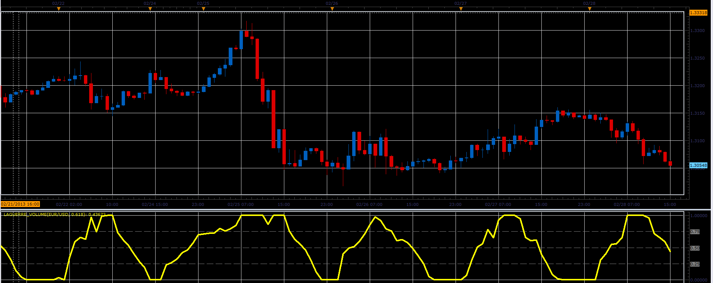

# Laguerre volume

> Source: https://fxcodebase.com/code/viewtopic.php?f=17&t=32542  
> Forum: 17 · Topic 32542 · 2 post(s)

---

## Laguerre volume

**Alexander.Gettinger** · Thu Feb 28, 2013 5:04 pm

This indicator is a ported MQL5 indicators from [http://www.mql5.com/en/code/1515](http://www.mql5.com/en/code/1515)

The indicator calculates the Laguerre filter for volume.

 

Download:

 [Laguerre_Volume.lua](files/55436/Laguerre_Volume.lua)

The indicator was revised and updated

---

## Re: Laguerre volume

**Apprentice** · Tue May 09, 2017 5:44 am

Indicator was revised and updated.
