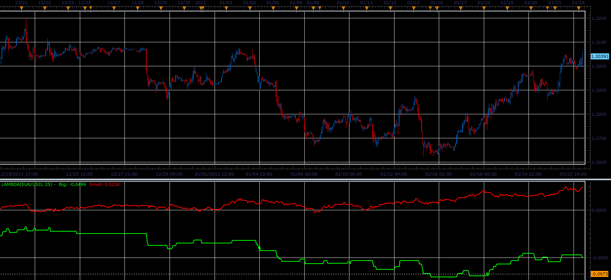

# Lambda indicator

> Source: https://fxcodebase.com/code/viewtopic.php?f=17&t=12225  
> Forum: 17 · Topic 12225 · 2 post(s)

---

## Lambda indicator

**Alexander.Gettinger** · Tue Jan 24, 2012 5:08 am

Indicator separates candles into 2 streams: with d>Lambda and d<Lambda, where
d[i]=Open[i]-Open[i-1].

 

Download:

 [Lambda.lua](files/24214/Lambda.lua)

The indicator was revised and updated

---

## Re: Lambda indicator

**Apprentice** · Thu Mar 23, 2017 2:58 pm

Indicator was revised and updated.
