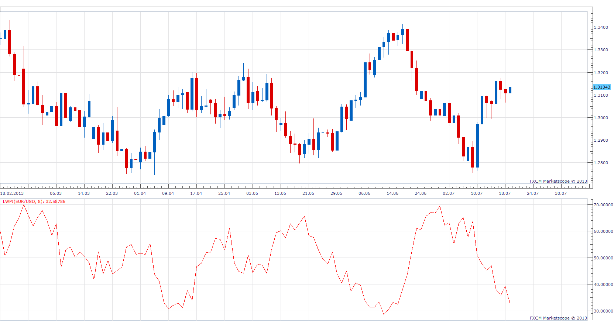
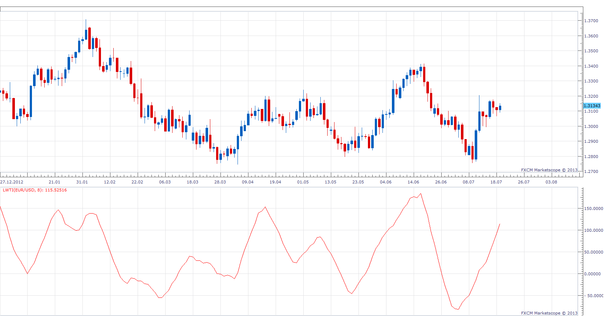
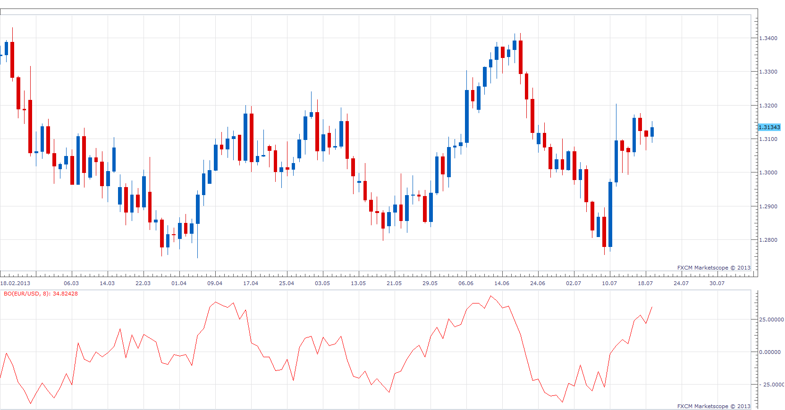

# Larry Commerical Proxy Index

> Source: https://fxcodebase.com/code/viewtopic.php?f=17&t=54686  
> Forum: 17 · Topic 54686 · 15 post(s)

---

## Larry Commerical Proxy Index

**Apprentice** · Sun Jul 21, 2013 2:59 am

 Larry Commerical Proxy Index
Larry Williams said he even dont need COT report to buil COT index. Here his formula:

MovingAvg(Open-Close, bars used in average)/MovingAvg(Range,bars used in average)*50 +50

 [LWPI.lua](files/82250/LWPI.lua)

The indicator was revised and updated

---

## Larry Large Trade Index

**Apprentice** · Sun Jul 21, 2013 3:05 am

MovingAvg(Close - Close[Period], bars used in average)/MovingAvg(Range,bars used in average)*50 +50

 [LWTI.lua](files/82253/LWTI.lua)

---

## Blast Off

**Apprentice** · Sun Jul 21, 2013 3:19 am

Larry Williams shared a method that he uses to determine when a trading instrument is ready to make a big move. He calls it Blast Off. He compares the Open and Close verses the High and Low of the day. If the difference between the open and close of the day is less than 20% of the range of the day, then it's likely that the next day will be a pretty good size move.

MovingAvg(Abs(Close-Open, X days) /MovingAvg((High- Low),X days)*100

 [BO.lua](files/82265/BO.lua)

---

## Re: Larry Commerical Proxy Index

**Alexander.Gettinger** · Thu Aug 29, 2013 11:23 am

MQL4 version of oscillators: [http://www.fxcodebase.com/code/viewtopi ... 38&t=59355](http://www.fxcodebase.com/code/viewtopic.php?f=38&t=59355).

---

## Re: Larry Commerical Proxy Index

**Apprentice** · Thu Jul 27, 2017 9:56 am

The indicator was revised and updated.

---

## Re: Larry Commerical Proxy Index

**logicgate** · Tue Feb 12, 2019 8:47 pm

Hello dear friend, hope all is good.

Is it possible to code this indicator for excel? And add it to the pool of indicators there, as an add on?

Or if not possible, do you know how to use the formula there?

I am starting to do some EOD futures data analysis in excel and this commercial proxy would come in handy there.

Thanks!

---

## Re: Larry Commerical Proxy Index

**Apprentice** · Wed Feb 13, 2019 5:46 am

Your request is added to the development list under Id Number 4469

---

## Re: Larry Commerical Proxy Index

**logicgate** · Thu Feb 14, 2019 7:43 am

My friend, you are my super hero!

The first thing on my list when I start making money with this is making you a fat donation.

I am starting to watch some excel courses to get really good at it. Would you care to explain to me why the formula in the TR (true range) column is that big?

=max(abs(D2-F3),abs(E2-F3),abs(D2-E2))

I saw that MAX returns the largest value in a set of values. In this case, you wanna see which is the highest value between D2-F3, E2-F3 and D2-E2 to use as true range?

I can see in the MA and ATR columns you are using a 6 day average, right? So to get different results, I just need to change the values here.

So when you are using the AVERAGE excel formula, you don't need to worry about inputing a formula like:

Current ATR = [(Prior ATR x 13) + Current TR] / 14

 - Multiply the previous 14-day ATR by 13.
 - Add the most recent day's TR value.
 - Divide the total by 14

You just need to use AVERAGE and then choose the number cells (like in this case you used =average(H2:H8)

Thanks mate.

---

## Re: Larry Commerical Proxy Index

**Apprentice** · Thu Feb 14, 2019 9:12 am

Try this version.

---

## Re: Larry Commerical Proxy Index

**logicgate** · Thu Feb 14, 2019 1:46 pm

My friend, would you add a new column to your file called "COT Movement Index" based on this formula here?

COT Movement Index = C.O.T. Index[Current] - COT Index[ROC Weeks]

Steve Briese introduced this calculation in his book “Commitments of Traders Bible”. It takes the C.O.T. Index output and finds the Rate of Change or (ROC) and outputs that result. When Move Index is selected you will see a second input box call ROC Weeks. This allows you to enter the number of weeks used in the ROC calculation

I am not sure on how to do it.

---

## Re: Larry Commerical Proxy Index

**Apprentice** · Sat Feb 16, 2019 3:09 am

About COT.
As you can see no new data was retrieved for 2018.
Until this is fixed by gehtsoft team, will we use Larry Commerical Proxy Index?

---

## Re: Larry Commerical Proxy Index

**logicgate** · Sat Feb 16, 2019 7:26 am

> **Apprentice wrote:**
> About COT.
> As you can see no new data was retrieved for 2018.
> Until this is fixed by gehtsoft team, will we use Larry Commerical Proxy Index?

You mean for 2019, right? The data is being released with a delay, CFTC will return to normal schedule by the 9th of March.

You can get good data here:

[http://commitmentsoftraders.org/cot-data/](http://commitmentsoftraders.org/cot-data/)

---

## Re: Larry Commerical Proxy Index

**p0506958** · Sun Jul 12, 2020 7:58 am

Hi, I am going to verify my calculation of Larry Commerical Proxy Index, since the file link for the dropbox is expired, could you please shear the file to me, trillion thanks.

---

## Re: Larry Commerical Proxy Index

**Emma_202** · Sun Aug 23, 2020 9:08 pm

Hi

Can you post the excel file again, please?

I really want to take a look at the calculations to understand the index at a data level.

Its an intriguing concept to synthetically calculate commercial price action.

I'm wondering to what extent it can help to build a model for darkpools

---

## Re: Larry Commerical Proxy Index

**Apprentice** · Mon Aug 24, 2020 3:29 am

This was temp version,
all changes ware uploaded to the topic.
