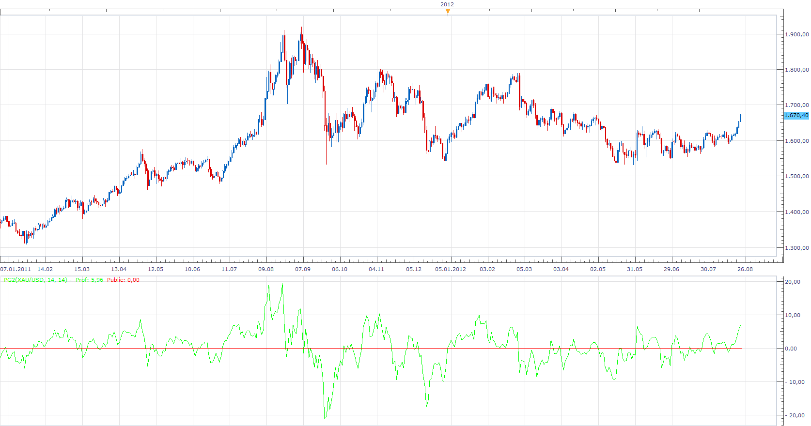
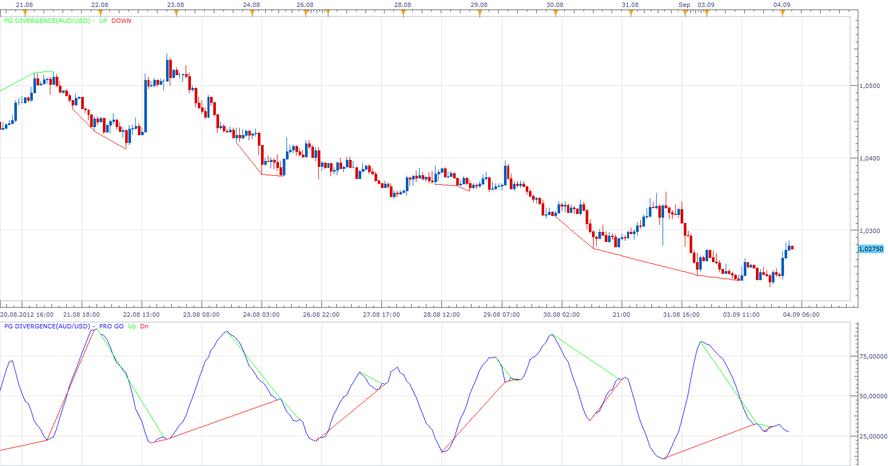

# Larry William's Pro-Go

> Source: https://fxcodebase.com/code/viewtopic.php?f=17&t=22685  
> Forum: 17 · Topic 22685 · 4 post(s)

---

## Larry William's Pro-Go

**Apprentice** · Thu Aug 23, 2012 4:22 pm

public=EMA(OPEN- CLOSE(-1));
pro=EMA(CLOSE-OPEN);

 [PG2.lua](files/39127/PG2.lua)

 [PG1.lua](files/39127/PG1.lua)

If someone has working version of this indicators, please send it to my email.
I have reproduced this indicator, according to the specification, but the results are strange.
I assume that this indicator works well for equities, not the forex.
Any help in Testing and revision of this indicator is appreciated.

The indicator was revised and updated

---

## Re: Larry William's Pro-Go

**Apprentice** · Tue Sep 04, 2012 2:04 am

 [PG Divergence.lua](files/39617/PG%20Divergence.lua)

Make sure to install PG1 indicator.

---

## Re: Larry William's Pro-Go

**cash4u** · Tue Sep 04, 2012 2:40 am

very nice indicator this is.

---

## Re: Larry William's Pro-Go

**Apprentice** · Mon Apr 24, 2017 5:25 am

Indicator was revised and updated.
