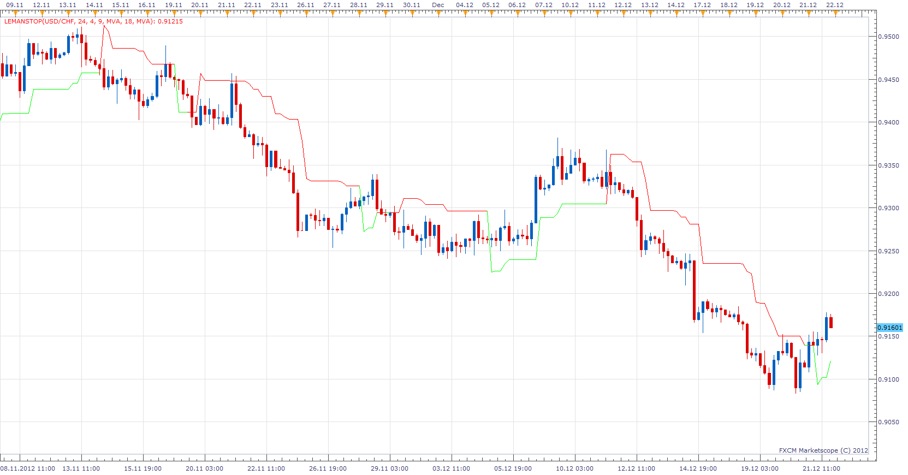

# LeMan Stop

> Source: https://fxcodebase.com/code/viewtopic.php?f=17&t=27929  
> Forum: 17 · Topic 27929 · 3 post(s)

---

## LeMan Stop

**Apprentice** · Sun Dec 23, 2012 4:28 am

 [LeManStop.lua](files/49007/LeManStop.lua)

The indicator was revised and updated

---

## Re: LeMan Stop

**Alexander.Gettinger** · Mon Sep 22, 2014 11:06 am

MQL4 version of LeMan Stop indicator: [viewtopic.php?f=38&t=61219](https://fxcodebase.com/code/viewtopic.php?f=38&t=61219).

---

## Re: LeMan Stop

**Apprentice** · Sat Jun 24, 2017 5:24 am

The indicator was revised and updated.
