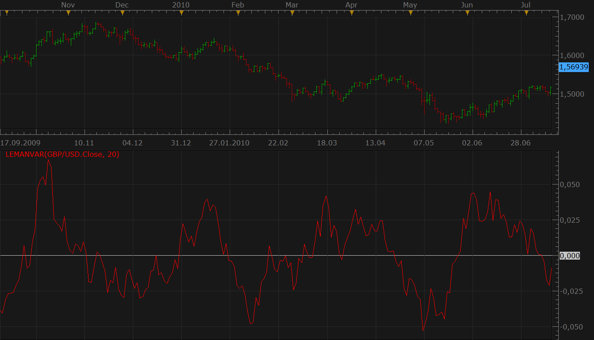
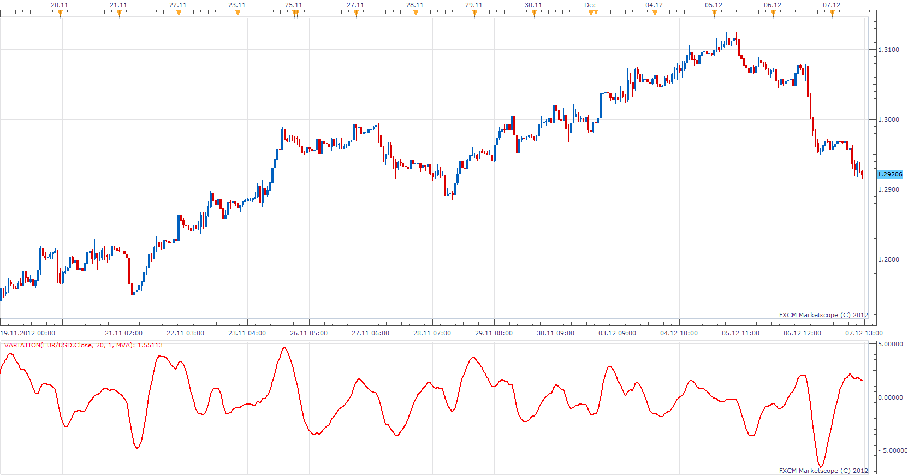

# LeMan variation

> Source: https://fxcodebase.com/code/viewtopic.php?f=17&t=1622  
> Forum: 17 · Topic 1622 · 5 post(s)

---

## LeMan variation

**Nikolay.Gekht** · Fri Jul 30, 2010 1:01 pm

The LeMan variation indicator is an indicator recently created by Russian trader LeMan.
The indicator formula is

LV= Close[period]-(AVG(Close) +AVG(Close[period]-AVG(Close)))

LeMan recommends to use this indicator to see the direction of the trade and to detect the exit points at the moments when the indicator crosses the zero level.

 

Download:

 [LemanVar.lua](files/3214/LemanVar.lua)

The indicator was revised and updated

---

## Re: LeMan variation

**braumann** · Thu Oct 11, 2012 5:19 am

Hello,

Can you make a signal, please ?

Thanks you !

---

## Re: LeMan variation

**Apprentice** · Thu Oct 11, 2012 9:18 am

Requested can be found here.
[viewtopic.php?f=31&t=24324](https://fxcodebase.com/code/viewtopic.php?f=31&t=24324)

---

## Re: LeMan variation

**Apprentice** · Fri Dec 07, 2012 6:35 am

 LeMan Variation, Variation that can use digital smoothing filters.
By default no smoothing is used, will have standard LeMan variation.

 [variation.lua](files/48058/variation.lua)

---

## Re: LeMan variation

**Apprentice** · Mon Apr 17, 2017 6:46 am

Indicator was revised and updated.
