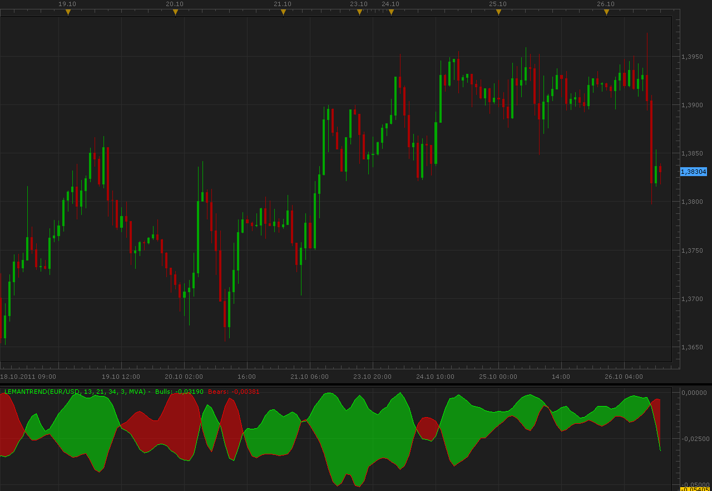

# LeManTrend indicator

> Source: https://fxcodebase.com/code/viewtopic.php?f=17&t=7634  
> Forum: 17 · Topic 7634 · 2 post(s)

---

## LeManTrend indicator

**Alexander.Gettinger** · Wed Oct 26, 2011 11:59 am

This indicator is a ported MQL5 indicator from [http://www.mql5.com/ru/code/563](http://www.mql5.com/ru/code/563) (in Russian).

Formulas:
Bulls - MA of HH, Bears - MA of LL, where
HH(i)=3*(High price(i))-High(x-Min,x)-High(x-Middle,x)-High(x-Max,x),
LL(i)=Low(x-Min,x)+Low(x-Middle,x)+Low(x-Max,x)-3*(Low price(i)).

 

Download:

 [LeManTrend.lua](files/16930/LeManTrend.lua)

For this indicator must be installed AVERAGES indicator ([viewtopic.php?f=17&t=2430](https://fxcodebase.com/code/viewtopic.php?f=17&t=2430)).

---

## Re: LeManTrend indicator

**Apprentice** · Mon Mar 05, 2018 2:21 pm

The Indicator was revised and updated.
