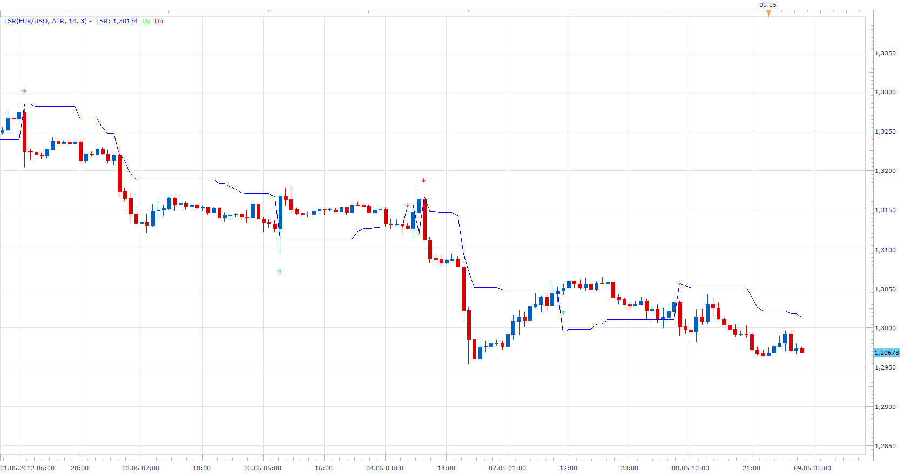
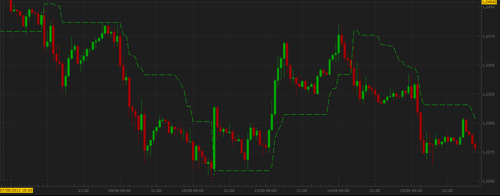

# Level Stop Reverse

> Source: https://fxcodebase.com/code/viewtopic.php?f=17&t=18031  
> Forum: 17 · Topic 18031 · 21 post(s)

---

## Level Stop Reverse

**Apprentice** · Wed May 09, 2012 5:05 am

 [LSR.lua](files/32602/LSR.lua)

 

This indicator version provides Audio / Email Alerts for Close/LSR Line Cross.
Early Warning System, provides alarm, X number of pips up and down from the LSR line.

 [LSR With Alert.lua](files/32602/LSR%20With%20Alert.lua)

Compatibility issue fixed.
_Alert Helper is not longer needed.

 

 [Level Stop Reverse Overlay.lua](files/32602/Level%20Stop%20Reverse%20Overlay.lua)

---

## Re: Level Stop Reverse

**gainskeeper** · Wed May 09, 2012 6:02 am

Thank you Apprentice. Appreciate you doing this. For those that would like to use it, here is how I trade it and tweaking out the false signal or 2 you may get. I use it on euro, swissy, g/y, euro/yen, for the most part. 15 minute chart. I usually only take the signal with the present trend (200/250 ema I use for trend) , 50sma and QQE with a 60 setting. (macd 21/55/9 is very close to the qqe setting) .
Example of a trade. Get a long signal, candle must close above 50sma, 200/250 ema must be bullish trend, qqe must also be bullish. Opposite for short signal. Stops and take profits up to the trader.
For the active trader 5min chart maybe more suited for you. I do not recommend 1 minute charts or 1hr or above.

---

## Re: Level Stop Reverse

**gainskeeper** · Wed May 09, 2012 7:50 am

Only change I made was changing the ATR period from 14 to 9, left everything else to default.Some great trades this morning. Any questions just message me. Good luck

---

## Re: Level Stop Reverse

**saturn** · Tue Aug 28, 2012 5:22 am

Amazing indicator! Thank you!
Is it possible to add sound alert when price gets close (10 pips) to the LSR line?

Thanks!

---

## Re: Level Stop Reverse

**gainskeeper** · Tue Aug 28, 2012 10:10 am

I did make a change on some indicators I was using to take trades. I got rid of the 50sma, got rid of the ema trend indicators (200/250). Instead I have gone with unique Bollinger Bands settings. BB settings 62 periods, .20 deviation and hide the middle or average line. You should now have 2 lines running parallel with each other.
Rules of engagment, get a signal, the whole candle including the wick must be completely outside the Bollinger Bands, whether its a buy or sell signal. Place the trade, stop is the opposite side of the Bollinger Band. I like to make the pip difference between my open and stop loss a multiple of five. For
instance, if the other side of the Bollinger Band is 23 pips away, I will add an additional two pips on to that number to make it 25 pips. I use a 1/1 risk reward for first target and I move the rest to break even plus spread or use a trailing stop.

---

## Re: Level Stop Reverse

**Hailkayy** · Tue Aug 28, 2012 2:44 pm

Hi, gainskeeper.

Thanks for your advices.
However with your settings BB. The bollinger bands are seable. Too far away from eachother. and not parallel. Eurusd. anytimeframe.
I think you have to check settings. 60+ and 20+ seems way too big.

---

## Re: Level Stop Reverse

**saturn** · Tue Aug 28, 2012 3:51 pm

I think gainskeeper's settings are 62 periods and 0.20 deviation.

---

## Re: Level Stop Reverse

**gainskeeper** · Wed Aug 29, 2012 8:04 am

Yes its 0.20 setting. You can also use the bands indicator with same settings as I posted.

---

## Re: Level Stop Reverse

**Hailkayy** · Thu Aug 30, 2012 6:02 pm

Apprentice.

Could we please get a strategy for this indicator ?
No special implementation. Basic stuff.

Thx.

 

---

## Re: Level Stop Reverse

**Apprentice** · Fri Aug 31, 2012 4:39 am

Requested strategy can be found here.
[viewtopic.php?f=31&t=22850](https://fxcodebase.com/code/viewtopic.php?f=31&t=22850)

---

## Re: Level Stop Reverse

**Apprentice** · Fri Aug 31, 2012 5:26 am

Indicator Alert Option Added to Topmost post.

---

## Re: Level Stop Reverse

**RJH501** · Fri Aug 31, 2012 8:16 am

When you get time, please check for problem with down arrow. It does not show up when show arrows is set to YES.

Regards,

RJH

---

## Re: Level Stop Reverse

**Apprentice** · Fri Aug 31, 2012 9:00 am

Bug Fixed.

---

## Re: Level Stop Reverse

**Hailkayy** · Fri Aug 31, 2012 1:41 pm

Thank you much.

---

## Re: Level Stop Reverse

**fxadam** · Tue Oct 30, 2012 10:38 am

Hi,

I would like to know if the formula for the LSR is the same like this:
______________________________________________________________
_Pips:= Pips*SymbolPoint();
DeltaStop:= if(Mode=0,Wilders(ATR(atrperiods),atrsmperiods)*atrmult,_Pips);

TSL:= if(BarCount()>(atrperiods+atrsmperiods),
 if(ref(price,-1)>PREV(0) AND price>PREV(0),max(PREV(0),price-DeltaStop),
 if(ref(price,-1)<PREV(0) AND price<PREV(0),min(PREV(0),price+DeltaStop),
 if(Cross(price,PREV(0)),price-DeltaStop,
 if(Cross(PREV(0),price),price+DeltaStop,
 if(price=PREV(0),PREV(0),PREV(0)))))),
 NULL);
__________________________________________________________________
Thanks.

---

## Re: Level Stop Reverse

**Apprentice** · Wed Oct 31, 2012 2:40 am

I believe it is.

Code: [Select all](https://fxcodebase.com/code/)
`if source.close[period-1] <= LSR[period-1]  and  source.close[period] < LSR[period-1] then
LSR[period] = math.min(source.close[period]+ Delta, LSR[period-1] );
elseif source.close[period-1] >= LSR[period-1] and  source.close[period] >LSR[period-1] then
LSR[period] = math.max(source.close[period]- Delta, LSR[period-1]);
else`

---

## Re: Level Stop Reverse

**fxadam** · Fri Jan 03, 2014 1:28 pm

Well, i do not think so.
Can you check it once more please?
When I put "my LRS" (formula below) and "yours" LRS and compare the charts, it's not the same.
I am using "my LRS - Trailing Stoploss Reversal Level" from Visual Trading platform and I would like to convert it from Visual Trading into the TSII.
Thanks a lot.
Adam

Input Variables:
1)
Name: price
Display Name: Price
Type: price
Default: close
2)
Name: Mode
Display Name: Trailing Stoploss Mode
Type: Enumeration
Default: click [...] button, [New] button, then create the following entries:
Volatility
Pips
... then, click [OK] button
Default: Volatility
3)
Name: atrperiods
Display Name: If Volatility, ATR Periods
Type: integer
Default: 14
4)
Name: atrsmperiods
Display Name: If Volatility, Wilders ATR Smoothing Periods
Type: integer
Default: 14
5)
Name: atrmult
Display Name: If Volatility, ATR Multiplier
Type: float
Default: 2.8240
6)
Name: Pips
Display Name: If Pips, # of Pips to Trail
Type: integer
Default: 20

Output Variable:
Var Name: TSL
Name: (TSL)
Line Color: red
Line Width: thin
Line Type: dashed

FORMULA:
_Pips:= Pips*SymbolPoint();
DeltaStop:= if(Mode=0,Wilders(ATR(atrperiods),atrsmperiods)*atrmult,_Pips);
TSL:= if(BarCount()>(atrperiods+atrsmperiods),
 if(ref(price,-1)>PREV(0) AND price>PREV(0),max(PREV(0),price-DeltaStop),
 if(ref(price,-1)<PREV(0) AND price<PREV(0),min(PREV(0),price+DeltaStop),
 if(Cross(price,PREV(0)),price-DeltaStop,
 if(Cross(PREV(0),price),price+DeltaStop,
 if(price=PREV(0),PREV(0),PREV(0)))))),

---

## Re: Level Stop Reverse

**Apprentice** · Fri Dec 25, 2015 7:01 am

Compatibility issue fixed.
_Alert Helper is not longer needed.

---

## Re: Level Stop Reverse

**easytrading** · Mon Jul 11, 2016 7:21 pm

kindly Apprentice,
could we have overlay for LSR.lua please? with many thanks.

---

## Re: Level Stop Reverse

**Apprentice** · Tue Jul 12, 2016 7:38 am

Level Stop Reverse Overlay.lua Added.

---

## Re: Level Stop Reverse

**Apprentice** · Mon Aug 27, 2018 4:49 am

The indicator was revised and updated.
