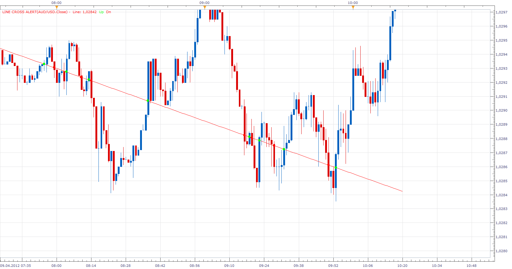
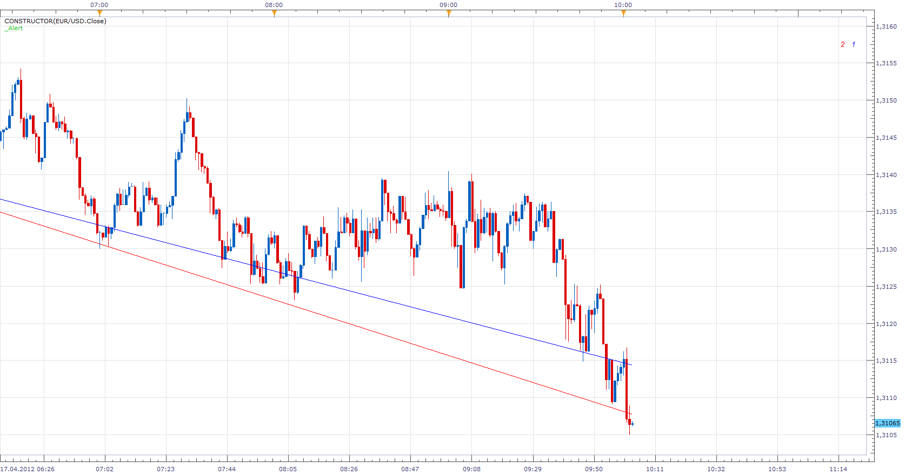
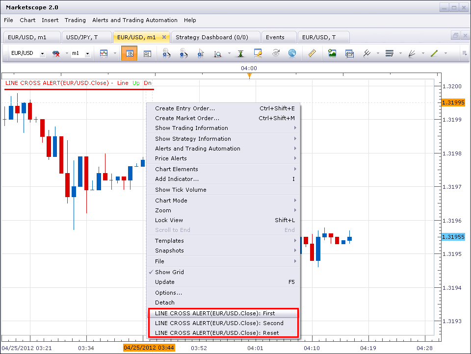
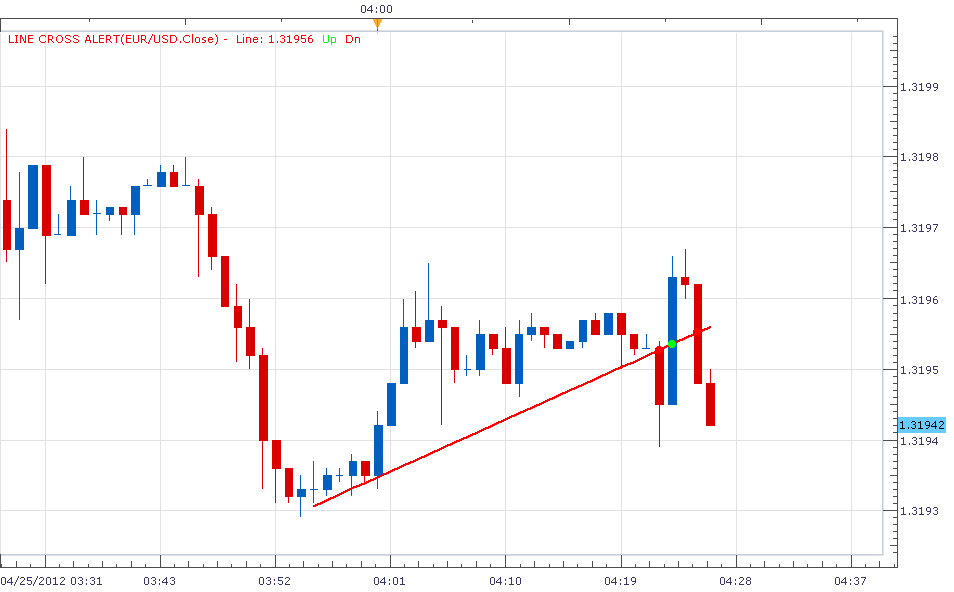
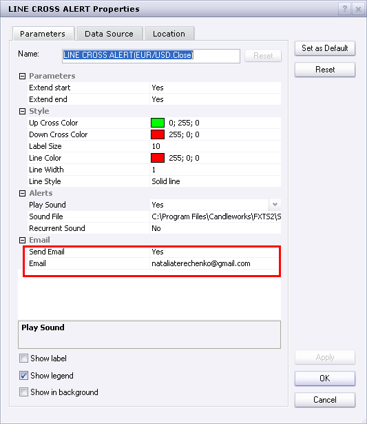
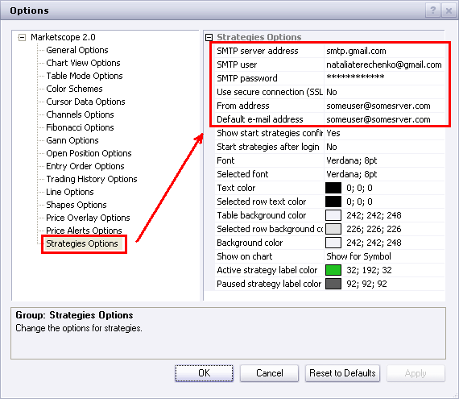
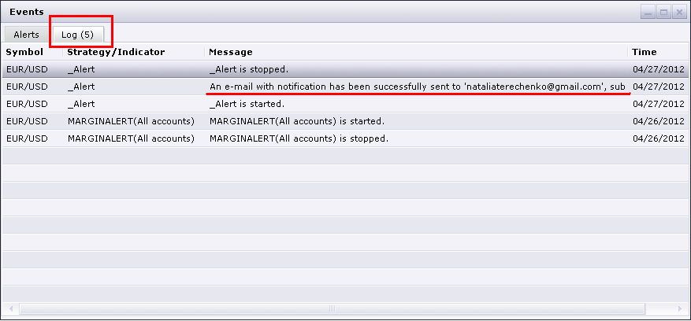
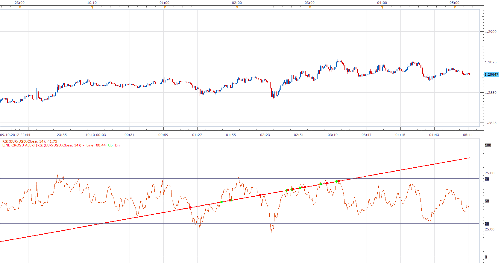
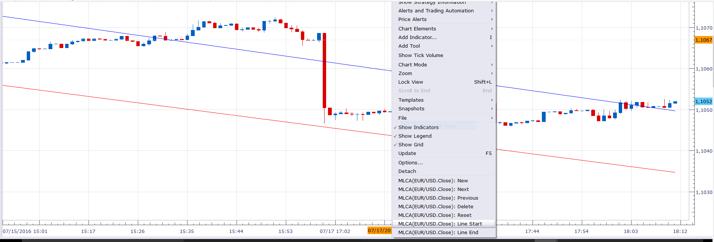

# Line Cross Alert

> Source: https://fxcodebase.com/code/viewtopic.php?f=17&t=15690  
> Forum: 17 · Topic 15690 · 59 post(s)

---

## Line Cross Alert

**Apprentice** · Sat Apr 07, 2012 3:56 pm

The indicator provides audio and Email Alerts.
When Source Data (close) crosses the trend line defined by the user.
To define a trend line use the First and Second Paremetre from the menu.
(Left mouse click)
Current version supports only one trend line per currency pair.

 [Line Cross Alert.lua](files/29545/Line%20Cross%20Alert.lua)

---

## Re: Line Cross Alert

**Apprentice** · Mon Apr 09, 2012 8:56 am

Moved from Beta Sub Forum.

---

## Re: Line Cross Alert

**LuckyPanda** · Fri Apr 13, 2012 10:17 pm

Hi Apprentice thanks for the indicator. Just what I was looking for.

Could you add an optional alert for when it bounces off the line too?

And please allow two lines.

Also does it work on an indicator data source?

Thanks.

---

## Re: Line Cross Alert

**Apprentice** · Mon Apr 16, 2012 3:48 am

When I find time, I had planned to offer you advanced version.
The current version works on Indicator data.

---

## Re: Line Cross Alert

**Apprentice** · Tue Apr 17, 2012 9:01 am

This version allows you to add unlimited number of lines.
Before defining new line use New parameter to define it.

 [MLCA.lua](files/30238/MLCA.lua)

---

## Re: Line Cross Alert

**LuckyPanda** · Tue Apr 17, 2012 5:58 pm

Great work! Although it took forever to figure out how to add lines.

Bug: When MLCA is on indicator window and you choose Extend Start or Extend End, the lines will show incorrectly, changing to horizontal lines sometimes.

Also right clicking to set start or end is difficult because usually the start or end points are where other indicator lines are. Right clicking on them will show a different menu. Can we open the menu and then left click to set the points? Or allow choosing existing lines drawn on chart? Thanks.

Hope to see rebounding alert when you have time. Thanks.

---

## Re: Line Cross Alert

**Apprentice** · Wed Apr 18, 2012 2:06 am

Bug - Make sure that the line start / end is not, prior to the first, after the last, candles.

---

## Re: Line Cross Alert

**LuckyPanda** · Wed Apr 18, 2012 4:44 am

Ya that's what happened with the lines.

After more testing, I did not get an audio alert when lines crossed. Could you add a pop up dialog option? Thanks.

---

## Re: Line Cross Alert

**Apprentice** · Thu Apr 19, 2012 1:36 am

Do yuo have _Alert Signal/Strategy installed, loaded and Activ.

---

## Re: Line Cross Alert

**LuckyPanda** · Mon Apr 23, 2012 4:52 pm

OK I loaded _Alert and it did make alert sound but no popup. Also does it need to be loaded for every pair that the MLCA is loaded? Thanks.

---

## Re: Line Cross Alert

**Apprentice** · Tue Apr 24, 2012 2:38 am

popup? I'm not sure what you mean.
This indicator provides audio alerts, sending email notifications.
Yes for each currency pair, you must add a separate indicator.

---

## Re: Line Cross Alert

**laners303** · Tue Apr 24, 2012 5:59 pm

hi there.

looks like a great indicator but I dont know how to assign the lines that are to trigger the alerts, can you explain this to me please?

all the best,
Laners303

---

## Re: Line Cross Alert

**sunshine** · Tue Apr 24, 2012 11:16 pm

Add the indicator Line Cross Alert to your chart. To assign values for the line, right-click on the chart and use the commands in the context menu:

 

The point where you right-clicked will be assigned for the value. First, choose the "LINE CROSS ALERT...: First" command to assign the first value. Then right-click on another point on the chart and choose "LINE CROSS ALERT...: Second" command to assign the second value.
You will see the line on your chart:

 

If you need to re-assign values, use the command "LINE CROSS ALERT...: Reset".

---

## Re: Line Cross Alert

**Apprentice** · Wed Apr 25, 2012 2:32 am

A small addition.
Use, Extend Start / End if you are using sound alert.

---

## Re: Line Cross Alert

**laners303** · Wed Apr 25, 2012 4:33 pm

Great stuff lads, thanks for the quick replys think this indicator
could make the world of difference.

All the best,
Laners303

---

## Re: Line Cross Alert

**Giantball** · Thu Apr 26, 2012 9:57 pm

I've added the alert strategy, but the email alert for this indicator still doesn't work. I tried it with 1min chart and tick chart too. Please help me figure this out. Email alert sent out for the other indicators works fine. When I open the Alert strategy, the middle of the box is all white. Is that normal?

Thank you for helping us small guys out.

Best regards,
G

---

## Re: Line Cross Alert

**sunshine** · Fri Apr 27, 2012 12:14 am

Hi,

Please check the settings in the Indicator Properties:

 

Besides, to be able to get email alerts, you should configure sending e-mail alerts in Chart Options. I use the following options and this works for me:

 

Please read for details: [How to configure send e-mail alert properly](https://fxcodebase.com/code/viewtopic.php?f=31&t=3034)

Also, I'd recommend you to use the Events window to view errors in case you will have issues with sending emails(Alerts and Trading Automation menu - > Show Events):

 

---

## Re: Line Cross Alert

**LuckyPanda** · Fri Apr 27, 2012 1:44 am

Can you make it so the alert also shows a dialog in addition to an audio alert? It's easy to miss the audio alert. A dialog box like the built-in pricealert does would be good. Thanks.

---

## Re: Line Cross Alert

**Coondawg71** · Tue Oct 09, 2012 1:05 pm

Can this Line Cross Alert Indicator be applied to Indicator Panel too, instead of just price chart??? If so, I would like to formally request it be added to the que.

thanks,

sjc

---

## Re: Line Cross Alert

**Apprentice** · Wed Oct 10, 2012 4:08 am

Yes, it's possible, just add the Alert Line Cross on oscillator of your choosing.

---

## Re: Line Cross Alert

**Coondawg71** · Fri Oct 12, 2012 5:57 am

Incorporating this Line Cross Alert as a parameter drop-down choice when adding indicators would be an incredible addition to the Trade Station platform. Perhaps this is something that could be added to the next platform release since it seems to be in Beta form as of now???

example: I have the choice to have Fibonacci Retracement/ Fib Fann Indicators alert and open/close a position when price closes after touching the parameter selection of ".618"

This may be a lofty request, but would make the user interface and indicators considerably "smarter".

thanks,

sjc

---

## Re: Line Cross Alert

**Apprentice** · Sun Oct 14, 2012 6:26 am

I will discuss this with the development team.

---

## Re: Line Cross Alert

**oraclefusions** · Sun Nov 17, 2013 4:21 am

> **Apprentice wrote:**
> I will discuss this with the development team.

Suppose I draw an 4H chart and i draw a Trend Line and use your indicator.
Now I will be notified when there is a breach of TL by the candles up or down.
I have questions

1. The cross of TL is triggered only when it happens in the 4H chart, right? because it is possible that price may have crossed that line in 1m chart, but thats not gonna trigger, only 4h is in the scope, am i right?

2. Can we make the indicator to have a choice, say if 4H, trigger only when a candle crosses above or below (closes or open ) the line, so we avoid when the wicks of candles breaks the line.

3. Can we have the same forumla attach to a strategy so that we will make this as a SL, So our pisution will be stopped out based on cross

cheers

---

## Re: Line Cross Alert

**Apprentice** · Mon Nov 18, 2013 5:36 am

As it is, it will alert you if chart time frame line is crossed on any time frame,
as we have Live, Not, End of Turn Alert.

Your request has been added to the development list.

---

## Re: Line Cross Alert

**easytrading** · Mon Jun 29, 2015 12:53 am

Hello Apprentice,

can we please, request a strategy for MLCA.lua indicator as below:

Buy when price crosses above line of MLCA.lua
Sell when price crosses below line of MLCA.lua
Close on opposite.

with much much appreciation in advance.

---

## Re: Line Cross Alert

**easytrading** · Thu Jul 02, 2015 2:09 pm

kindly Apprentice,
could you show the colored dot when price crossing blow/above MLCA.lua lines ,the same way as in Line Cross Alert.lua do ?
thank you in advance.

---

## Re: Line Cross Alert

**Apprentice** · Mon Jul 06, 2015 4:43 am

Your request is added to the development list.

---

## Re: Line Cross Alert

**HappyFox8** · Mon Oct 19, 2015 10:35 pm

I have downloaded & installed both the Line Cross Alert & the _Alert files. I am able to draw the lines on a chart but I am unable to get the alert to sound.

Furthermore, I have the _alert file appearing in the top left corner of the first chart on which i attempted to use it. And it also appears in the "Configure Strategies & Alerts" window. But when I go to a new chart the _Alert is not listed in the "Add indicator" window in the indicators selection window. I have tried downloading & re-installing again, but get the message "the strategy you are trying to replace is currently in use. Unable to proceed with the replacement".

Could we please have an explanation of exactly how to install, activate & use the _alert file so that there will be a sound when a line is crossed. Many thanks.

---

## Re: Line Cross Alert

**Apprentice** · Thu Oct 22, 2015 4:27 am

Please redownload.

Have fix a potential bug.
Audio alert has been tested and work as expected now.

---

## Re: Line Cross Alert

**HappyFox8** · Sun Nov 01, 2015 6:29 pm

Hi Apprentice,
Thanks for the fix. I have re-downloaded & all is working perfectly. Thanks heaps for the indicator.

---

## Re: Line Cross Alert

**HappyFox8** · Mon Nov 02, 2015 2:11 am

Hello again Apprentice (& everyone else on the forum),

Unfortunately I am finding that the alert only sounds some of the time. I am applying it in exactly the same way each time as far as I can tell. At this moment as I write, an alerted trend line (on a one minute chart) has been crossed 4 times without sounding. On the 5th cross (about 10 minutes after the first violation) it has begun to sound & has sounded on the 6th & 7th crosses.

So it seems that it has taken 10 minutes for it to get the idea. Do you have any thoughts? Has anyone else found the same thing happening?

---

## Re: Line Cross Alert

**HappyFox8** · Mon Nov 02, 2015 2:52 am

Update. I am figuring out that the alert is only sounding when approached from above. Yet I first drew the line when price was below it. I have double checked this with several other trend lines & the alert is definitely only sounding when approached from above.

The alert sounds without any time delay when approached from above, so, it is nothing to do with the passing of time, but the direction from which the line is approached.

---

## Re: Line Cross Alert

**HappyFox8** · Mon Nov 09, 2015 10:44 am

Hello Apprentice,

I am wondering whether you have noticed my last two posts & whether you have time to reply. Since posting I have continued to attempt using the MLCA but without success. Tonight alerts are not sounding at all & the indicator seems to have corrupted other indicators. E.g. standard price alerts have sometimes not been sounding. Another example is that the numbers that go with the MLCA lines have been appearing when I apply other indicators such as the parabolic SAR & ATR (even though the MLCA indicator has been deleted from the chart).

---

## Re: Line Cross Alert

**Apprentice** · Tue Nov 10, 2015 1:18 pm

Unfortunately, I was busy.
I encourage you to wait for the next update TS.
Indicator will get native alert support.
This alert helper business can become messy,
especially if multiple instances are used.

---

## Re: Line Cross Alert

**HappyFox8** · Tue Nov 10, 2015 7:45 pm

Hi Apprentice,
Thanks so much for your reply. I understand both your busy-ness & the difficulties. That is marvellous news that the trend line alert will be in the next TS update!

---

## Re: Line Cross Alert

**Apprentice** · Thu Dec 03, 2015 7:28 am

Compatibility issue Fix.
_Alert helper is not longer needed.

---

## Re: Line Cross Alert

**HappyFox8** · Mon Dec 14, 2015 7:28 pm

Thanks Apprentice,

It is working well & is extremely useful for my trading. I hope it is useful for others too.

When you have time I would like to be able to add a second alerted trend line to a chart too.

Many many thanks.

---

## Re: Line Cross Alert

**Apprentice** · Wed Dec 16, 2015 4:56 am

Your request is added to the development list.

---

## Re: Line Cross Alert

**gummysergeant** · Wed Jan 20, 2016 1:35 am

Hello Apprentice,

Is there any word on the native support? Thank you again for your help on this. It's amazing it hasn't already been included yet.

---

## Re: Line Cross Alert

**Apprentice** · Wed Jan 20, 2016 5:37 am

Native support for Line Tool Cross Alert?

---

## Re: Line Cross Alert

**HappyFox8** · Thu Jul 21, 2016 8:11 pm

Hi Apprentice,
I made a request some time ago for the ability to add a second alerted TL to a chart. Do you have time to look at this?

---

## Re: Line Cross Alert

**Apprentice** · Sun Jul 24, 2016 7:56 am

Why do not you use MLCA.lua instead?

---

## Re: Line Cross Alert

**HappyFox8** · Tue Jul 26, 2016 12:01 am

Okay. I didn't realise it was there. Thank you very much.

---

## Re: Line Cross Alert

**Steve0001** · Wed Jan 18, 2017 5:08 pm

I am trying to use MCLA.lua, but so far I have not been able to get it to sound an alert or send me an e-mail. Yes, I put my e-mail address in the indicator. My next step is go back to Line Cross Alert.lua and see if I can get that to work. Any ideas about getting this to work will be appreciated. Thanks!

---

## Re: Line Cross Alert

**Apprentice** · Thu Jan 19, 2017 3:13 pm

You must define the trend lines, via showed menu.

---

## Re: Line Cross Alert

**Apprentice** · Thu Jan 19, 2017 3:16 pm

Indicator was revised and updated.

---

## Re: Line Cross Alert

**Steve0001** · Thu Jan 19, 2017 5:03 pm

OK, thanks. I thought I did everything correctly (had lines on my chart and price crossed lines, but no alert). I will download your revised version and try it again.

---

## Re: Line Cross Alert

**Steve0001** · Thu Jan 19, 2017 10:32 pm

Hi. I discovered that my copy of the indicator was not the latest available (oops!). So I downloaded a fresh copy and tried it and it works. Great!

One way it might be improved would be if there was some way of identifying which pair(s) had experienced a line crossing. The way it is now, I could put it on 20 different currency pairs and then have no idea which one was crossing, so I would have to look at each pair to see which one(s) had triggered. And if I left the room and came back, I would have no way of knowing if I missed an event.

Possible ideas for improvement:
(1) A dashboard that logs which pair(s) had an event would be really nice (probably asking too much).
(2) An option to have a dialogue box pop-up (identifying the event, like on the price alerts).
(3) Another possibility would be to have a separate sound alerts for different pairs (like I could record my voice saying each pair by name).

Thanks again!

---

## Re: Line Cross Alert

**Steve0001** · Thu Jan 19, 2017 10:34 pm

Also, I did not get the e-mail notification to work.

---

## Re: Line Cross Alert

**Apprentice** · Fri Jan 20, 2017 5:47 am

If Sound Alert is ok.
Email should work also.
Can you please check / test, your TS email settings.

---

## Re: Line Cross Alert

**Steve0001** · Sun Jan 22, 2017 9:57 am

Thanks! You were correct. TS was not configured to send e-mail. Explanation for anyone else reading this: you enter the recipient e-mail address into the indicator for the alert, but TS also needs sender information in order to send an e-mail alert. The e-mail alerts tell you what pair it is alerting on (very helpful). If you are using it with another indicator (e.g. RSI), it does not tell you "RSI" in the e-mail alert, but it does tell you what value the line was crossed at (so you can deduce what it is alerting on if you also happen to have a line crossing alert set up on piece on the same pair).

The only problem now is this: I did a few limited tests with the indicator and found that it seems to alert for crossing under, but not for crossing over.

Thanks!

---

## Re: Line Cross Alert

**Steve0001** · Tue Jan 24, 2017 3:33 pm

There is still a problem. I have tested the indicator (MLCA) more extensively now and I find that it alerts for "Cross Under" only, and never for "Cross Over." I looked at the program, but could not find what could be wrong (the logic appears to be correct, but I don't know lua very well).

It would also be helpful if the instrument name could be included in the subject line of the e-mail alert (to be able to see at a glance which pairs have alerted without having to open the messages).

It might also be useful if there was an option to alert only if the line crossing persists on the candle close (ignore temporary crossing by candle wicks).

Thanks.

---

## Re: Line Cross Alert

**7000306337** · Sun Jul 16, 2017 11:09 pm

Hi:
Thanks in advance for your precious time.

This is EXACTLY what I need .... IF (in addition to activating the ALERT) .... it can ALSO execute enter() and exit() trades upon crossing that amazing trend line.

Could this be done????????
Or impossible .. too good to be true !!!!

---

## Re: Line Cross Alert

**anashassan76** · Mon Jul 17, 2017 2:01 am

hi . very good work . but i faced a problem . i normally take trading signal at candle close . not at touch .

can you add selection of time frame to make the alert go . bib or 1m or 5m or 15 or 1h or 2h .... etc

---

## Re: Line Cross Alert

**Apprentice** · Mon Jul 17, 2017 4:01 am

7000306337
Two ways exist.
Execute the first trade from the indicator.
Send a trade signal from indicator to strategy
Steve0001
Your request is added to the development list, Under Id Number 3824
 If someone is interested to do this task, please contact me.

---

## Re: Line Cross Alert

**7000306337** · Mon Jul 17, 2017 8:00 am

Thank you Apprentice for wonderful news.

Please, please, please give me a link to an existing example of each of the 2 ways.

You`re amazing.

---

## Re: Line Cross Alert

**Apprentice** · Mon Jul 17, 2017 4:06 pm

Trade from Indicator
[viewtopic.php?f=17&t=64251&p=112616&hilit=trading#p112616](https://fxcodebase.com/code/viewtopic.php?f=17&t=64251&p=112616&hilit=trading#p112616)
As for second part.
U can use

Code: [Select all](https://fxcodebase.com/code/)
`function Prepare()
       ...
       require("storagedb");
       local db = storagedb.get_db("MYINDI");
       ...
   end`

---

## Re: Line Cross Alert

**Apprentice** · Tue Sep 05, 2017 4:24 am

One for anashassan76

 [Line Cross Alert.lua](files/114697/Line%20Cross%20Alert.lua)

I've tested it on AUD/JPY.

 [1.csv](files/114697/1.csv)

---

## Re: Line Cross Alert

**Apprentice** · Mon Feb 05, 2018 8:12 am

The Indicator was revised and updated.
