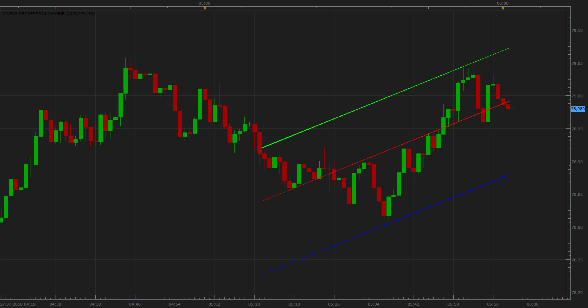

# Linear Regression Channel (Simple)

> Source: https://fxcodebase.com/code/viewtopic.php?f=17&t=1595  
> Forum: 17 · Topic 1595 · 23 post(s)

---

## Linear Regression Channel (Simple)

**Apprentice** · Tue Jul 27, 2010 5:04 am

 Linear Regression Line is a straight line that best fits the prices between a starting price point and an ending price point.

The indicator has two channel modes
1) Max Distance
The distance between Linear Regression Line and Linear Regression channel,
 equals to the value of maximum close price Distance from the regression line.

2)Standard deviations
Default value is one Standard deviations from central line.

 [Linear Regression Channel.lua](files/3140/Linear%20Regression%20Channel.lua)

 

 [Linear Regression Channel.lua](files/3140/Linear%20Regression%20Channel%20%282%29.lua)

Data Filter version.
If the price is, beyond the default standard deviation, price is set to standard deviation.
if Price >Mid Line + STD*Multiplier then
 Price = Mid Line + STD*Multiplier
elseif Price < Mid Line - STD*Multiplier then
 Price = Mid Line - STD*Multiplier
end

 [Linear Regression Channel With Data Filter.lua](files/3140/Linear%20Regression%20Channel%20With%20Data%20Filter.lua)

Complex version, can be found here.
[http://fxcodebase.com/code/viewtopic.php?f=17&t=548&start=0&hilit=Linear+Regression](https://fxcodebase.com/code/viewtopic.php?f=17&t=548&start=0&hilit=Linear+Regression)

---

## Re: Linear Regression Channel (Simple)

**Nikolay.Gekht** · Tue Oct 05, 2010 7:46 pm

hi all!

Could you please take a look at [auto fibonacci lines](http://www.fxcodebase.com/code/viewtopic.php?f=17&t=2338) indicator. If the approach to manage lines in auto fib. indicator is ok, I can rewrite channel indicator, so you will be able to choose the from/to bar to calculate the channel. I think it would be a bit more useful.

---

## Re: Linear Regression Channel (Simple)

**zekelogan** · Wed Jan 05, 2011 10:31 am

Is it possible to add in a tidbit of code in order to have the channel extend further than the current period? I suppose a toggle would be handy for those that did not want it...

Thanks!

---

## Re: Linear Regression Channel (Simple)

**Nikolay.Gekht** · Wed Jan 05, 2011 8:57 pm

Linear regression channel is made as an instrument in upcoming version of TS/Marketscope. So, just wait a few days to have these features "natively".

---

## Re: Linear Regression Channel (Simple)

**Blackcat2** · Fri Jan 07, 2011 8:02 am

Very nice indicator, I agree with zekelogan about the option to extend the line couple of bars and also to adjust line style...

Cheers..
BC

---

## Re: Linear Regression Channel (Simple)

**Blackcat2** · Sun Jan 09, 2011 5:53 pm

I find the regression channel tool in the new version of marketscope difficult to use. I still use this indicator as it automatically update abd calculate the channels.. Is it possible to ask for option to change line style?

Thanks

---

## Re: Linear Regression Channel (Simple)

**holly2011** · Thu Jan 20, 2011 1:52 pm

where can i find the linear regression channel so i can set it to 2 deviation? Because the standard one doesnt tell you what deviation it is set on.
Thank you
Holly

---

## Re: Linear Regression Channel (Simple)

**Apprentice** · Thu Jan 20, 2011 3:36 pm

Under the standard, do you think about the standard tools within the Platform.

This indicator, posted hire, i do not use a standard deviation.
But it is possible to add it.

---

## Re: Linear Regression Channel (Simple)

**Apprentice** · Fri Jan 21, 2011 1:02 pm

Standard deviation, channel mode added.

---

## Re: Linear Regression Channel (Simple)

**BlueBloodedTrader** · Wed Feb 16, 2011 4:46 am

Is it possible to refine this in such a way that outliers in the data set are ignored? For example , if the linear regression channel is based on a user defined 20 candles, but one of those candles sees an uncharacteristic spike in volatility that is completely out of line with all other candles then it should be removed from the data set used to calculate the linear regression channel and so only 19 periods will be used for the calculation in that case. Outliers may be removed from the dataset if perhaps they exceed 1.65 Standard Deviations or 2 standard deviations from other candles in the defined set.

---

## Re: Linear Regression Channel (Simple)

**Apprentice** · Wed Feb 16, 2011 1:21 pm

Very interesting proposal.
I'll try to write it as soon as possible.

In addition, I'll try to write a Price / Data filters in order to filter the different data sources.
What would later be used with existing indicators.

---

## Re: Linear Regression Channel (Simple)

**Apprentice** · Wed Feb 16, 2011 1:57 pm

I add a version that contains a simple data filter.

 if open[i] > Mid[i]+ SD[i] then
 open[i] = Mid[i]+ SD[i];
elseif open[i] < Mid[i] - SD[i] then
 open[i] = Mid[i] - SD[i] ;
 end

if close[i] > Mid[i]+ SD[i] then
close[i] = Mid[i]+ SD[i];
elseif close[i] < Mid[i] - SD[i] then
close[i] = Mid[i] - SD[i];
end

if high[i] > Mid[i]+ SD[i] then
 high[i] = Mid[i]+ SD[i];
elseif high[i] < Mid[i] - SD[i] then
high[i] = Mid[i] - SD[i];
 end

if low[i] > Mid[i]+ SD[i] then
low[i] = Mid[i]+ SD[i];
elseif low[i] < Mid[i] - SD[i] then
low[i] = Mid[i] - SD[i] ;
end

After thorough research plans to release an independent data filter.

---

## Re: Linear Regression Channel (Simple)

**BlueBloodedTrader** · Mon Aug 01, 2011 4:53 am

**UPDATE REQUEST**

Would it be possible to have this indicator working on a basis where it doesn't include the current candle (so a linear regression channel based on candles n-x to n-1) and then incorporate a breakout strategy on this indicator so that if the current candle (not included in the regression calculation) breaks out of either the upper or lower limit then a trade is entered?

---

## Re: Linear Regression Channel (Simple)

**Coondawg71** · Sun Dec 09, 2012 12:33 pm

Can we please request an update to this indicator which would add user option of additional standard deviation parameters such as 0.25, 0.50, 0.75, 1.618, 2.0, 3.0.

thanks,

sjc

---

## Re: Linear Regression Channel (Simple)

**Apprentice** · Mon Dec 10, 2012 3:08 am

Version with Multiple, deviation lines added.

---

## Re: Linear Regression Channel (Simple)

**Coondawg71** · Mon Dec 10, 2012 6:55 am

Thanks! Exactly what I needed. Works great for trading off the median lines and the trend lines associated with it. As you probably know, there is the small issue of: if you toggle any of the additional ratios to "OFF" it creates an error for the indicator. So before users flood the thread with error notices, users please toggle all the default ratios to "YES", and the "Channel Mode to "Deviation"; these ratios will prove to be quite beneficial trend lines for future price action!

Thanks Again for another job well done and expeditious turn around!

sjc

---

## Re: Linear Regression Channel (Simple)

**Apprentice** · Mon Dec 10, 2012 9:01 am

Corrected.
By mistake I upload wrong, in development version.

---

## Re: Linear Regression Channel (Simple)

**boss_hogg** · Tue Jan 08, 2013 12:55 pm

> **BlueBloodedTrader wrote:**
> **UPDATE REQUEST**
>
> Would it be possible to have this indicator working on a basis where it doesn't include the current candle (so a linear regression channel based on candles n-x to n-1) and then incorporate a breakout strategy on this indicator so that if the current candle (not included in the regression calculation) breaks out of either the upper or lower limit then a trade is entered?

This is exactly what I also wanted, I think I managed to make it work. Keep in mind the following:
For a 2 candle period, lets consider the last 4 candles:
n is the current (still running) one: the lines are drawn up to this candle so you see if there will be a break out or not; it is not taken into account for the calculations though
n-1 and n-2: these are the candles used for the calculations
n-3: the line is also drawn till that but it is not taken into account for the calculations; I could not remove it so I just kept it and just ignore it.

I have also added two output streams, one for tilt and one for break out:
tilt: -1 for downslope, 0 for horizontal, 1 for upslope
break out: 1 for breaking top line, -1 for breaking bottom line, 0 for not breaking either

When the current candle closes, keep in mind that:
- break out is calculated if the close value of the CURRENT candle is higher/lower than the top/bottom lines at the CURRENT candle period
- THEN the standard deviation is calculated and then tilt is calculated considering candles n and n-1 (which are to become n-1 and n-2)
- THEN the new top and bottom lines are calculated and they will be used for break out calculation of the NEW current candle.

Apprentice one question for you: I tried to use internal streams (addInternalStream) for passing values to a strategy but I failed; is it only possible with normal streams (addStream) ?

---

## Re: Linear Regression Channel (Simple)

**boss_hogg** · Tue Jan 08, 2013 1:01 pm

One more thing, if there are two ore more consecutive break outs in the same direction, then break out value is 2 or -2 for top/bottom respectively.

---

## Re: Linear Regression Channel (Simple)

**Apprentice** · Wed Jan 09, 2013 5:06 pm

Yes you have to use normal streams.

Try to use this implementation.

indicator.parameters:addBoolean("Use", "Use Signal Mode", "" , true);

local Use;
local Out;

Use =instance.parameters.Use;

if Use then
Out = instance:addStream("Out", core.Line, name, "Out",core.rgb(0,0,0), first);
end

if Use then
 if condition then
 Out[period]= 1;
 elseif condition then
 Out[period]= -1;
 end
end

By adding this Additional parameter, Use.
You can control the output signal.
If u use it as indicator, set it to false.
If called from the strategy Use true.

---

## Re: Linear Regression Channel (Simple)

**boss_hogg** · Thu Jan 10, 2013 8:25 am

That's a good idea, thanks

---

## Re: Linear Regression Channel (Simple)

**Apprentice** · Tue May 02, 2017 11:35 am

Indicator was revised and updated.

---

## Re: Linear Regression Channel (Simple)

**Apprentice** · Wed Feb 21, 2018 6:30 am

The Indicator was revised and updated.
