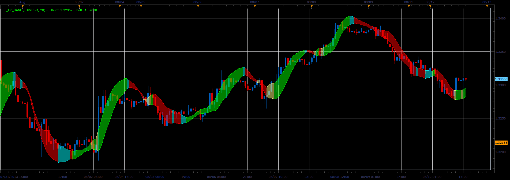

# Linear Regression High/Low band

> Source: https://fxcodebase.com/code/viewtopic.php?f=17&t=59058  
> Forum: 17 · Topic 59058 · 3 post(s)

---

## Linear Regression High/Low band

**Alexander.Gettinger** · Tue Aug 13, 2013 8:54 am

The oscillator uses for its calculations indicator Linear Regression Line ([viewtopic.php?f=17&t=14929&p=43329](https://fxcodebase.com/code/viewtopic.php?f=17&t=14929&p=43329)).

Formulas:
Hbuff = Linear Regression Line (High, Period),
Lbuff = Linear Regression Line (Low, Period).

 

Download:

 [HL_LR_Band.lua](files/88475/HL_LR_Band.lua)

For this indicator must be installed Linear Regression Line indicator ([viewtopic.php?f=17&t=14929&p=43329](https://fxcodebase.com/code/viewtopic.php?f=17&t=14929&p=43329)).

The indicator was revised and updated

---

## Re: Linear Regression High/Low band

**Alexander.Gettinger** · Tue Aug 13, 2013 8:56 am

MQL4 version of Linear Regression High/Low band: [http://fxcodebase.com/code/viewtopic.php?f=38&t=59059](https://fxcodebase.com/code/viewtopic.php?f=38&t=59059)

---

## Re: Linear Regression High/Low band

**Apprentice** · Sun Jun 04, 2017 5:21 am

The indicator was revised and updated.
