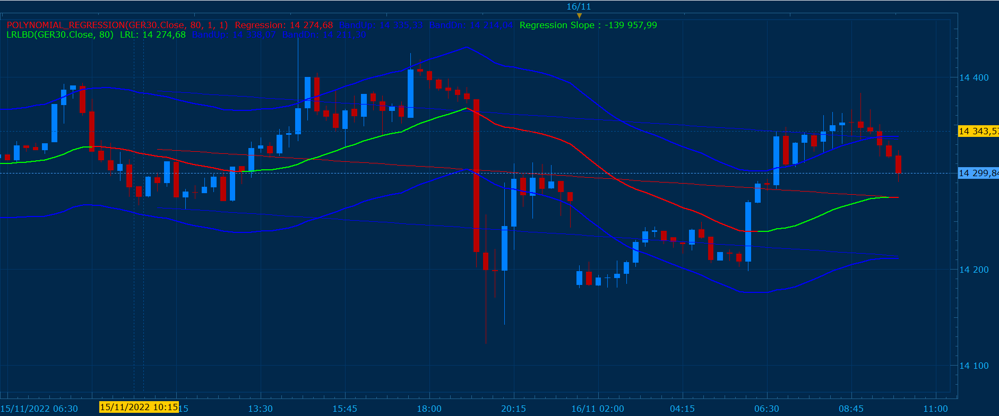

# Linear Regression Line with Band Deviation

> Source: https://fxcodebase.com/code/viewtopic.php?f=17&t=72957  
> Forum: 17 · Topic 72957 · 4 post(s)

---

## Linear Regression Line with Band Deviation

**Gilles** · Wed Nov 16, 2022 4:17 am

*image*

Hi Apprentice,

I propose this indicator that I have just done.

based on LINEAR REGRESSION LINE and POLYNOMIAL_REGRESSION

The purpose of this indicator is to show the evolution of a polynomial regression of degree 1 (linear) over time.
This also makes it possible to visualize where the tapes are to consider where not a profit taking
or the positioning of the stop loss, as desired.

Enjoy it :) !

And please DONATE to Gehtsoft USA LLC.

 [LRLBD.lua](files/148368/LRLBD.lua)

---

## Re: Linear Regression Line with Band Deviation

**crypto0014** · Thu Nov 17, 2022 12:47 pm

Pls provide mt4 version

---

## Re: Linear Regression Line with Band Deviation

**Apprentice** · Tue Nov 22, 2022 4:17 am

We have added your request to the development list.
Development reference 769.

---

## Re: Linear Regression Line with Band Deviation

**Apprentice** · Mon Jan 20, 2025 11:04 am

MT4 version.
[https://fxcodebase.com/code/viewtopic.p ... 15#p157915](https://fxcodebase.com/code/viewtopic.php?f=38&t=75525&p=157915#p157915)
