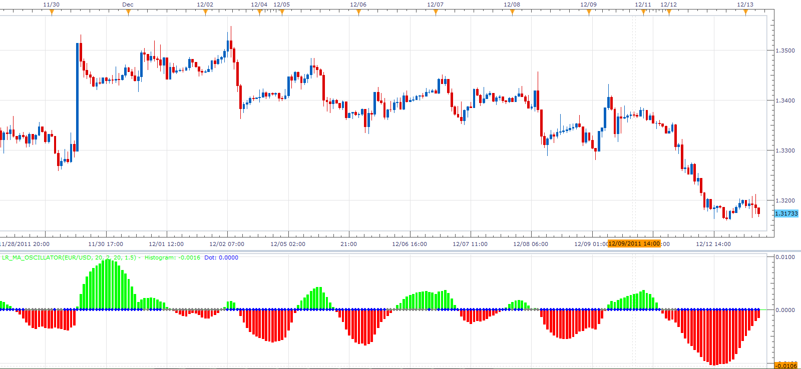

# Linear regression MA oscillator

> Source: https://fxcodebase.com/code/viewtopic.php?f=17&t=9561  
> Forum: 17 · Topic 9561 · 2 post(s)

---

## Linear regression MA oscillator

**Alexander.Gettinger** · Tue Dec 13, 2011 4:32 am

This indicator is a ported MQL4 indicators from [http://www.mql5.com/ru/code/745](http://www.mql5.com/ru/code/745) (in Russian).

 

Download:

 [LR_MA_Oscillator.lua](files/20504/LR_MA_Oscillator.lua)

For this indicator must be installed Averages indicator from [viewtopic.php?f=17&t=2430%29](https://fxcodebase.com/code/viewtopic.php?f=17&t=2430%29)

For this indicator must be installedStandard Deviation Indicator from
[viewtopic.php?f=17&t=870&hilit=STDDEV](https://fxcodebase.com/code/viewtopic.php?f=17&t=870&hilit=STDDEV)

The indicator was revised and updated

---

## Re: Linear regression MA oscillator

**Apprentice** · Sun Mar 19, 2017 11:09 am

Indicator was revised and updated.
