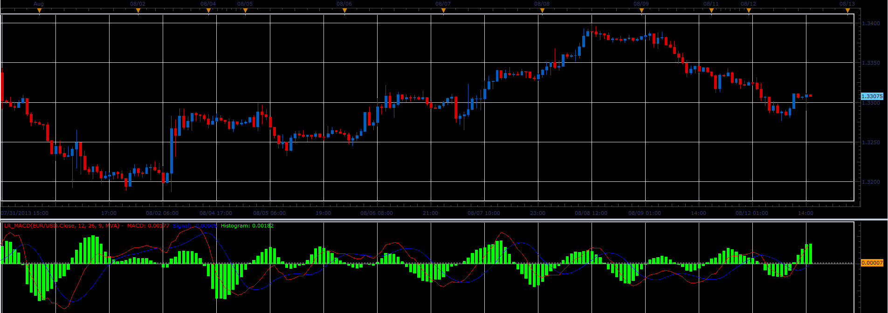

# Linear Regression MACD

> Source: https://fxcodebase.com/code/viewtopic.php?f=17&t=59055  
> Forum: 17 · Topic 59055 · 3 post(s)

---

## Linear Regression MACD

**Alexander.Gettinger** · Tue Aug 13, 2013 8:46 am

The MACD uses for its calculations indicator Linear Regression Line ([viewtopic.php?f=17&t=14929&p=43329](https://fxcodebase.com/code/viewtopic.php?f=17&t=14929&p=43329)).

Formulas (for LR_MACD.lua):
MACD = Linear Regression Line(Short period)-Linear Regression Line(Long period),
Signal = Moving average(MACD, Signal period, Signal method),
Histogram = MACD - Signal.

Formulas (for LR_MACD2.lua):
MACD = Linear Regression Line(Short period)-Linear Regression Line(Long period),
Signal = Linear Regression Line(MACD, Signal period),
Histogram = MACD - Signal.

 

The indicator was revised and updated

Download:

 [LR_MACD.lua](files/88471/LR_MACD.lua)

 [LR_MACD2.lua](files/88471/LR_MACD2.lua)

For this indicator must be installed Linear Regression Line indicator ([viewtopic.php?f=17&t=14929&p=43329](https://fxcodebase.com/code/viewtopic.php?f=17&t=14929&p=43329)) and Averages indicator ([viewtopic.php?f=17&t=2430](https://fxcodebase.com/code/viewtopic.php?f=17&t=2430)).

---

## Re: Linear Regression MACD

**Alexander.Gettinger** · Tue Aug 13, 2013 8:50 am

MQL4 version of Linear Regression MACD: [viewtopic.php?f=38&t=59056](http://www.fxcodebase.com/code/viewtopic.php?f=38&t=59056)

---

## Re: Linear Regression MACD

**Apprentice** · Sun Jun 04, 2017 5:36 am

The indicator was revised and updated.
