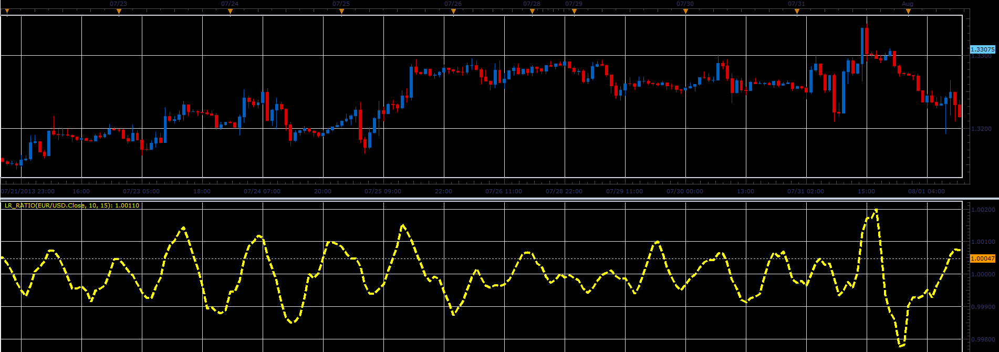

# Linear regression ratio oscillator

> Source: https://fxcodebase.com/code/viewtopic.php?f=17&t=59051  
> Forum: 17 · Topic 59051 · 3 post(s)

---

## Linear regression ratio oscillator

**Alexander.Gettinger** · Tue Aug 13, 2013 8:33 am

The oscillator uses for its calculations indicator Linear Regression Line ([viewtopic.php?f=17&t=14929&p=43329](https://fxcodebase.com/code/viewtopic.php?f=17&t=14929&p=43329)).

Ratio = Linear Regression Line(Period1)/Linear Regression Line(Period2).

 

Download:

 [LR_Ratio.lua](files/88465/LR_Ratio.lua)

For this indicator must be installed Linear Regression Line indicator ([viewtopic.php?f=17&t=14929&p=43329](https://fxcodebase.com/code/viewtopic.php?f=17&t=14929&p=43329)).

The indicator was revised and updated

---

## Re: Linear regression ratio oscillator

**Alexander.Gettinger** · Tue Aug 13, 2013 8:41 am

MQL4 version of this oscillator: [http://www.fxcodebase.com/code/viewtopi ... 38&t=59054](http://www.fxcodebase.com/code/viewtopic.php?f=38&t=59054)

---

## Re: Linear regression ratio oscillator

**Apprentice** · Sun Jun 04, 2017 5:40 am

The indicator was revised and updated.
