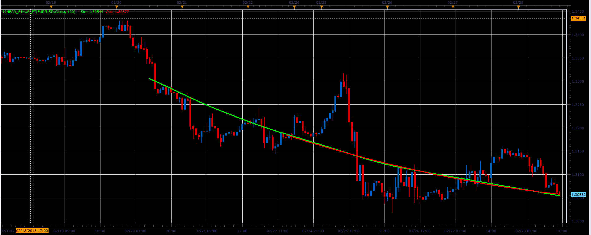

# Linear Sinus FT

> Source: https://fxcodebase.com/code/viewtopic.php?f=17&t=32537  
> Forum: 17 · Topic 32537 · 2 post(s)

---

## Linear Sinus FT

**Alexander.Gettinger** · Thu Feb 28, 2013 4:39 pm

This indicator was required: [viewtopic.php?f=27&t=31394&p=53570#p53570](https://fxcodebase.com/code/viewtopic.php?f=27&t=31394&p=53570#p53570)

 

Indicator with indent in bars:

 [Linear_Sinus_FT.lua](files/55427/Linear_Sinus_FT.lua)

Indicator with indent in hours:

 [Linear_Sinus_FT_H.lua](files/55427/Linear_Sinus_FT_H.lua)

The indicator was revised and updated

---

## Re: Linear Sinus FT

**Apprentice** · Mon May 01, 2017 5:37 am

Indicator was revised and updated.
Major performance update was introduced.
