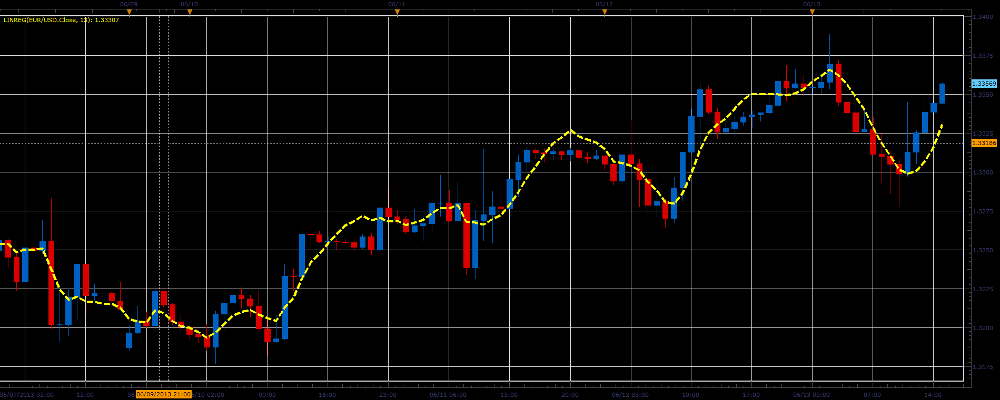

# Linreg indicator

> Source: https://fxcodebase.com/code/viewtopic.php?f=17&t=41308  
> Forum: 17 · Topic 41308 · 2 post(s)

---

## Linreg indicator

**Alexander.Gettinger** · Tue Jun 18, 2013 2:44 pm

This indicator is a ported MQL5 indicator from [http://www.mql5.com/ru/code/1724](http://www.mql5.com/ru/code/1724) (in Russian).

The indicator uses a linear regression algorithm.

 

Download:

 [linreg.lua](files/67536/linreg.lua)

The indicator was revised and updated

---

## Re: Linreg indicator

**Apprentice** · Sat May 27, 2017 11:50 am

Indicator was revised and updated.
