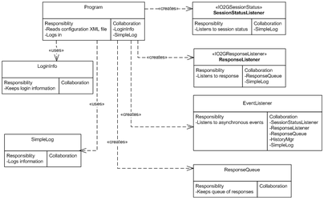
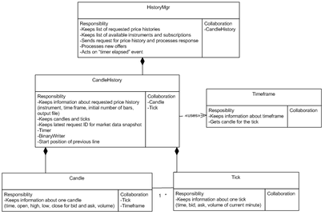
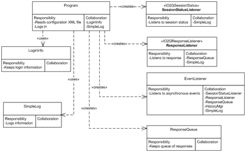
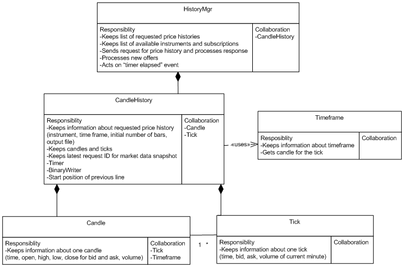
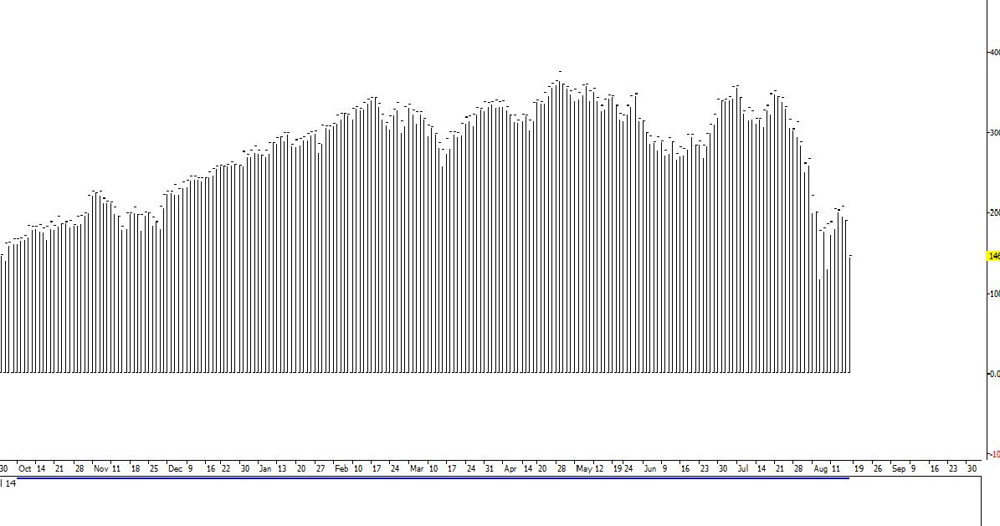
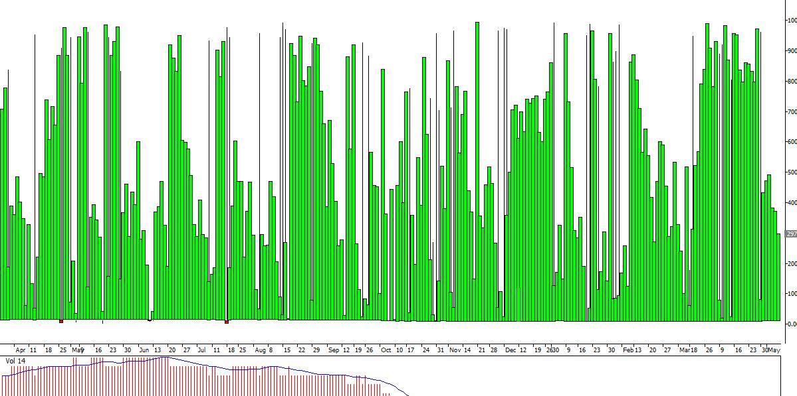

# Live chart data export to CSV

> Source: https://fxcodebase.com/code/viewtopic.php?f=17&t=4685  
> Forum: 17 · Topic 4685 · 128 post(s)

---

## Live chart data export to CSV

**chimpy** · Fri Jun 10, 2011 11:30 am

For my style of trading its important for me to use the chart data from the broaker I am using.
However if you use an external charting package or something like Ninja trader or EWAVE for short term trading then what can you do??
Well as it stands at the moment there is good and bad news as far as Tradstation is concerned.

The good news: is that someone had already thought of this problem and coded a standard Tradestation 8/2000i *.ELD, *.ELA format indicatior addon that you can add to any timeframe chart TICK, 1min, 5min, 1hour, 4 hour etc, and as soon as the chart is updated in tradstation then a CSV file is updated with that bar information in a folder you chose so, that all you have to do is read that file with your external charting package and you have exactly the same live data as you have in tradstation... great. (I have attached the indicator and source code to this post)

The bad news: is that for some reason fxcm's version of tradestation does not the standard ELD, ELA indicator addon that all the other tradestation platform brokers use. fxcm's tradestation uses lua format I am told...

I dont know if anyone on this forum is capable for recoding this indicator into lua but I am sure it woudl be very valuable to the tradestation uses of this site...

out of interest, metatrader has an indicator addon called Historydata.mq4 that does much the same job as dttsutility.eld attached to this thread

Greatful for any help

Chimpy

UPDATE:
DOWNLOAD THE LATEST VERSION HERE
[viewtopic.php?f=17&t=4685&start=100#p105245](http://www.fxcodebase.com/code/viewtopic.php?f=17&t=4685&start=100#p105245)

---

## Re: Live chart data export to CSV

**chimpy** · Sat Jun 11, 2011 9:06 am

sorry, here are the files mentioned above, attached

---

## Re: Live chart data export to CSV

**chimpy** · Mon Jun 13, 2011 12:44 pm

the ELD Tradestation addon attached

---

## Re: Live chart data export to CSV

**sunshine** · Tue Jun 14, 2011 8:20 am

If I understand you correctly, you have an indicator on EasyLanguage for TradeStation. And you would like to use it with FXCM .
1) you can post request on this forum for fxcodebase developers and ask them to convert your indicator from EasyLanguage to Lua. And they develop the indicator for free in the order of a queue. You will be able to use the indi in Marketsope.
2) if you really need live chart data from FXCM, you should use our trading API to develop your own application which receives prices.

---

## Re: Live chart data export to CSV

**chimpy** · Wed Jun 15, 2011 5:58 pm

sunshine,

Thanks for you reply. Yes you are correct. The file I posted above is in easylanguage and I understand this section of the website is the right place to post indicator conversion requests.. so I will I be given some queue number at some point or just wait for a reply from one of the developers?

Your idea about using the API is interesting. I am not a developer so are not sure how to go about that, could you show me? What I need is a bunch of CSV files that are updated each time their respective bar is updated. Or alternatively some kind of polling sequence, say every 25 seconds, that checks the current price and adjusts the data in the CSV files accordingly. The HISTORYDATA.mq4 indicator for metatrader works that way. I have posted a requestto convert that as well, but the easylanguage file in this post may be somewhat easier for the developers to deal with.

If you can tell me how to achieve this kind of functionality from the API then all the better

Thanks

---

## Re: Live chart data export to CSV

**chimpy** · Thu Jun 23, 2011 3:57 pm

I have two 3rd party apps which both check the file with timeouts. I usually set the timeout to be slightly less that the timeout of the indicator output file just to make sure I get updated with the latest version. Seems like my apps just skip an update if they ever clash or perhaps the OS (vista in my case) just queues requests to that file...?

---

## Re: Live chart data export to CSV

**chimpy** · Sun Jun 26, 2011 1:54 pm

does anyone have a rough idea how long the request will take to resolve. I know you guys are busy but are we talking weeks or months??!?

Chimpy

---

## Re: Live chart data export to CSV

**allpin** · Mon Jul 18, 2011 12:51 pm

Hi! Here is an application which would load required price histories with predefined number of bars, and then continue to build price histories based on incoming offers. It would periodically write the results to the output files.
You have to create a file `Configuration.xml` to provide arguments (password is provided via command line).
This is a sample of configuration file.

```
<?xml version="1.0" encoding="utf-8" ?>
<configuration>
  <Settings>

    <UserID>GBD76837005</UserID>
    <URL>www.fxcorporate.com/Hosts.jsp</URL>
    <Connection>demo</Connection>
    <SessionID></SessionID>
    <Pin></Pin>
    <TradingDayOffset>-7</TradingDayOffset>
    <TradingWeekOffset>0</TradingWeekOffset>
    <Delimiter>;</Delimiter>
    <Timeout>60</Timeout>
    <OutputDir>c:\fxcmdata</OutputDir>
    <SeparateDateAndTime>N</SeparateDateAndTime>
    <FormatDecimalPlaces>Y</FormatDecimalPlaces>
    <NeedLastCompletedCandle>N</NeedLastCompletedCandle>
    <TimeZone>EST</TimeZone>
    <History>
      <Instrument>USD/JPY</Instrument>
      <TimeFrame>m5</TimeFrame>
      <File>USD_JPY_min5</File>
      <NumBars>1000</NumBars>
    </History>
     
    <History>
      <Instrument>EUR/USD</Instrument>
      <TimeFrame>m1</TimeFrame>
      <File>EUR_USD_min1</File>
      <NumBars>1000</NumBars>
    </History>
       
    <History>
      <Instrument>USD/JPY</Instrument>
      <TimeFrame>m1</TimeFrame>
      <File>USD_JPY_min1</File>
      <NumBars>1000</NumBars>
    </History>
   
  </Settings>
</configuration>
```

You always have to provide `UserID`, `URL`, `Connection`, and `Password`. You may need to provide `SessionID` and `Pin`.
 You can provide `TradingDayOffset` (default=-7) and `TradingWeekOffset` (default=0).
 You have to provide `Delimeter` for you .csv file (usually ',' or ';').
 You have to provide `Timeout` (in seconds) for writing to .csv file.
 You can provide `OutputDir` (deafult is current directory).
 You can provide `SeparateDateAndTime` (if the value is 'y' or 'Y', separate fields for date and time would be created;
	default is one field for DateTime).
 You can provide `FormatDecimalPlaces` (if the value is 'y' or 'Y', all prices will have the same number of decimal places
 (trailing zeroes will be added if needed), default is 'N' ('Do not format decimal places').
 You can provide TimeZone (valid values are "UTC", "EST", and "Local"). The default value is "EST".
 You can provide `NeedLastCompletedCandle` (if the value is 'y' or 'Y', the last completed candle will be shown on the screen, and offers would not be shown),
 default is 'N' ('User needs forming candles as well').
 For each price history you would like to get, you have to provide
 `Instrument`, `TimeFrame`, `File` (name of the output file), `NumBars` (number of bars loaded from the start).
If you would like just get the last candle use `<NumBars>2</NumBars>`.

This application uses [ForexConnect API](http://www.fxcodebase.com/documents/ForexConnectAPI).

These are main classes used by application:

 



The main class `Program` reads configuration XML file and validates input. `Program` creates a session, creates an instance of session status listener, and subscribes it to the session. Then it creates `ResponseQueue` (for storing a queue of `O2GResponses`) and an instance of response listener. The instance of response listener is subscribed to the session. Then application logs in. `EventListener` catches asynchronous events (“connected”, "reconnecting", “status changed”, “got a response”) and calls `HistoryMgr` for action.

Please see the class `HistoryMgr` and supporting classes:

 



Class `HistoryMgr` is a heart of the application. It keeps a list of `CandleHistories`. `CandleHistory` keeps a price history required by configuration XML file. It contains input parameters (instrument, timeframe, initial number of candles, name of the output file) as well as a list of `Candles` ready to be written to output file and new `Ticks` to be added to the candles. It also contains last request ID for getting `MarketDataSnapshot`. Each `CandleHistory` contains `BinaryWriter` for writing output file and `Timer` for firing writing event (initially timer is disabled). It also contains the start position of the last line of the output file. `Candle` contains information about one candle (time, OHLC bid and ask prices, and volume) while `Tick` contains information about one tick (time, bid and ask prices, and volume of current minute). Helper class `Timeframe` is used to find a candle incoming tick belongs to.
When `onConnected` event occurs, function `StartGettingData` of `HistoryMgr` is called. `HistoryMgr` gets all available instruments and subscriptions. Price histories would be gathered for valid and subscribed instruments only. Function `SendMarketDataSnapshotForHistory` fills and sends request for `MarketdataSnapshot`. This function can be called several times until the required number of initial candles would be received. So when using using [createMarketDataSnapshotRequestInstrument](http://www.fxcodebase.com/documents/ForexConnectAPI/web-content.html?key=fxcore2.O2GRequestFactory.createMarketDataSnapshotRequestInstrument.0.html)
`O2GRequest createMarketDataSnapshotRequestInstrument (string instrument, O2GTimeframe timeframe, int maxBars)`
initially `maxBars` equals to the required number of bars, and is reduced for the amount of candles in the history for subsequent calls.
When using [fillMarketDataSnapshotRequestTime](http://www.fxcodebase.com/documents/ForexConnectAPI/web-content.html?key=fxcore2.O2GRequestFactory.fillMarketDataSnapshotRequestTime.0.html)
`void fillMarketDataSnapshotRequestTime (O2GRequest request, DateTime timeFrom, DateTime timeTo)`
`timeFrom` equals 01/01/1900 while `timeTo` initially equals to [ZERODATE](http://www.fxcodebase.com/documents/ForexConnectAPI/web-content.html?key=fxcore2.O2GRequestFactory.ZERODATE.0.html) (which means “up to now”), and during subsequent calls `timeTo` equals the date of the earliest candle.
The request ID for `MarketDataSnapshot` would be kept with a history.
Function `ProcessMarketDataSnapshot` is called when `onResponse` event occurs, and the type of response is [MarketDataSnapshot](http://www.fxcodebase.com/documents/ForexConnectAPI/web-content.html?key=fxcore2.O2GResponseType.MarketDataSnapshot.0.html).
It adds candles to the history with corresponding request ID and makes another call to `SendMarketDataSnapshotForHistory` if there not enough candles.
Function `ProcessOffer` is called when `onResponse` event occurs and the type of response is either [GetOffers](http://www.fxcodebase.com/documents/ForexConnectAPI/web-content.html?key=fxcore2.O2GResponseType.GetOffers.0.html) or [TablesUpdates](http://www.fxcodebase.com/documents/ForexConnectAPI/web-content.html?key=fxcore2.O2GResponseType.TablesUpdates.0.html).
If candles are ready, the new ticks would be added to the candles’ collection, otherwise they would be added to the ticks’ collection.
When candles are ready (application got required number of initial candles), timer is launched. On event “Timer elapsed” output file is updated. The last candle written to output file is exchanged for the candle from the `CandleHistory` (which could be updated with new ticks), and new candles are added.
Should "reconnect" event happen `CandleHistories` are reset (ticks' and candles' collections are cleared, application sends new requests for price histories, and output files are rewritten.
You can download project exporting live chart data to .csv file here:

The attachment **ProgramMain.png** is no longer available

 



 



---

## Re: Live chart data export to CSV

**chimpy** · Thu Jul 21, 2011 9:07 pm

allpin,

Thanks a lot for your help in resolving this request. I will try out your solution over the next four weeks and let you know how I get on.

Thanks again

Chimpy

---

## Re: Live chart data export to CSV

**chimpy** · Mon Jul 25, 2011 3:04 pm

Is there a general guide on the site of how to install the code you posted?

Also what is the default file location where the CSV files are updated to?

Thanks

---

## Re: Live chart data export to CSV

**allpin** · Tue Jul 26, 2011 9:18 am

Please use this zipped executable in case you do not want to compile code by yourself.

LiveChartDataExportToCSVexe.zip

---

## Re: Live chart data export to CSV

**allpin** · Fri Jul 29, 2011 12:27 pm

ForexConnect API could be dowloaded from here: [http://www.fxcodebase.com/wiki/index.php/June_2011_Release_(0.3.x)](http://www.fxcodebase.com/wiki/index.php/June_2011_Release_(0.3.x))

---

## Re: Live chart data export to CSV

**chimpy** · Sun Jul 31, 2011 1:28 am

allpin I have attached my 3rd question as a text file.

---

## Re: Live chart data export to CSV

**chimpy** · Mon Aug 01, 2011 4:46 am

allpin,

I managed to get the CSV files to appear in the "C:\Program Files\Candleworks\ForexConnectAPI\bin" folder by running the application in administrator mode. However the files are still locked by the process so I cannot view them even using just notepad.
Not sure if this problem is related to the 'user control' feature in Vista/windows 7 but, it may be a good idea to move the CSV file target folder out of the programfiles folder as this folder is always probematic for data files I have experienced in the past.

Was there meant to be a Tick timeframe functionality? I tried to produce a tick CSV file by entering the letter "T" in the timeframe field of the configuration file but, it did not like it? I dont need a tick chart myself, just wondering if it is meant to work?

I also tried to produce CSV data files for the "SPX500" and "JPN225". I got a "Error: instrument JPN225 is invalid" message?

Some 3rd party charting packages have a problem with the price data keep changing the decimal places it uses, for example
one time the open is "1.82" and then on the next line it is "1.82037" then its "1.827" etc. For compatibility can the data be formated using all 5 decimal places as so, 1.82 becomes 1.82000 and 1.827 becomes 1.82700 . I can then set the charting package to analyse to the first four or five decinal places

Thanks again

chimpy

---

## Re: Live chart data export to CSV

**allpin** · Mon Aug 01, 2011 5:31 pm

This application cannot be used on ticks.

The format of the output file is `DateTime, Bid Open, Bid High, Bid Low, Bid Close, Ask Open, Ask High, Ask Low, Ask Close, Volume`.

About getting offers "SPX500" and "JPN225". Do you have US-based account? If the answer is "yes" you are unable to trade them. If the answer is "no", are you able to see them using trading station? Are you subscribed to them?

I have updated project and zipped executable.
Changes made:
- Output files can be opened while application is running as read-only.
- DateTime can be written in 2 fields ("Date" and "Time"). You have to provide `<SeparateDateAndTime>Y</SeparateDateAndTime>` in configuration file (default is one field for DateTime)
- Prices can be written formatted with fixed number of decimal places (using `Digits` value from `Offers` table). You have to provide `<FormatDecimalPlaces>Y</FormatDecimalPlaces>` in configuration file (default is 'N' - do not format prices)
- You can choose output directory for the .csv files. You have to provide something like `<OutputDir>c:\fxcmdata</OutputDir>` in configuration file (default is current directory)

---

## Re: Live chart data export to CSV

**chimpy** · Tue Aug 02, 2011 3:48 am

allpin,

Thanks for the update.
When the app does the initial download, the time format is 00:00 but then then the periodical updates come as 00:00:00 format. Both are workable but can it be one or the other please.

>>- Prices can be written formatted with fixed numbed of decimal places (using Digits from Offers >>table).
So its exactly the same data but with 0's put on the end to always make it up to 5 decimal places?

I am not in the US but the demo account does not have JPN225 available anyhow, that was the problem..

What does the tradingweekoffset do? I assume the trading day offset is related to the timezone. So a setting of 0 in the trading day offset would mean GMT?

Thanks
Chimpy

---

## Re: Live chart data export to CSV

**chimpy** · Tue Aug 02, 2011 12:26 pm

Hi, can you please tell me what do these two tags do?
<TradingDayOffset>-7</TradingDayOffset>
 <TradingWeekOffset>-1</TradingWeekOffset>

Also, the data is set to EST but in the marketscope the time appears to be GMT+1
for consistancy can the CSV have the same time and date a whats in market scope or some way or setting the time.

thanks

---

## Re: Live chart data export to CSV

**allpin** · Tue Aug 02, 2011 12:58 pm

Hello Chimpy,
I have updated zipped project file and zipped executable on the thread.
Changes made:
Historic date and prices should have the same format as upcoming prices.

Trading day offset is an offset of the trading day against the date's midnight, expressed in hours. For example, FXCM US starts the trading day at 17:00 of the previous date. So, the offset of the trading day is -7 hours.
Trading week offset is an offset of the week day against the Sunday's midnight, expressed in days. For example, FXCM US starts the trading week at Friday 17:00 (Saturday's trading day start). So, the offset of the trading day is -1 day.

“Digits” value from “Offers” table is the number of digits after the decimal point to which the price of the instrument is rounded in calculations (5 for EUR/USD and GBP/USD, and 3 for USD/JPY). Application uses this value to get the number of decimal places. It would depend on the instrument used, and it does not always equal 5.

---

## Re: Live chart data export to CSV

**chimpy** · Wed Aug 03, 2011 2:08 am

Allpin,

An additional problem I found last night was that the M1 timeframe does not work. It reports an error of file in use even though there is not file at that stage.

Thanks again

Chimpy

---

## Re: Live chart data export to CSV

**chimpy** · Wed Aug 03, 2011 4:44 am

Hi Allpin,
Another Issue I left out above,

The W1 D1, H6, H4 and H3 timeframes are not updating after the initial history download.

The m1, m5, m15, m30 and H1 timeframes seem to be downloading correctly. the H1 for example will see close and volume updates every 60 seconds (as per the timer)

Thanks

---

## Re: Live chart data export to CSV

**allpin** · Wed Aug 03, 2011 7:33 am

Hello Chimpy,
I suspect that the issue with M1 timeframe is not a problem. If the configuration file asks, for example, for 1000 monthly candles, it is likely that history was not gathered for that long (almost 20 years). Try to decrease the "NumBars" value.
Hope it helps!

---

## Re: Live chart data export to CSV

**allpin** · Wed Aug 03, 2011 7:56 am

Hello Chimpy,
Could you please verify the issue with “big” timeframes like “W1”, “D1”, “H6”, “H4”, and “H3”? The last line (last candle) should be updated on timeout. Let’s look on the most likely situation when the last candle is not closed yet (for example, we have timeout every 60 seconds and we are looking for “D1” (daily) bars). After timeout the open price would be the same, the high and low price could be the same, but the close price most likely to be changed, and the volume should be increased.

---

## Re: Live chart data export to CSV

**chimpy** · Wed Aug 03, 2011 4:18 pm

allpin,
Thanks, The M1 timeframe had the same filename as the 1 minute, thats what caused the clash.
Its working fine now thanks

---
I am using the the following values for the timeoffset
<TradingDayOffset>-7</TradingDayOffset>
<TradingWeekOffset>-1</TradingWeekOffset>

These give me EST time. I have tried many different values but I always get EST time values in the CSV files.

----

Thats correct, the most likely thing to happen wioth the larger timeframes is that the close and volume will change every timeout value. over an hour I did a study yesterday of all the available timeframes. Anything under an hour works properly. The H1 works properly, anything larger than H1 does not update the volume or close.
I noted the last line by reading the CSV file manually, copied the values down then went back to them some minutes later to see if it had changed, thus ruling out any charting package problem.

Thanks
Chimpy

---

## Re: Live chart data export to CSV

**chimpy** · Wed Aug 03, 2011 7:53 pm

Allpin

correction, H3 is working ok.

Something else I noticed, is that at the faster timeout values like 1,3,5 seconds there is obviously a lot of disk hashing with the app accessing the temporary files that form in the c:\windows\temp directory and updating them to the CSV files. at these fast refresh rates the app naturally has to do a lot of work accessing hardware and this causes the initial history download to show down as well as the disk hashing.
so I was thinking, can a variable for the temporary file directory be added so that I can point this to a RAM drive instead of the windows\temp default, this will allow the app to access the temporary files much faster.

Otherwise I was amazed how lean and mean this little application is.. It uses less than 1% of CPU time even when you set it to update every 1 second.

---

## Re: Live chart data export to CSV

**allpin** · Thu Aug 04, 2011 8:15 am

I have another suggestion about problem with writing file with
timeframe "M1" (one month). Is it possible that you have program
writing file for time frame "m1" (one minute) at the same time?
So if you have something like this in your configuration file:

```
<History>
      <Instrument>USD/JPY</Instrument>
      <TimeFrame>m1</TimeFrame>
      <File>USD_JPY_m1</File>
      <NumBars>1000</NumBars>
    </History>
    <History>
      <Instrument>USD/JPY</Instrument>
      <TimeFrame>M1</TimeFrame>
      <File>USD_JPY_M1</File>
      <NumBars>10</NumBars>
    </History>
```

That could be a problem because for Windows "USD_JPY_m1.csv" and
"USD_JPY_M1.csv" is the same file.
Anyway I can see possible solutions here:
1 - change the "File" value in the configuration file for "M1", for
example:
 `<File>USD_JPY_OneMonth</File>`
2 - change the `OutputDir` to another value (create a new directory,
or point to the directory where file "USD_JPY_M1.csv" does not exist
yet).
3 - try to delete existing file "USD_JPY_M1.csv" (you would not be
able to do it if the file is really in use)

---

## Re: Live chart data export to CSV

**chimpy** · Thu Aug 04, 2011 11:18 am

Thanks allpin, I did notice that with the M1 this morning and fixed it myself, yeah the m1 and M1 caught me out..

Something I have noticed on the H4 history. From about May 2011 going back to 2002, Open and Closes are back to front. This has the effect of giving Bull candles a red body and Bear candles a Blue or Breen body. I have attached a sample of the data plus a picture showing the problem. After May 2011 the problem goes away and the candles look normal.

This problem is probably nothing to do with the application but, someone handling the data should look into it so, I thought I should mention the problem. strangly though, the H4 candles in marketscope look correct?

---

## Re: Live chart data export to CSV

**chimpy** · Thu Aug 04, 2011 11:32 am

In reference to the back to front Open and Closes above, I have just had a look at the USDCHF H4 and the same thing is happening before May 2011 approximately.

---

## Re: Live chart data export to CSV

**allpin** · Fri Aug 05, 2011 9:07 am

Hello Chimpy,
Please have a look at the issue of .csv file not updating after
loading initial prices. I would like to ask you to use this value:
`<TradingWeekOffset>0</TradingWeekOffset>`
Please let me know whether it would fix the problem.
Your approach to check the updates is right: open the files (as read
only), write down values, close the files, wait (at least for timout),
and then repeat the sequence several times.

---

## Re: Live chart data export to CSV

**chimpy** · Fri Aug 05, 2011 1:37 pm

Allpin,

I changed the trading week offset to 0. Noting happened, same problem.

I thought the offsets have something to do with the Timezone anyway?
In any even they do not change the timezones either. Still stays as eastern standard time, whatever you set them to.. Is this something that needs fixing or are you able to change the time zones yourself with your test app?

Did you see my pic with the upside down candles? whats causing that? does fxcm know their data is like this?

---

## Re: Live chart data export to CSV

**allpin** · Mon Aug 08, 2011 8:56 am

Chimpy,
Would you like to have an option to change output time to EST, UTC, or Local time? It can be added.
Offsets are used to calculate the beginning of the candle, and weekly offset is used only to calculate the beginning of weekly candle (W1).
Could you give me more information about candles not being updated for bigger time intervals? You mentioned that smaller timeframe are OK (m1 ... H3). Could you verify that timeframes H4, D1, W1, M1 are not updated? Could you note “modified” time of the output file(s) several time. Is it changing? Do you have any error messages like “Cannot update file ...”?
Sorry, I haven’t look into the problem of “upside down candles” yet.

---

## Re: Live chart data export to CSV

**chimpy** · Mon Aug 08, 2011 12:14 pm

Allpin,

Hi, I'll list things so its easier on the eye and to keep track of:

Timeframes not updating
------------------------------

Yes, I mentioned on Friday that I changed the offset as you suggested but, nothing happened, I.E no updates.
The H4, H6, H8, D1, W1, M1 are not updating.. The Modified time never changes on ANY of the files, Even the ones that update perfectly, I.E 1min, 5min, 15min, 30min, H1.
The only time the file modified time gets updated is when the application restarted.

The lower timeframes are working very well and very fast updating, and reliable. The application has never crashed and I dont have any error messages, only when I misstype something in the configuration file, which is easily corrected.

Timezones
-------------

Yes, I thought the offsets were something to do with setting the timezones, I was a bit confused..
I am told with my account and FXCM's tradestation that I cant change the timezones, which is GMT.
I dont mind working with EST if you can tell me how to change marketscope to EST otherwise you see different sized candles on the higher timeframes when you go back and forth between marketscope and yoru 3rd party charting package which can be confusing. Its not as important an issue as the upside down candles and timeframe updates, so just when you can get it done would be great.

Upside down candles
------------------------

This is a big problem, as I said it may be nothing to do with your application. It could affect all apps pulling history from the API, maybe.. I would rule this one out first before you spend any time troubleshooting the CSV app.

Temporary file hashing (solved)
---------------------------

I fixed this one entirely, by installing a RAMdisk application and pointing the CSV file output to there. I recommend the use of a RAM disk if you update the CSV's frequently.

Thanks

---

## Re: Live chart data export to CSV

**chimpy** · Thu Aug 18, 2011 8:56 pm

Can someone please have a look at the upside down candle stick or mangled data problem as the whole application is unusable at the moment because the data output can't be trusted..

At least can we please confirm if the problem lies within the API itself, then we can at least alert the proper developers/support people within fxcm to get the problem resolution in the pipeline, as otherwise this will drag on for week on week into the fall.

Please see the two charts attached below of the SPX500 and JPN225 D1 markets both are unusable and the data is badly mangled, in a different way to the what was reported earlier with the GBPUSD market. I would like to start using this application in its basic form knowing I can download trusted data and be able to update that data. Thank you.

 



*S&P Normal Daily OHLC chart*

 



*JPN225 Candlestick Daily chart*

---

## Re: Live chart data export to CSV

**allpin** · Mon Aug 22, 2011 5:13 pm

Hello,
I have updated project and zipped executable. Changes made:
1 - fixing issue with bigger candles not being updated
2 - do not show same offer more than once on the screen (case with same instrument and different timeframes)

---

## Re: Live chart data export to CSV

**chimpy** · Mon Aug 22, 2011 10:37 pm

Hi, I am getting the following error message when I use the updated app:

```
Status: Connecting
Status: Connected
Exception System.MissingMethodException: Method not found: 'fxcore2.O2GResponse fxcor
e2.O2GLoginRules.getTableRefeshResponse(fxcore2.O2GTableType)'.
   at fxcore2.Samples.HistoryMgr.GetInstrumentsAndSubscriptions(Dictionary`2& instrum
entsSubscriptions)
   at fxcore2.Samples.HistoryMgr.StartGettingData()
   at fxcore2.Samples.EventListener.WaitNextEvent()
   at fxcore2.Samples.Program.Login(LoginInfo loginInfo)
   at fxcore2.Samples.Program.Main(String[] args) occured
```

Thanks C

---

## Re: Live chart data export to CSV

**allpin** · Tue Aug 23, 2011 9:01 am

Chimpy, sorry for inconvenience. I have updated the executable and the project again. Please let me know whether it would run successfully and whether "big" timeframes would be updated.
The second bug fix relates to cosmetic issue I noticed myself (showing same offer more than once on the screen if, for example, configuration file asks for "m1" candles for EUR/USD and "H1" candles for EUR/USD).

---

## Re: Live chart data export to CSV

**chimpy** · Tue Aug 23, 2011 2:14 pm

Thank you for the update. I ave tested it and all the timeframes are now updating except the weekly? The monthly is ok though..

Do the offsets have anything to do with it:
 <TradingDayOffset>-7</TradingDayOffset>
 <TradingWeekOffset>-1</TradingWeekOffset>

Do you have any idea whats causing the mangled candles, is it an API problem?

chimpy

---

## Re: Live chart data export to CSV

**allpin** · Wed Aug 24, 2011 8:04 am

Hi Chimpy,
Please use `<TradingWeekOffset>0</TradingWeekOffset>` in configuration file. That should fix the issue with updating of weekly candles.
I have yet to look at the case with upside down candles. Thank you for your patience.

---

## Re: Live chart data export to CSV

**allpin** · Wed Aug 24, 2011 10:31 am

I have updated project file and executable. Changes made:
1 - Use 0 as a default for `TradingWeekOffset`
2 - Added option `NeedLastCompletedCandle` in configuration file.
 If the value is 'y' or 'Y', the last completed candle will be shown on the screen, and offers would not be shown. Default is 'N' ('User needs forming candles as well'). This option can be used for those users who need only completed candle.

---

## Re: Live chart data export to CSV

**chimpy** · Fri Aug 26, 2011 6:32 am

allpin,

Thanks for that fix .All timerames appear to be updating now.
speak to you next week.

Chimpy

---

## Re: Live chart data export to CSV

**allpin** · Wed Sep 07, 2011 3:46 pm

I have updated project and executable. Changes made: workaround for possible problem with Open and Close prices.

---

## Re: Live chart data export to CSV

**allpin** · Thu Sep 08, 2011 10:33 am

Another update for zipped project file and executable. Changes made: removing commas as thousand separators.

---

## Re: Live chart data export to CSV

**chimpy** · Wed Sep 14, 2011 6:17 am

Thanks allpin. Its looking good. I can use a demo account for testing as thats in the same timezone as the API, but, been trading live with it for two days now.
Let me know when the TimeZone shift thing has been updated and I will give it a go.

Thanks again

---

## Re: Live chart data export to CSV

**allpin** · Mon Sep 19, 2011 3:05 pm

Hi Chimpy,
Thank you for being an educated and patient user
I have updated zipped project file and executable.
Changes made:
Ability to get the results in different time zones (see entry like this:
“<TimeZone>EST</TimeZone>” in configuration file). Valid values are “EST” (default), “UTC”, and “Local”.

---

## Re: Live chart data export to CSV

**haris123** · Thu Apr 05, 2012 4:53 pm

its nice and cool

---

## Re: Live chart data export to CSV

**chimpy** · Tue Mar 19, 2013 7:21 pm

Hello again,

I am getting a "LiveChartDataExportToCSV.exe as stopped working" message when I launch the program.
I am using vista. Its been about 1.5 years since I have used the program so I am wondering if maybe some update on my system has affected it. I downloaded the newest version of the ForexConnect API 1.2.2 and installed it without any problem, however when I run LiveChartDataExportToCSV.exe I still get the same problem.

Can someone please hae a look for me

Thanks Chimpy

---

## Re: Live chart data export to CSV

**chimpy** · Mon Mar 25, 2013 7:59 am

Ignore the post above for now as I think this is a problem with my computer and not a problem with forexconnect update.

However, can someone please take a look at the message I sent allpin about some unresolved problem with this coded program. I dont believe allpin is working on this board anymore?
as below:

allpin,

Thank you for the timezone update, I have been looking at it.
Below are the last two lines of the daily gbp/usd file.

Two things, at 7pm UTC the day clicked over to the next day. This usually happens at 9pm UTC.
also the last line has the 17:00 time which is typical of an EST timestamp not UTC. Anyway, i check again on the morning of 22nd and the time stamp had changed to 21:00, however the volume was not updating even though it was in the hourly and minute charts.

these are my settings for the offsets
<TradingDayOffset>-7</TradingDayOffset>
<TradingWeekOffset>0</TradingWeekOffset>

---------------------
at about 8pm UTC
---------------------
20/09/2011,21:00,76.435,76.680,76.105,76.588,76.463,76.695,76.132,76.612,77667
21/09/2011,17:00,76.588,76.680,76.512,76.626,76.612,76.705,76.538,76.653,5547

---------------------
at about 5am UTC morning of 22nd
---------------------

20/09/2011,21:00,1.57310,1.57461,1.54851,1.54980,1.57406,1.57488,1.54886,1.55015,214511
21/09/2011,21:00,1.54980,1.55183,1.54467,1.54587,1.55015,1.55240,1.54495,1.54616,27318

Thanks
Chimpy

---

## Re: Live chart data export to CSV

**chimpy** · Thu Nov 28, 2013 11:46 pm

Hello, Way back in March this year I posted that the application has stopped working with the new version of tha API..

I have been waiting to use it but despite messaging a few people there is still not a workable version. The origional coder put a lot of work into this application so could someone please make teh changes nessessary to make the code work with teh new API or as needed.

Additionally there are a few problems that need to be corrected relating to time zones and updates, as listed above in the thread.

Please please can someone take a look at it.

Thanks so much!

Chimpy

---

## Re: Live chart data export to CSV

**Gennadiy** · Mon Dec 02, 2013 6:27 am

Hello Chimpy,

Please find the updated source code and .exe (x86 and x64) in the attachment.
For now it should work with the latest version of API.

Unfortunately I do not completely understand the issue with time zones. Could you clarify it, please?

---

## Re: Live chart data export to CSV

**chimpy** · Sat Dec 07, 2013 2:26 am

Gennadiy, Thanks for your reply.

When you updated the source code did you repair the original post by Allpin, or did you take your reference code from the page 2 of this thread where there is a second copy that already has 8 updates. see here [viewtopic.php?f=27&t=4685&start=10#p13135](https://fxcodebase.com/code/viewtopic.php?f=27&t=4685&start=10#p13135)

This is the one that needs updting and also contains some important updates, as updated by alpin last on Mon Sep 19, 2011 2:56 pm.

---

anyway I the new code you posted but I am getting a crash error message (I PM'd it to you)
I have installed the latest forexconnect API onto a new build of windows 7.

--
I will check for the timezone problem once the code is running
Thanks

---

## Re: Live chart data export to CSV

**Gennadiy** · Tue Dec 10, 2013 5:04 am

Hello chimpy,

We have used the latest source code from Allpin.

The error looks as if you forgot to copy the required libraries into the exe directory.

Please copy the following files from C:\ForexConnectAPI\bin\ into the LiveChartDataExportToCSV_x86.exe directory:

ForexConnect.dll
fxcore2.dll
fxmsg.dll
gse xpat.dll
gstool3.dll
gszlib.dll
httplib.dll
log4cplus.dll
msvcp80.dll
msvcr80.dll
pdas.dll

and your Configuration.xml

---

## Re: Live chart data export to CSV

**chimpy** · Wed Dec 11, 2013 2:12 am

The fxcore2.dll file is not in the bin directory by default, but there are two copies in the bin\net\dotnet20 and dotnet40 directories. should I copy fxcore2.dll up to the bin directory from one of these, if so which one? I can try both but I wated to make sure I got the right one for this release of FXconnect api

---

## Re: Live chart data export to CSV

**chimpy** · Wed Dec 11, 2013 2:16 am

I am running the LiveChartDataExportToCSV_x86.exe from the bin directory as last time round it worked fine.

---

## Re: Live chart data export to CSV

**Gennadiy** · Wed Dec 11, 2013 10:37 pm

Hello chimpy,

> should I copy fxcore2.dll up to the bin directory from one of these, if so which one?

You should copy fxcore2.dll from bin\net\dotnet20.

> I am running the LiveChartDataExportToCSV_x86.exe from the bin directory as last time round it worked fine.

I am glad to hear it.

---

## Re: Live chart data export to CSV

**chimpy** · Mon Dec 16, 2013 11:46 am

Gennadiy,

The application is up and running again thanks.
An example of the timezone problem is below for GBPUSD . Along with the settings I am using.

```
<?xml version="1.0" encoding="utf-8" ?>
<configuration>
  <Settings>
    <UserID>0000000000</UserID>
    <URL>www.fxcorporate.com/Hosts.jsp</URL>
    <Connection>Real</Connection>
    <SessionID></SessionID>
    <Pin></Pin>
    <TradingDayOffset>-7</TradingDayOffset>
    <TradingWeekOffset>0</TradingWeekOffset>
    <Delimiter>,</Delimiter>
    <NeedLastCompletedCandle>N</NeedLastCompletedCandle>
    <TimeZone>UTC</TimeZone>
    <SeparateDateAndTime>Y</SeparateDateAndTime>   
    <FormatDecimalPlaces>Y</FormatDecimalPlaces>   
    <OutputDir>H:\fxcmdata</OutputDir>   
    <Timeout>60</Timeout>
```

Around the time that daylight saving is introduced in the UK, The 4 Hour candle times switch from 0200,0600,1000,1400,1800,2200 to 0100,0500,0900,1300,1700,2100
The timezone in the configuration.xml is set to UTC. UTC is set by some atomic clock and does not change. It should not change for daylight saving. When the timezone is set to EST you do not get this problem.
I have checked in marketscope and marketscope also has this problem so it seems the data being provided from the fxcm server is not correct or there is something wrong with the UTC flag?

I am just guessing but maybe the script is communicating the [Local] flag, which would explain the daylight saving time.
See here:
[http://fxcodebase.com/wiki/index.php/Changing_Time_Zone](https://fxcodebase.com/wiki/index.php/Changing_Time_Zone)

```
06/03/2013,02:00,1.51452,1.51478,1.51325,1.51402,1.51476,1.51503,1.51349,1.51429,5631
06/03/2013,06:00,1.51402,1.51457,1.50679,1.50756,1.51429,1.51484,1.50710,1.50777,14600
06/03/2013,10:00,1.50756,1.51046,1.50591,1.50819,1.50777,1.51067,1.50614,1.50840,16372
06/03/2013,14:00,1.50819,1.50819,1.50155,1.50191,1.50840,1.50840,1.50177,1.50217,18836
06/03/2013,18:00,1.50191,1.50404,1.50158,1.50170,1.50217,1.50425,1.50192,1.50197,7857
06/03/2013,22:00,1.50170,1.50178,1.49637,1.49943,1.50197,1.50280,1.49687,1.49969,10290
07/03/2013,02:00,1.49943,1.50117,1.49882,1.50027,1.49969,1.50138,1.49902,1.50053,6814
07/03/2013,06:00,1.50027,1.50123,1.49667,1.49913,1.50053,1.50142,1.49692,1.49939,18537
07/03/2013,10:00,1.49913,1.50732,1.49816,1.50591,1.49939,1.50759,1.49886,1.50618,29718
07/03/2013,14:00,1.50591,1.50820,1.50155,1.50253,1.50618,1.50840,1.50180,1.50275,21316
07/03/2013,18:00,1.50253,1.50275,1.50055,1.50120,1.50275,1.50301,1.50080,1.50170,7126
07/03/2013,22:00,1.50120,1.50256,1.50052,1.50134,1.50170,1.50274,1.50124,1.50154,6674
08/03/2013,02:00,1.50134,1.50168,1.49807,1.49815,1.50154,1.50193,1.49831,1.49841,6032
08/03/2013,06:00,1.49815,1.50327,1.49809,1.50252,1.49841,1.50354,1.49835,1.50279,13287
08/03/2013,10:00,1.50252,1.50460,1.48833,1.49259,1.50279,1.50485,1.48875,1.49280,23362
08/03/2013,14:00,1.49259,1.49577,1.49042,1.49443,1.49280,1.49598,1.49064,1.49471,23534
08/03/2013,18:00,1.49443,1.49471,1.49081,1.49145,1.49471,1.49497,1.49117,1.49212,7293
10/03/2013,21:00,1.49150,1.49233,1.49003,1.49146,1.49193,1.49279,1.49023,1.49170,4702
11/03/2013,01:00,1.49146,1.49256,1.49112,1.49175,1.49170,1.49282,1.49137,1.49202,4625
11/03/2013,05:00,1.49175,1.49423,1.49162,1.49251,1.49202,1.49447,1.49189,1.49273,11433
11/03/2013,09:00,1.49251,1.49325,1.48649,1.48876,1.49273,1.49345,1.48673,1.48900,15867
11/03/2013,13:00,1.48876,1.49182,1.48721,1.49019,1.48900,1.49204,1.48747,1.49045,15879
11/03/2013,17:00,1.49019,1.49320,1.48989,1.49137,1.49045,1.49341,1.49015,1.49170,7615
11/03/2013,21:00,1.49137,1.49185,1.48962,1.49051,1.49170,1.49212,1.48986,1.49077,6731
12/03/2013,01:00,1.49051,1.49112,1.48849,1.48946,1.49077,1.49132,1.48870,1.48974,5486
12/03/2013,05:00,1.48946,1.49152,1.48777,1.49018,1.48974,1.49163,1.48804,1.49043,10941
12/03/2013,09:00,1.49018,1.49146,1.48304,1.48888,1.49043,1.49170,1.48330,1.48902,23773
12/03/2013,13:00,1.48888,1.49026,1.48547,1.48994,1.48902,1.49047,1.48571,1.49022,21976
12/03/2013,17:00,1.48994,1.49129,1.48883,1.48997,1.49022,1.49147,1.48905,1.49030,10274
12/03/2013,21:00,1.48997,1.49093,1.48918,1.49036,1.49030,1.49123,1.48942,1.49063,6104
```

Also on the 4 Hour you get an extra bar every now and again. Unlike the anomaly above, this does not appear in marketscope:

22/05/2013,21:00,1.50475,1.50499,1.50165,1.50224,1.50509,1.50574,1.50191,1.50251,7121
22/05/2013,21:00,1.50475,1.50499,1.50165,1.50224,1.50509,1.50574,1.50191,1.50251,7121

Chimpy

---

## Re: Live chart data export to CSV

**Gennadiy** · Tue Dec 17, 2013 4:28 am

Hello chimpy,

> Around the time that daylight saving is introduced in the UK, The 4 Hour candle times switch from 0200,0600,1000,1400,1800,2200 to 0100,0500,0900,1300,1700,2100
> The timezone in the configuration.xml is set to UTC. UTC is set by some atomic clock and does not change. It should not change for daylight saving. When the timezone is set to EST you do not get this problem.
> I have checked in marketscope and marketscope also has this problem so it seems the data being provided from the fxcm server is not correct or there is something wrong with the UTC flag?

The point is that the FXCM server forms prices in EST timezone. In the daylight saving time the EST and UTC has an hour a difference. This is why prices (candles) "switches" with UTC parameter (only in daylight saving time).

> Also on the 4 Hour you get an extra bar every now and again. Unlike the anomaly above, this does not appear in marketscope:
>
> 22/05/2013,21:00,1.50475,1.50499,1.50165,1.50224,1.50509,1.50574,1.50191,1.50251,7121
> 22/05/2013,21:00,1.50475,1.50499,1.50165,1.50224,1.50509,1.50574,1.50191,1.50251,7121

We will check it. I will let you know about results.

Hope this helps.

---

## Re: Live chart data export to CSV

**chimpy** · Wed Dec 18, 2013 12:26 pm

Gennadiy,

Hi, so your saying that with the UTC setting the time stamp in the files is the same from one day to the next all year round and its the othe opening and closing on fridays and sundays because the opening and closing in tokyo and new york are affected by day light saving time?
With the UTC setting will say "16.45" always repeat literally on the stopclock 24 hours later?
This is important if your counting bars etc and market timing.

I could not find the FXCM daylight trading statement but here is the one from another dealer. seems this opening anc closing hours for forex are slightly different to fxcm. Is there a standard opening and closing time for forex as with the DOW and LSE?
[url]
[http://www.saxobank.com/market-insight/ ... ding-hours](http://www.saxobank.com/market-insight/news/daylight-saving-time-trading-hours)
[/url]

---

## Re: Live chart data export to CSV

**Gennadiy** · Thu Dec 19, 2013 1:49 am

Hello chimpy,

> Hi, so your saying that with the UTC setting the time stamp in the files is the same from one day to the next all year round and its the othe opening and closing on fridays and sundays because the opening and closing in tokyo and new york are affected by day light saving time?
> With the UTC setting will say "16.45" always repeat literally on the stopclock 24 hours later?

I am sorry, but I don't clearly understand your question. Could you please clarify it?

Market opening and closing time may be different depending on server. But for Europe and America this time is 17:00 EST. It is independent of the daylight time.

---

## Re: Live chart data export to CSV

**Gennadiy** · Tue Dec 24, 2013 5:10 am

Hello chimpy,

>
>
> > Also on the 4 Hour you get an extra bar every now and again. Unlike the anomaly above, this does not appear in marketscope:
> >
> > 22/05/2013,21:00,1.50475,1.50499,1.50165,1.50224,1.50509,1.50574,1.50191,1.50251,7121
> > 22/05/2013,21:00,1.50475,1.50499,1.50165,1.50224,1.50509,1.50574,1.50191,1.50251,7121
>
>
> We will check it. I will let you know about results.

We have tried to reproduce the issue, but without result.
Could you please provide us your Configuration.xml ? It would be helpful for us.
Send it to support(at) gehtsoftusa(dot) com or place it here.
Thank you.

---

## Re: Live chart data export to CSV

**chimpy** · Fri Jan 03, 2014 5:39 am

Gennadiy,

I have gone through the output files a few times lately, and I cannot find this error either. It could have been a one off event. I will keep an eye on it and let you know.

I understand the timezone thing now. Thanks.

Would it be possible to add a function so that the script can output bars of any minute length as we are currently its reststricted to 1, 5, 15, 30, 60 minute bars.

Instead of changing the current stable regime of <TimeFrame>m5</TimeFrame> and <TimeFrame>H4</TimeFrame> perhaps something simple that added the 1minute bars up and was controlled by say: <TimeFrame>mm125</TimeFrame> <TimeFrame>mm332</TimeFrame>

Although, I guess someone will come along and ask for 9 Hour bars in the future... would this cause a large script overhead adding up 540 minutes?

C

---

## Re: Live chart data export to CSV

**Gennadiy** · Mon Jan 06, 2014 3:06 am

Hello chimpy,

> Would it be possible to add a function so that the script can output bars of any minute length as we are currently its reststricted to 1, 5, 15, 30, 60 minute bars.
>
> Instead of changing the current stable regime of <TimeFrame>m5</TimeFrame> and <TimeFrame>H4</TimeFrame> perhaps something simple that added the 1minute bars up and was controlled by say: <TimeFrame>mm125</TimeFrame> <TimeFrame>mm332</TimeFrame>
>
> Although, I guess someone will come along and ask for 9 Hour bars in the future... would this cause a large script overhead adding up 540 minutes?

Unfortunately, the ForexConnect API does not allow to implement this function.

---

## Re: Live chart data export to CSV

**chimpy** · Fri Jan 17, 2014 8:56 am

Gennadiy ,

Here are the settings I am using and some sample data the app is pulling down.
The data is only running through to Thursday night instead of friday, then starting again on Sunday.
This is not consistent with the marketscope data. I assume its the same on other timeframes and symbols too but have not extensively checked it yet. can you please have a look

Thanks

<URL>www.fxcorporate.com/Hosts.jsp</URL>
 <Connection>Real</Connection>
 <SessionID></SessionID>
 <Pin></Pin>
 <TradingDayOffset>-7</TradingDayOffset>
 <TradingWeekOffset>0</TradingWeekOffset>
 <Delimiter>,</Delimiter>
 <NeedLastCompletedCandle>N</NeedLastCompletedCandle>
 <TimeZone>UTC</TimeZone>
 <SeparateDateAndTime>Y</SeparateDateAndTime>
 <FormatDecimalPlaces>Y</FormatDecimalPlaces>

```
31/10/2013,21:00,1.60359,1.60453,1.59076,1.59189,1.60387,1.60478,1.59102,1.59286,66594
03/11/2013,22:00,1.59243,1.59773,1.59025,1.59669,1.59282,1.59794,1.59048,1.59702,46844
04/11/2013,22:00,1.59669,1.60616,1.59473,1.60415,1.59702,1.60639,1.59498,1.60447,63592
05/11/2013,22:00,1.60415,1.61168,1.60408,1.60779,1.60447,1.61191,1.60430,1.60807,54797
06/11/2013,22:00,1.60779,1.61130,1.60091,1.60939,1.60807,1.61155,1.60110,1.60969,91867
07/11/2013,22:00,1.60939,1.61044,1.59563,1.60157,1.60969,1.61065,1.59586,1.60192,81912
10/11/2013,22:00,1.59997,1.60209,1.59646,1.59868,1.60042,1.60233,1.59670,1.59900,46371
11/11/2013,22:00,1.59868,1.59914,1.58533,1.59018,1.59900,1.59932,1.58555,1.59062,69155
12/11/2013,22:00,1.59018,1.60666,1.58776,1.60546,1.59062,1.60687,1.58797,1.60588,73004
13/11/2013,22:00,1.60546,1.61003,1.59874,1.60631,1.60588,1.61026,1.59900,1.60677,75846
14/11/2013,22:00,1.60631,1.61342,1.60472,1.61140,1.60677,1.61366,1.60495,1.61217,57005
17/11/2013,22:00,1.61168,1.61477,1.60803,1.61083,1.61301,1.61499,1.60831,1.61115,53921
18/11/2013,22:00,1.61083,1.61313,1.60585,1.61181,1.61115,1.61336,1.60608,1.61216,65643
19/11/2013,22:00,1.61181,1.61770,1.60862,1.61028,1.61216,1.61793,1.60890,1.61093,85818
20/11/2013,22:00,1.61028,1.61996,1.60714,1.61967,1.61093,1.62034,1.60740,1.62019,77659
21/11/2013,22:00,1.61967,1.62236,1.61751,1.62208,1.62019,1.62277,1.61779,1.62274,58404
24/11/2013,22:00,1.62203,1.62391,1.61325,1.61536,1.62297,1.62415,1.61345,1.61568,53981
25/11/2013,22:00,1.61536,1.62180,1.61378,1.62120,1.61568,1.62204,1.61400,1.62183,55458
26/11/2013,22:00,1.62120,1.63296,1.61966,1.62848,1.62183,1.63322,1.61989,1.62888,67296
27/11/2013,22:00,1.62848,1.63565,1.62763,1.63392,1.62888,1.63585,1.62783,1.63487,47340
28/11/2013,22:00,1.63392,1.63835,1.63132,1.63612,1.63487,1.63856,1.63157,1.63755,64531
01/12/2013,22:00,1.63645,1.64416,1.63417,1.63532,1.63768,1.64446,1.63441,1.63585,131212
02/12/2013,22:00,1.63532,1.64359,1.63454,1.63885,1.63585,1.64380,1.63475,1.63927,116136
03/12/2013,22:00,1.63885,1.64029,1.63222,1.63810,1.63927,1.64072,1.63284,1.63862,163331
04/12/2013,22:00,1.63810,1.64028,1.62996,1.63323,1.63862,1.64048,1.63017,1.63363,172992
05/12/2013,22:00,1.63323,1.63922,1.62909,1.63428,1.63363,1.63949,1.62940,1.63527,147259
08/12/2013,22:00,1.63431,1.64315,1.63218,1.64270,1.63533,1.64340,1.63242,1.64305,90710
09/12/2013,22:00,1.64270,1.64650,1.64178,1.64435,1.64305,1.64686,1.64199,1.64474,97668
10/12/2013,22:00,1.64435,1.64568,1.63381,1.63738,1.64474,1.64590,1.63405,1.63783,114016
11/12/2013,22:00,1.63738,1.64171,1.63201,1.63469,1.63783,1.64193,1.63219,1.63539,120544
12/12/2013,22:00,1.63469,1.63591,1.62615,1.62925,1.63539,1.63619,1.62639,1.63052,109957
15/12/2013,22:00,1.62878,1.63480,1.62833,1.62984,1.63026,1.63504,1.62905,1.62999,104193
16/12/2013,22:00,1.62984,1.63350,1.62144,1.62618,1.62999,1.63372,1.62183,1.62663,108314
17/12/2013,22:00,1.62618,1.64843,1.62603,1.63879,1.62663,1.64861,1.62637,1.63932,176764
18/12/2013,22:00,1.63879,1.63959,1.63346,1.63713,1.63932,1.63997,1.63366,1.63750,110981
19/12/2013,22:00,1.63713,1.63938,1.63145,1.63259,1.63750,1.63963,1.63171,1.63409,108665
22/12/2013,22:00,1.63346,1.63741,1.63200,1.63515,1.63442,1.63762,1.63257,1.63615,82600
23/12/2013,22:00,1.63515,1.63806,1.63211,1.63671,1.63615,1.63825,1.63242,1.63709,61296
```

---

## Re: Live chart data export to CSV

**Gennadiy** · Sun Jan 19, 2014 11:32 pm

Hello chimpy,

Thank you for report. We will check the issue on nearest Thursday and Friday.
I will let you know about results.

Thank you.

---

## Re: Live chart data export to CSV

**chimpy** · Mon Jan 20, 2014 8:38 pm

Gennadiy,

I dont know if its really going to help you observing it real time on thursday and friday, considering all the historical data is the same going back decades... The application did not produce results this before the API caused the app to break, as I remember using it for live trading. I am not sure if the problem is related to the tradingdayoffset, tradingweekoffset flags, i never really understood why they are in the config file or how they work?

I am sure the data from teh fxcm server is correct, its how the app is pulling it down and dating it up thats the problem

---

## Re: Live chart data export to CSV

**Gennadiy** · Thu Jan 23, 2014 1:47 am

Hello chimpy,

We have analyzed the data and understood, that all works well:

> 12/12/2013,22:00

The date is the time of beginning of the bar/candle. So the sentence above means that the bar is **opened** in 22:00 on the Thursday. But the bar will be closed on Friday. So the bar includes the data of Thursday **and** Friday.

We will check it on Friday. I will let you know about results.

> tradingdayoffset, tradingweekoffset flags

Unfortunately allpin did not leave any documentation according these parameters. I have tried to understand what do they mean from the sourcecode, but without success. Our developers do not know too.

---

## Re: Live chart data export to CSV

**chimpy** · Thu Jan 23, 2014 12:40 pm

Gennadiy,
Allpin used to work for the company so I think someone can get hold of him by email or professional website like linked-in I am sure he will remember because we communicated a lot by email but it was the company address.

I have not adjusted either of those offsets since the last time he told me to chance them in the development process as listed in the thread.

The bars are not correct. Because firstly they are not consistant with Marketscope. See the attached picture. The Bar on the 8 November 2013 exists but does not exist in the app data.
 For example as of the time of writing its 23rd Jan and that bar has been on my marketscope since 22:00 on 22nd Jan. It will represent 23rd of Jan when its closed, even though it started on 22nd of Jan at 22:00.

I was using this app as my main data source before it died when the API changed and there was always a friday bar, exactly the same as marketscope.

---

## Re: Live chart data export to CSV

**Gennadiy** · Fri Jan 24, 2014 4:39 am

Hello,
I have wrote an email to allpin with the question about config parameters. I will let you know about the answer.

Please take a look at attached image.
Compare the data from the Marketscope and CSV file created by allpin's program.
Marketscope shows the candle on 01/**17**/2014, but the program shows the same candle on 01/**16**/2014 5:00:00 PM. So all works well, because of Marketscope draws candle on the day when it's closed. But the program writes the date and time when the candle opened.

---

## Re: Live chart data export to CSV

**Gennadiy** · Thu Mar 27, 2014 4:59 am

Hello chimpy,

Please find the new version of the application below.

LiveChartDataExportToCSV_v2_x86.zip

LiveChartDataExportToCSV_v2_x64.zip

Release Notes:
1) new configuration file;
2) new format of date in CSV (by analogy with the FX Trading Station);
3) The issue with duplication of bars was fixed;
4) CSV updates with each new tick (not a timer as in the previous version).

Thank you.

---

## Re: Live chart data export to CSV

**chimpy** · Thu Jul 24, 2014 12:46 am

Gennadiy,

I havent been able to look at this for a few months, apologies.

>>2) new format of date in CSV (by analogy with the FX Trading Station);

Below is some data form GBPUSD. You can see that on the 17th Thursday the market is closing for the weekend whereas marketscopes same candle shows its the 18th a Friday. This is the same problem we had before.
(marketscope and the script are both set flags as UTC)

```
15/07/2014,21:00,1.71404,1.71498,1.71114,1.71338,1.71464,1.71524,1.71151,1.71411,119200
16/07/2014,21:00,1.71338,1.71426,1.70843,1.70987,1.71411,1.71450,1.70866,1.71040,205346
17/07/2014,21:00,1.70987,1.71167,1.70352,1.70789,1.71040,1.71190,1.70378,1.70909,131131
20/07/2014,21:00,1.70805,1.70984,1.70547,1.70736,1.70950,1.71009,1.70571,1.70777,91928
21/07/2014,21:00,1.70736,1.70822,1.70404,1.70626,1.70777,1.70847,1.70426,1.70667,93473
22/07/2014,21:00,1.70626,1.70942,1.70229,1.70415,1.70667,1.70967,1.70257,1.70459,105142
23/07/2014,21:00,1.70415,1.70416,1.70303,1.70308,1.70459,1.70465,1.70328,1.70335,10292
```

>>4) CSV updates with each new tick (not a timer as in the previous version).

I see all the time frames under 1 day are updating in real time. The D1 W1 and M1 are not updating in realtime. They only update when you restart the script. I vaguely remember this problem happening before on this timeframe.

I'd you could have a look I'd appreciate it. Thanks again

---

## Re: Live chart data export to CSV

**chimpy** · Thu Jul 24, 2014 1:02 am

To add: You mentioned the application updates on a new tick and not the timer anymore so I removed the <Timeout>1</Timeout> tag and run the application again, I then got this messsage

Exception System.NullReferenceException: Object reference not set to an instance of
n object.
 at fxcore2.Samples.Program.Main(String[] args) occured
Press any key to exit

so it still wants the <Timeout>1</Timeout> tag?

---

## Re: Live chart data export to CSV

**Gennadiy** · Thu Jul 24, 2014 2:41 am

Hello chimpy,
It looks like you are using the old version of the application.
Here is the output example of the new application:

```
07.16.2014 1,71404 1,71498 1,71114 1,71338 1,71464 1,71524 1,71151 1,71411 119200
07.17.2014 1,71338 1,71426 1,70843 1,70987 1,71411 1,7145 1,70866 1,7104 205346
07.18.2014 1,70987 1,71167 1,70352 1,70789 1,7104 1,7119 1,70378 1,70909 131131
07.21.2014 1,70805 1,70984 1,70547 1,70736 1,7095 1,71009 1,70571 1,70777 91887
07.22.2014 1,70736 1,70822 1,70404 1,70626 1,70777 1,70847 1,70426 1,70667 92956
07.23.2014 1,70626 1,70942 1,70229 1,70415 1,70667 1,70967 1,70257 1,70459 104943
07.24.2014 1,70415 1,70458 1,7021 1,70429 1,70459 1,70483 1,70238 1,70456 16820
```

Also the structure of the config file was changed in the latest version of the application.
Please, download the latest version one more time, extract it in the new folder, fill the new config file and try to use the application again (new config does not contain <Timeout>1</Timeout> parameter). Please let me know about the result.

Thank you.

---

## Re: Live chart data export to CSV

**chimpy** · Thu Jul 24, 2014 11:57 am

ok fixed that. the new app file name changed with the x86 bit missing off the end caught me out.
The new application runs but crashes on the word "Real" referring to the Real/Demo choice in the config file.
Mine is set to Real as I am using it on a real account. Here is my config file below. Please tell me which options are no longer used and that should be removed as well?

<UserID></UserID>
 <URL>www.fxcorporate.com/Hosts.jsp</URL>
 <Connection>Real</Connection>
 <SessionID></SessionID>
 <Pin></Pin>
 <TradingDayOffset>-7</TradingDayOffset>
 <TradingWeekOffset>0</TradingWeekOffset>
 <Delimiter>,</Delimiter>
 <NeedLastCompletedCandle>N</NeedLastCompletedCandle>
 <TimeZone>UTC</TimeZone>
 <SeparateDateAndTime>Y</SeparateDateAndTime>
 <FormatDecimalPlaces>Y</FormatDecimalPlaces>
 <OutputDir>H:\fxcmdata</OutputDir>

The TimeZone; and SeperateDateAndTime options are needed by some people because, of the way their third party applications process data
I am not sure about the FormatDecimalPlaces. Allpin put it in to fix some problem but I cant remember what it does and cant test it without all the old functionality of the old FXconnect version.

---

## Re: Live chart data export to CSV

**chimpy** · Thu Jul 24, 2014 12:13 pm

Glennadiy,
This is what FormatDecimalPlaces does, from the conversation on 01 Aug 2011.

"Some 3rd party charting packages have a problem with the price data keep changing the decimal places it uses, for example
one time the open is "1.82" and then on the next line it is "1.82037" then its "1.827" etc. For compatibility can the data be formated using all 5 decimal places as so, 1.82 becomes 1.82000 and 1.827 becomes 1.82700 . I can then set the charting package to analyse to the first four or five decinal places
Thanks again
Chimpy"

"- Prices can be written formatted with fixed number of decimal places (using Digits value from Offers table). You have to provide <FormatDecimalPlaces>Y</FormatDecimalPlaces> in configuration file (default is 'N' - do not format price"

Its important for compatibility. Can you confirm if this still works as designed?
Thanks

---

## Re: Live chart data export to CSV

**Gennadiy** · Fri Jul 25, 2014 12:09 am

> <FormatDecimalPlaces>Y</FormatDecimalPlaces>

> Its important for compatibility. Can you confirm if this still works as designed?

Unfortunately this functionality is not included in the version 2. But we will return it in the nearest time. Also could you please clarify which parameters from the old config are required and, please describe these parameters:

<NeedLastCompletedCandle>N</NeedLastCompletedCandle>
<SeparateDateAndTime>Y</SeparateDateAndTime>
<TimeZone>UTC</TimeZone>

We will return/add them in the version 2 of the application.

> Please tell me which options are no longer used and that should be removed as well?

The following parameters are included in the new config (config sample may be found in the archive with new version of the application as well):

```
<Login></Login>
<Url>www.fxcorporate.com/Hosts.jsp</Url>
<Connection>demo</Connection>
<SessionID></SessionID>
<Pin></Pin>
<OutputDir>d:\fxcmdata</OutputDir>
<Delimiter>;</Delimiter>

    <History>
      <Instrument>USD/JPY</Instrument>
      <Timeframe>m1</Timeframe>
      <Filename>USD_JPY_m1</Filename>
      <NumBars>400</NumBars>
    </History>
```

---

## Re: Live chart data export to CSV

**chimpy** · Fri Jul 25, 2014 3:16 am

Gennadiy,

The <NeedLastCompletedCandle>N</NeedLastCompletedCandle>

Basically this option made the last line in the .csv not update per tick/timer... its waited until the 1m,5m,15m 30m ..etc was up before rolling all the updates into one rather than edit the file each tick or per timer.
personally I never used it but someone with a performance issue on their system my use it to avoid hashing the hard disk every tick for every timeframe.
so {Priority Medium/Low}

<SeparateDateAndTime>Y</SeparateDateAndTime>

If set to N then Time and date were lumped together as in DD/MM/YYYYHHMM
I have not seen this format in any of the third party applications I have used. Maybe if someone else speaks up and requests it then put it back in?
so {Priority Low}

<TimeZone>UTC</TimeZone>

This is important and worked the same as in marketscope with the options of UTC, Server, Local, Financial Time, New York.
(not sure if financial time was included by allpin but New York was included and called EST)

If you play around with the option in marketsope you can see how it effects the candles in the chart and someone using this application in usa will want a different setting to someone in London or Paris.
so {Priority High}

<FormatDecimalPlaces>Y</FormatDecimalPlaces>
Some 3rd party apps simply wont work if the data keeps jumping around from "1.72" > "1.72190" > "1.723" etc
Got to be able to format the decimal places so if a symbol provides a maximum of 5 digits or 3 digits after the period (as with JPY) then there should always be 5 or 3 digits - this is how it worked in the original. I.E "101.1" becomes "101.100" and "1.72" is "1.72000"
so {Priority High}

The date format needs to be delimited with like DD/MM/YYYY (the original) or MMDDYYY, DDMMYYYY works well for most charting software I think.
Time is HH:MM (original) or HHMM

If you can get the FormatDecimalPlaces working, Date delimiting fixed and timezone temporarily hard coded to UTC then at least the app is in a usable state. Also I was not sure why I could not log in earlier using the "Real" account option?

Thanks
C

---

## Re: Live chart data export to CSV

**Gennadiy** · Sun Jul 27, 2014 11:29 pm

Hello,

Thank you very much for the clarifications. We have started to work on an update for the application. I will let you know about the result.

> Also I was not sure why I could not log in earlier using the "Real" account option?

Could you please clarify if this happens with the old application? Could you please try to do it with the new application and let me know about result?

Thank you.

---

## Re: Live chart data export to CSV

**chimpy** · Mon Jul 28, 2014 3:21 am

Gennadiy,

No this is a new thing with the latest application update you posted earlier this year.
I am passing the password on the command line as parameter, just like all the previous versions.
Crash pic attached

---

## Re: Live chart data export to CSV

**Gennadiy** · Wed Jul 30, 2014 1:38 am

Hello chimpy,

Please find the new version of the application below:

LiveChartDataExportToCSV_v2.0.1_x86.zip

LiveChartDataExportToCSV_v2.0.1_x64.zip

Release Notes:
1) New format of date in CSV (dd/MM/yyyy);
2) FormatDecimalPlaces parameter is added;
3) TImezone parameter is added.

Please note that the new configuration file shall be used (template is contained in archives above).

---

## Re: Live chart data export to CSV

**chimpy** · Wed Jul 30, 2014 7:21 am

Gennadiy,

Thanks for the update, I have havd a quick look and I can see that although the date format has been fixed to the original, (dd/mm/yyyy) it is now lumped in with the time plus a space between. I.E there is no delimiter after the date:

30/07/2014 12:00;1.34003;1.34039;1.33947;1.33981;1.34027;1.34064;1.33972;1.34003;3237

This would be ok if the <SeparateDateAndTime>Y</SeparateDateAndTime> option still existed, which I just tried but did not work.

The normal format for most analysis packages is:

30/07/2014,12:00;1.34003;1.34039;1.33947;1.33981;1.34027;1.34064;1.33972;1.34003;3237

Can the date and time be delimited in their own cells or the SeparateDateAndTime be put back in as before?

Thanks

---

## Re: Live chart data export to CSV

**Gennadiy** · Thu Jul 31, 2014 12:28 am

Hello chimpy,
We will work on it. I will let you know about the result later. Thank you.

---

## Re: Live chart data export to CSV

**Gennadiy** · Fri Aug 01, 2014 2:10 am

Hello chimpy,

Please find updated application below:

LiveChartDataExportToCSV_v2.0.2_x86.zip

LiveChartDataExportToCSV_v2.0.2_x64.zip

Release notes:

1) parameter DateTimeSeparator is added. This parameter determines the symbol between date and time in the output file.
example: you could add
<DateTimeSeparator>,</DateTimeSeparator> to separate date and time by comma (may be any other symbol instead of comma);
<DateTimeSeparator> </DateTimeSeparator> to separate date and time by space;
<DateTimeSeparator></DateTimeSeparator> to do not separate date and time (delete DateTimeSeparator from config file to get the same result);

---

## Re: Live chart data export to CSV

**chimpy** · Tue Aug 11, 2015 12:39 am

1. Hello, I have checked and the application update I see the updates, thanks but now the monthly time format is not correct on the D1 Daily, W1 weekly and M1 Monthly files.
It is coming up as say for example 07/2015 instead of 31/07/2015 as are the other timescales.

2.
The 00:00 time column is missing from the D1, W1 and M1 which is important when you set your formatting file even though it does not change as in the lower timeframes.
In the old app before it was rewritten the time column was always either 21:00 or 22:00 for these three timeframes on each line.

3. The D1, W1 and M1 timeframes are not updating in real time. The other timeframes appear to be working fine and updating each second.

Can you please have a look. Thanks
Chimpy

---

## Re: Live chart data export to CSV

**Georgiy** · Mon Aug 17, 2015 5:57 am

Hello chimpy,

**Concerning 1 point:**
We have tried to reproduce the specified issue, but it appears only for Month file.
Please find our examples in the attachment below.

Could you please provide us with a config file (without login settings) for Week/Day period to further investigation?
It would also be really helpful if you attach the files with incorrect behavior.

**Behavior described in 2,3 points has been reproduced.**

We are currently working on the specified issue and will be able to provide you with the new version of the application in the nearest future.

Thank you.

---

## Re: Live chart data export to CSV

**okiryanova** · Tue Aug 18, 2015 4:42 am

Hello chimpy,

The new version is attached. The issues from your post have been fixed

---

## Re: Live chart data export to CSV

**chimpy** · Tue Aug 18, 2015 8:20 am

Okiryanova / Georgiy,

I just tested the new one and I see the changes thanks. The Weekly timeframe is still having problems with Live updating, you can see this by virtue of the Volume count.

The monthly date and updating is fixed now thanks.
Once you have another look at the weekly, I will give it an extensive test.

Thanks
C

---

## Re: Live chart data export to CSV

**chimpy** · Tue Aug 18, 2015 11:40 am

As well as the above, see the code here for SPX500 CFD symbol. Because the price is up in the thousands, the system is putting in a comma producing "2,102.88000" instead of "2102,88000"
The comma causes a formatting problem for most 3rd party packages. This appears on all timeframes and in all the high priced CFDs like nasdaq, Dow, gold etc and the various European bourses

```
17/08/2015 21:00 2,093.88000 2,104.13000 2,078.38000 2,102.38000 2,094.38000 2,104.63000 2,078.88000 2,102.88000 14772
18/08/2015 21:00 2,102.38000 2,107.38000 2,096.13000 2,097.40000 2,102.88000 2,107.88000 2,096.63000 2,097.90000 11646
```

---

## Re: Live chart data export to CSV

**Georgiy** · Wed Aug 19, 2015 4:25 am

Hello chimpy,

Thank you for reporting the problem.
A new build will be prepared in the nearest time.

---

## Re: Live chart data export to CSV

**okiryanova** · Tue Aug 25, 2015 3:46 am

Hello chimpy,

The new version is attached. The issues from your post have been fixed.

---

## Re: Live chart data export to CSV

**free2readme** · Sun Aug 30, 2015 9:28 am

Hello,
I would like to use/see Live chart data on the website, is that possible?
I saw this article but if I understand correctly, this is converting live data into CSV format.
Is there a way that live chart data can be transferred onto the website page? And how is it done?
Thank you, I hope I am not ruining this topic.

---

## Re: Live chart data export to CSV

**Julia CJ** · Tue Sep 01, 2015 6:35 am

Hi Free2readme,
Please install and use the ForexConnect API version on Java. Therefore, using this version you will be able to receive and display data on your site as you wish.

---

## Re: Live chart data export to CSV

**free2readme** · Tue Sep 01, 2015 3:32 pm

Hi Julia,

I already have. I installed it from wikipedia and I thought that will solve everything,hehe. But there is not execution file(exe). Just info.
I am not a developer so I have no clue how to do this, is there already a premade script with which I can start? I noticed some published scripts on this topic but they are all related to "live chart to csv".
by the way, I use Trading Station 2 from FXCM.
Thank you very much for responding.

---

## Re: Live chart data export to CSV

**Julia CJ** · Thu Sep 03, 2015 7:48 am

Hi Free2readme,

As far as I know, FXCM has a separate service that allows you to display prices on a site. I need to find this information and learn about this service in more details. I will answer in the coming days.

---

## Re: Live chart data export to CSV

**Julia CJ** · Mon Sep 07, 2015 7:39 am

Hi Free2readme,

Please use Forex Rates Widgets to display prices:
[http://www.fxcm.com/resources/web-tools ... rates-feed](http://www.fxcm.com/resources/web-tools/widgets/forex-rates-feed)

---

## Re: Live chart data export to CSV

**free2readme** · Tue Sep 08, 2015 3:38 am

Thank you Julia but this is not what I want.
I want the actual candlestick chart on the webpage and that it is able to load a template for a particular chart(currency pair) on a blank webpage.
I know it is possible, I just dont know how to do it. :/ If anyone knows, I will greatly appreciate.

---

## Re: Live chart data export to CSV

**chimpy** · Fri Sep 25, 2015 8:02 pm

free2readme,

Hi, I am not the programmer for this project but I may be able to address some of your comments:

>>Is there a way that live chart data can be transferred onto the website page?
You say "onto" the webpage? what webpage? If you mean FXCM's website then they have their own charts available in tradestation and the webaccess trading program, you of course would not be able to load up any charts in that official capacity "onto" their servers, although you can of course post your own charts in the daily FX forum

>>I installed it from wikipedia and I thought that will solve everything,hehe. But there is not >>execution file(exe). Just info.
The Live chart data export to CSV project has nothing to do with the website wikipedia so I am confused there.. If you download the latest program update from this thread you will find the executable file there. Be aware that some over overzealous antivirus applications often rip out exe files and delete them or quarantine them, so you will have to make sure that does not happen.

 >>I want the actual candlestick chart on the webpage and that it is able to load a template for a >>particular chart(currency pair) on a blank webpage.

This application is nothing to do with a web driven currency pair chart. This application is designed to allow 3rd party charting packages access OHLC data in a simple CSV file, which is compatible with as many applications as possible.
If you want a simple CSV file of EUR/USD in a directory on your actual computer then this app will do it, thats all.

Hope this helps

---

## Re: Live chart data export to CSV

**chimpy** · Mon Oct 19, 2015 5:38 am

okiryanova / Georgiy

```
12/10/2015 21:00 1.53054 1.53726 1.53054 1.53462 1.53212 1.5373999999999999 1.5315699999999999 1.535 205615
13/10/2015 21:00 1.53462 1.5387300000000002 1.51998 1.52461 1.535 1.5388499999999998 1.5200999999999998 1.52504 263802
14/10/2015 21:00 1.52461 1.5494 1.52455 1.54753 1.52504 1.54955 1.52491 1.5479399999999999 255186
15/10/2015 21:00 1.54753 1.55084 1.54149 1.54492 1.5479399999999999 1.55097 1.54158 1.5465 546368
16/10/2015 21:00 1.54492 1.54858 1.54298 1.54329 1.5465 1.5487399999999998 1.5431499999999998 1.5445799999999998 248586
19/10/2015 21:00 1.5433700000000001 1.5481 1.5427000000000002 1.54611 1.54466 1.54826 1.54287 1.5462699999999998 96761
999 96664

82099999999999 74511
```

```
19/10/2015 08:00 119.33999999999999 119.435 119.264 119.375 119.352 119.44800000000001 119.275 119.387 10918
19/10/2015 09:00 119.375 119.422 119.341 119.408 119.387 119.433 119.35300000000001 119.421 8600
.42200000000001 8598
.42800000000001 8436
```

when you log into with the application using a demo account you get a bunch of decimals tacked onto the end of the prices sometimes. Othertimes you get the correct 5 decimal places as with GBPUSD and 3 decimal places with USDJPY. See the examples above.
I usually use live account to log in but this time I was using a demo, I don't know if that is relevant or is just something has changed with the fcxm backend in the last couple of weeks that has caused this problem.

---

## Re: Live chart data export to CSV

**Georgiy** · Thu Oct 22, 2015 4:06 am

Hello chimpy,

We are trying to reproduce your issue at the moment.
Could you please tell which ForexConnect version do you use?

---

## Re: Live chart data export to CSV

**chimpy** · Thu Oct 22, 2015 6:52 am

1.3.1 07/2014 from the daily fx update forum.
[http://www.dailyfx.com/forex_forum/fore ... tes-3.html](http://www.dailyfx.com/forex_forum/forexconnect/392705-forexconnect-api-subscribe-updates-3.html)
or is this a defunct thread?

---

## Re: Live chart data export to CSV

**Georgiy** · Thu Oct 22, 2015 9:11 am

Chimpy,

I would strongly recommend you to use the latest version. It is ForexConnect 1.3.2 (2015-01-29).
All stable versions and beta versions are available here:
[http://fxcodebase.com/wiki/index.php/Download](https://fxcodebase.com/wiki/index.php/Download)

---

## Re: Live chart data export to CSV

**Georgiy** · Fri Oct 23, 2015 4:10 am

Hello chimpy,

Thank you very much for finding the issue with extra decimals. We will prepare a new version of the application with the issue fixed and post it here at the beginning of the next week.

If I can be of assistance, please do not hesitate to contact me.

---

## Re: Live chart data export to CSV

**okiryanova** · Fri Nov 06, 2015 4:47 am

Hello chimpy,

Please find the new version in the attachment below. The decimal issues have been fixed.
Please check and let me know about the result.

Thanks.

---

## Re: Live chart data export to CSV

**chimpy** · Wed Nov 25, 2015 12:41 pm

I tested for a few weeks , none of the extra decimals appeared again thanks but the W1, D1 and H6 timeframes have stopped updating in real time, you can see this in the file by opening up, observing the last lines volume count, closing and opening again 10 seconds later (assuming a liquid time of day)

The other timeframes appear to be working ok

---

## Re: Live chart data export to CSV

**Julia CJ** · Thu Nov 26, 2015 5:11 am

Hello Chimpy,

We investigate this. I will answer you in the nearest time.

---

## Re: Live chart data export to CSV

**sriganesh** · Wed Mar 02, 2016 6:06 pm

Hi , I am fXCM Custmer, i am trying to use your Live Chart Data Export to CSV app. Please provide instructions on how to setup so i can use it download the historical data. Do you provide source codes for furture development ?

---

## Re: Live chart data export to CSV

**chimpy** · Fri Mar 04, 2016 10:53 am

> **sriganesh wrote:**
> Hi , I am fXCM Custmer, i am trying to use your Live Chart Data Export to CSV app. Please provide instructions on how to setup so i can use it download the historical data. Do you provide source codes for furture development ?

Hi,

There are a few outstanding issue waiting to be looked at however the program is still partly usable if you want to have a go.

first install the forex connect API, instructions on the page.
[http://fxcodebase.com/wiki/index.php/Download](https://fxcodebase.com/wiki/index.php/Download)

Then look at the last couple of zips posted by julia on this thread as these are the most up to date. [note to future readers, there may notice a tidy up and find the updated code posted at the beginning of the thread]

Then extract either the x86 or x64 code from the zip to your " :\Program Files\Candleworks\ForexConnectAPI\bin" path.

There is an example of the configuration.xml file earlier in the thread.
I suggest you read through the whole thread to get a feel of the development and how things have progressed. There might be some code available at some point once the problems listed earlier in the thread have been ironed out. PM me if you have a question

---

## Re: Live chart data export to CSV

**imxuf92** · Sat Mar 05, 2016 7:39 pm

I'm a bit lost now as to which version has the latest source code for this project...

Can the latest version with source code be re-posted?

Thanks in advance!

---

## Re: Live chart data export to CSV

**chimpy** · Wed Mar 09, 2016 6:43 am

A new version will be posted in due course, otherwise roll back and find the last two zip files. 7zip or otherwise.
if you dont know what 7zip is see here
[http://www.7-zip.org/](http://www.7-zip.org/)

---

## Re: Live chart data export to CSV

**Julia CJ** · Fri Mar 11, 2016 7:36 am

Hello Chimpy,

The new version is attached. Please find the applications below.

Release notes:
1. For Forex Connect 1.3. version:

 [LiveChartDataExportToCSV_v2.0.4_x64.7z](files/105245/LiveChartDataExportToCSV_v2.0.4_x64.7z)

 [LiveChartDataExportToCSV_v2.0.4_x86.7z](files/105245/LiveChartDataExportToCSV_v2.0.4_x86.7z)

2. For Forex Connect 1.4.1 version:

 [LiveChartDataExportToCSV_v2.0.4_x64_1.4.1.7z](files/105245/LiveChartDataExportToCSV_v2.0.4_x64_1.4.1.7z)

 [LiveChartDataExportToCSV_v2.0.4_x86_1.4.1.7z](files/105245/LiveChartDataExportToCSV_v2.0.4_x86_1.4.1.7z)

Please let me know if you have any questions.
Thank you.

---

## Re: Live chart data export to CSV

**sriganesh** · Sun Mar 13, 2016 7:33 am

LiveChartDataExportToCSV.exe i RUN THIS EXE AND I GET NOTHING.
Below is part of configuration.xml file, where do i enter the username and password in confg.xml File ?
<Login></Login>
 <Url>www.fxcorporate.com/Hosts.jsp</Url>
 <Connection>demo</Connection>
 <SessionID>D1022</SessionID>
 <Pin>6477</Pin>
 <OutputDir>d:\fxcmdata</OutputDir>

---

## Re: Live chart data export to CSV

**chimpy** · Mon Mar 14, 2016 2:59 pm

See Allpin's comments earlier in the thread.. In fact familiarize yourself with the whole thread.

> **allpin wrote:**
> Hi! Here is an application which would load required price histories with predefined number of bars, and then continue to build price histories based on incoming offers. It would periodically write the results to the output files.
> You have to create a file `Configuration.xml` to provide arguments (password is provided via command line).

so for example this would be in the shortcut.
"C:\Program Files\Candleworks\ForexConnectAPI\bin\LiveChartDataExportToCSV.exe" 1234

you can reset <SessionID></SessionID> and <Pin></Pin> to nothing. I think these are in the config file because of some earlier idea and have never been used.

make sure you double check the syntax of the config file etc.

---

## Re: Live chart data export to CSV

**Kyle.Gilbertson** · Mon Aug 29, 2016 11:36 am

Is the source for this project available anywhere?

---

## Re: Live chart data export to CSV

**Julia CJ** · Tue Sep 06, 2016 8:03 am

Hi Kyle,

Please write your e-mail where we can send you the source.

---

## Re: Live chart data export to CSV

**Apprentice** · Thu Sep 21, 2017 5:02 am

Bump up.

---

## Re: Live chart data export to CSV

**Cactus** · Sat Nov 04, 2017 8:20 am

Would this work with new ForexConnect 1.5.0 version or does it need updating?

---

## Re: Live chart data export to CSV

**Apprentice** · Tue May 08, 2018 4:54 am

Bump up.

---

## Re: Live chart data export to CSV

**chimpy** · Tue Oct 09, 2018 6:16 am

> **Apprentice wrote:**
> Bump up.

Hello

Two questions, has there been any changes to the API or the framework that requires an update?
the Live chart data export to CSV program has crashed a bit more often lately although as of this week it appears to be ok. Would you like me to initiate a debug sequence to help find out if there is a problem?

Also, can I request a custom header be added so that the very first line of each CSV file produced.
Example:

The configuration file would have something like
<Header>"date" "time" "open" "high" "low" "close"</Header>
<History>
 <Instrument>EUR/GBP</Instrument>
 <Timeframe>m1</Timeframe>
 <Filename>EUR_GBP_m1</Filename>
 <Header>"date" "time" "open" "high" "low" "close"</Header>
 <NumBars>3000</NumBars>
 </History>

Then the header would be printed on the first line:
----------------
"date" "time" "open" "high" "low" "close"
05/10/2018 06:04 0.88397 0.88403 0.88395 0.88403 0.88420 0.88423 0.88417 0.88423 125
05/10/2018 06:05 0.88403 0.88411 0.88401 0.88407 0.88423 0.88432 0.88422 0.88426 256
----------------

Some 3rd party programs require a header in each data file so this would be very useful.

Thanks alot
Chimpy

---

## Re: Live chart data export to CSV

**Konstantin.Toporov** · Fri Oct 19, 2018 1:24 pm

Hello, we will update this software soon.

---

## Re: Live chart data export to CSV

**chimpy** · Sat Oct 20, 2018 12:06 am

Konstaintin,

How do I run the app in debug mode in such a way that is useful to you? Then through the course of next week I can send you the output should the application crash again?
To note: it has not crashed again since last week so, it is happening only occasionally at the moment.

> **Konstantin.Toporov wrote:**
> Hello, we will update this software soon.

---

## Re: Live chart data export to CSV

**Konstantin.Toporov** · Mon Oct 29, 2018 3:47 pm

LiveChartDataExportToCSV software is now open sourced and hosted on GitHub.
[https://github.com/gehtsoft/LiveChartDataExportToCSV](https://github.com/gehtsoft/LiveChartDataExportToCSV)

You can download a build for Win64:
[https://github.com/gehtsoft/LiveChartDa ... _1.6.0.zip](https://github.com/gehtsoft/LiveChartDataExportToCSV/blob/master/release/LiveChartDataExportToCSV_v2.1.0_x64_1.6.0.zip)

Or build everything from sources:
[https://github.com/gehtsoft/LiveChartDa ... ter/source](https://github.com/gehtsoft/LiveChartDataExportToCSV/tree/master/source)

---

## Re: Live chart data export to CSV

**Konstantin.Toporov** · Tue Oct 30, 2018 9:18 am

Prebuilt version for Win32 is also available:
[https://github.com/gehtsoft/LiveChartDa ... _1.6.0.zip](https://github.com/gehtsoft/LiveChartDataExportToCSV/blob/master/release/LiveChartDataExportToCSV_v2.1.0_x86_1.6.0.zip)

---

## Re: Live chart data export to CSV

**noyp22** · Sun Aug 08, 2021 2:56 am

@chimpy,
 how do you import the generated csv file into DT, do u set it up as an ascii ?

thanks,

---

## Re: Live chart data export to CSV

**Apprentice** · Mon Aug 09, 2021 7:32 am

DT is?

---

## Re: Live chart data export to CSV

**noyp22** · Sat Aug 14, 2021 5:14 am

> **Apprentice wrote:**
> DT is?

it is short for dynamic trader

---

## Re: Live chart data export to CSV

**Apprentice** · Sun Aug 15, 2021 4:43 am

Do not know the platform.

---

## Re: Live chart data export to CSV

**noyp22** · Wed Aug 25, 2021 10:51 pm

Hello,

 Been using FXconnect api 6.2 and livedataexporttocsv2.1.0 from here [https://github.com/gehtsoft/LiveChartDataExportToCSV](https://github.com/gehtsoft/LiveChartDataExportToCSV) but cant get to receive local timezone. see below config

<?xml version="1.0" encoding="utf-8" ?>
<configuration>
 <Settings>
 <Login>1234567</Login>
 <Url>www.fxcorporate.com/Hosts.jsp</Url>
 <Connection>demo</Connection>
 <SessionID></SessionID>
 <Pin></Pin>
 <OutputDir>c:\fxcmdata</OutputDir>
 <Delimiter>,</Delimiter>
 <SeparateDateAndTime>Y</SeparateDateAndTime>
 <DateTimeSeparator>,</DateTimeSeparator>
 <FormatDecimalPlaces>Y</FormatDecimalPlaces>
 <TradingDayOffset>-7</TradingDayOffset>
 <TradingWeekOffset>0</TradingWeekOffset>
 <Timezone>Local</Timezone>

 <History>
 <Instrument>EUR/USD</Instrument>
 <Timeframe>M1</Timeframe>
 <Filename>EUR_USD_M1</Filename>
 <NumBars>330</NumBars>
 <AddHeader>Y</AddHeader>
 </History>

 <History>
 <Instrument>EUR/USD</Instrument>
 <Timeframe>W1</Timeframe>
 <Filename>EUR_USD_W1</Filename>
 <NumBars>1300</NumBars>
 <AddHeader>Y</AddHeader>
 </History>

 <History>
 <Instrument>EUR/USD</Instrument>
 <Timeframe>D1</Timeframe>
 <Filename>EUR_USD_D1</Filename>
 <NumBars>3000</NumBars>
 <AddHeader>Y</AddHeader>
 </History>

 <History>
 <Instrument>EUR/USD</Instrument>
 <Timeframe>H1</Timeframe>
 <Filename>EUR_USD_H1</Filename>
 <NumBars>5000</NumBars>
 <AddHeader>Y</AddHeader>
 </History>

 <History>
 <Instrument>EUR/USD</Instrument>
 <Timeframe>m15</Timeframe>
 <Filename>EUR_USD_m15</Filename>
 <NumBars>7000</NumBars>
 <AddHeader>Y</AddHeader>
 </History>

 </Settings>
</configuration>

---

## Re: Live chart data export to CSV

**noyp22** · Mon Aug 30, 2021 12:27 am

Hello,

 Is it possible to extract number of bars in years, months or days through the configuration xml. like

Code: [Select all](https://fxcodebase.com/code/)
`<NumBars>5years</NumBars>` as currently only number value is accepted.

Thanks,
Noyp

---

## Re: Live chart data export to CSV

**noyp22** · Thu Nov 25, 2021 7:04 am

Hello,
 I tried changing the <OutputDir> on each instrument due to its different price display format, removed the <OutputDir> in settings and put it in every instrument as below. Now got an error "Status: connecting
Status: connected
Error: Path cannot be the empty string or all whitespace.
Status: disconnecting" is there any possibility that it can be done.

<History>
 <Instrument>USDOLLAR</Instrument>
 <Timeframe>M1</Timeframe>
 <Filename>USD_M1</Filename>
 <NumBars>300</NumBars>
 <AddHeader>Y</AddHeader>
 <OutputDir>c:\usd</OutputDir>
 </History>

<History>
 <Instrument>EUR/USD</Instrument>
 <Timeframe>m5</Timeframe>
 <Filename>EUR_USD_m5</Filename>
 <NumBars>7000</NumBars>
 <AddHeader>Y</AddHeader>
 <OutputDir>c:\fxcmdata</OutputDir>
 </History>

Thanks,
noyp

---

## Re: Live chart data export to CSV

**noyp22** · Wed Nov 23, 2022 10:20 pm

LiveChartDataExportToCSV_v2.1.0_x64 with FC 1.6.2 x64 no longer updates csv file realtime higher timeframe D1 and W1 while M1,H4, H1,15m are working fine.

Please advsie

---

## Re: Live chart data export to CSV

**noyp22** · Sun Nov 27, 2022 10:31 am

Now im unable to connect to the api see below errors

"E:\Program Files\Candleworks\ForexConnectAPIx64\bin>LiveChartDataExportToCSV.exe xxxxxxx
Connecting to xxxx **** [http://www.fxcorporate.com/Hosts.jsp](http://www.fxcorporate.com/Hosts.jsp) real
Status: connecting
Connection error: ORA-499: Unable to obtain station descriptor. HTTP request failed object='/Hosts.jsp?ID=43928906&PN=real&SN=ForexConnect&MV=5&LN=xxxxx&AT=PLAIN' errorCode=400
Status: disconnected"

E:\Program Files\Candleworks\ForexConnectAPIx64\bin>

Please advise
