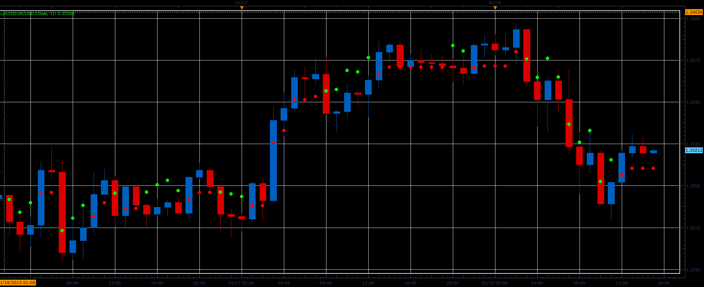

# Loco indicator

> Source: https://fxcodebase.com/code/viewtopic.php?f=17&t=31123  
> Forum: 17 · Topic 31123 · 2 post(s)

---

## Loco indicator

**Alexander.Gettinger** · Fri Jan 18, 2013 5:36 pm

This indicator is a ported MQL4 indicators from [viewtopic.php?f=27&t=27909](https://fxcodebase.com/code/viewtopic.php?f=27&t=27909)

Formulas:
Loco[i]=Loco[i-1], if Price[i]=Loco[i-1],
Loco[i]=Max(Loco[i-1], Price[i]*(1-K)), if Price[i-1]>Loco[i-1] and Price[i]>Loco[i-1],
Loco[i]=Price[i]*(1-K), if Price[i]>Loco[i-1],
else Loco[i]=Price[i]*(1+K), where
K=Coeff/1000.

 

Download:

 [Loco.lua](files/53114/Loco.lua)

The indicator was revised and updated

---

## Re: Loco indicator

**Apprentice** · Thu Apr 27, 2017 4:18 am

Indicator was revised and updated.
