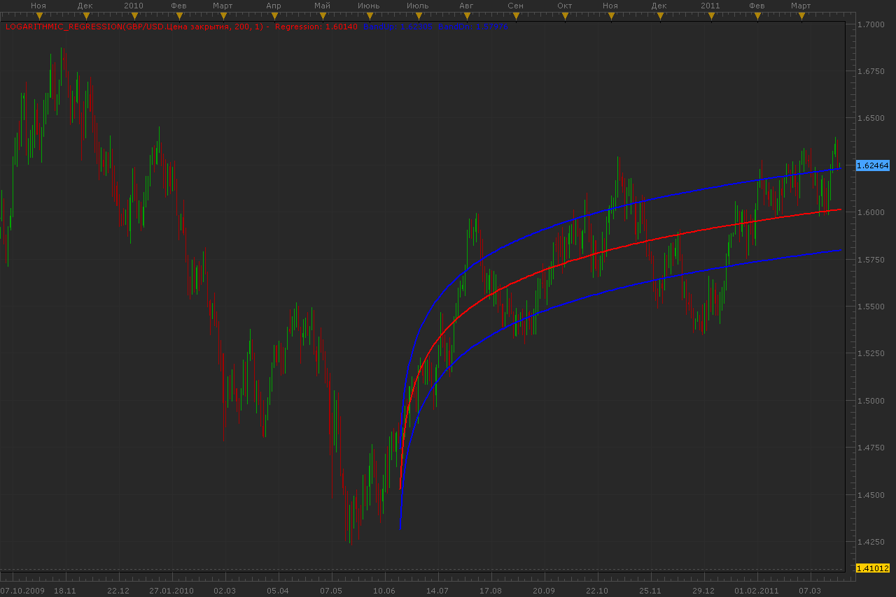

# Logarithmic regression

> Source: https://fxcodebase.com/code/viewtopic.php?f=17&t=3716  
> Forum: 17 · Topic 3716 · 8 post(s)

---

## Logarithmic regression

**Alexander.Gettinger** · Wed Mar 23, 2011 9:43 pm

Indicator looks like Polynomial regression ([viewtopic.php?f=17&t=3715](https://fxcodebase.com/code/viewtopic.php?f=17&t=3715)), but instead of polynomial use a logarithmic function.

 

Download:

 [Logarithmic_Regression.lua](files/9007/Logarithmic_Regression.lua)

The indicator was revised and updated

---

## Re: Logarithmic regression

**mfoste1** · Sun Apr 24, 2011 7:02 pm

this log regression as well as the polynomial regression would probably make excellent algorithmic strategies.

-enter short if price exceeds upper line by N number of pips.

-enter long if price exceeds bottom line by N number of pips.

parameters

lot sizing
allowed side
stop and limit
time period allowed to trade as specified by user

---

## Re: Logarithmic regression

**Apprentice** · Mon Apr 25, 2011 4:14 am

Your request has been added to developmental cue.

---

## Re: Logarithmic regression

**Alexander.Gettinger** · Thu Apr 28, 2011 12:00 am

> **mfoste1 wrote:**
> this log regression as well as the polynomial regression would probably make excellent algorithmic strategies.
>
> -enter short if price exceeds upper line by N number of pips.
>
> -enter long if price exceeds bottom line by N number of pips.
>
> parameters
>
> lot sizing
> allowed side
> stop and limit
> time period allowed to trade as specified by user

This strategy you may find here: [viewtopic.php?f=31&t=4050](https://fxcodebase.com/code/viewtopic.php?f=31&t=4050)

---

## Re: Logarithmic regression

**TakisGen** · Tue Jun 14, 2011 4:35 am

Hi,

Is it possible to modify the algorithm so that it works with negative streams too?

Thnx in advance
Takis

---

## Re: Logarithmic regression

**Flemming_Dall** · Thu Jul 14, 2011 6:18 am

What time scale is the best for this signal...?

15min, 2hours, 4hours... etc.?

I also tried the Polynominal regresion signal and sometimes they tell me to in to opposite directions.

The Logarithmic seems to work fine in a 15 min timechart?

Thanks !

---

## Re: Logarithmic regression

**Alexander.Gettinger** · Fri Jun 29, 2012 1:36 pm

MQL4 version of this indicator: [viewtopic.php?f=38&t=20676](https://fxcodebase.com/code/viewtopic.php?f=38&t=20676)

---

## Re: Logarithmic regression

**Apprentice** · Tue Apr 04, 2017 6:07 am

Indicator was revised and updated.
