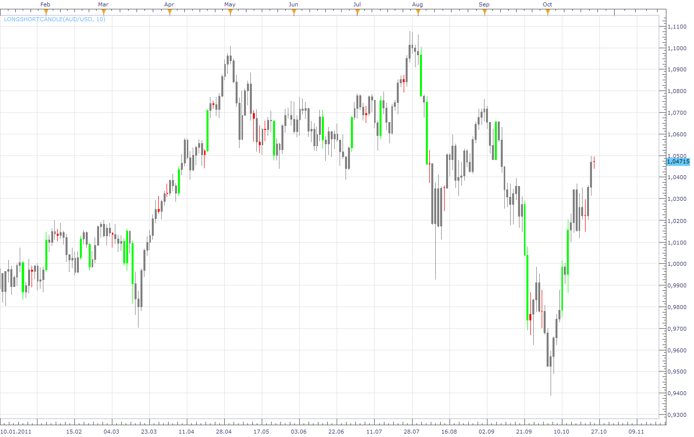

# Long/Short Candle

> Source: https://fxcodebase.com/code/viewtopic.php?f=17&t=7575  
> Forum: 17 · Topic 7575 · 11 post(s)

---

## Long/Short Candle

**Apprentice** · Tue Oct 25, 2011 4:19 am

If the candle is the longest or the shortest within the defined range,
Candle color is changed.

 [LongShortCandle.lua](files/16815/LongShortCandle.lua)

 [LongShortCandle with Alert.lua](files/16815/LongShortCandle%20with%20Alert.lua)

---

## Re: Long/Short Candle

**TraderKen** · Tue Oct 25, 2011 10:03 pm

Hi,
Thank you for this indicator. Can we just keep the neutral candles red or green as usual and change the color of a long candle to another color ? The whole idea here is to highlight exceptional long candles in the chart. Thanks again.

---

## Re: Long/Short Candle

**Apprentice** · Wed Oct 26, 2011 11:31 am

Color Style option Added.

---

## Re: Long/Short Candle

**TraderKen** · Sun Oct 27, 2013 9:30 pm

Hi Apprentice,

Can you modify this indicator a bit? I want to add a condition to this indicator. A valid candle must has different color from its prior candle. To be clear, for example, on a chart: A candle closed RED. The next candle has a longer size than 6 prior candles and only closes GREEN will be highlighted.

Thanks.

---

## Re: Long/Short Candle

**Apprentice** · Mon Oct 28, 2013 2:24 am

Your request is added to the developmental list.

---

## Re: Long/Short Candle

**Apprentice** · Sun Nov 03, 2013 7:41 am

Try updated version.

---

## Re: Long/Short Candle

**Alexander.Gettinger** · Wed Jun 04, 2014 5:34 pm

MQL4 version of Long/Short Candle indicator: [viewtopic.php?f=38&t=60772](https://fxcodebase.com/code/viewtopic.php?f=38&t=60772).

---

## Re: Long/Short Candle

**Apprentice** · Mon Jun 19, 2017 8:15 am

The indicator was revised and updated.

---

## Re: Long/Short Candle

**FXDatinh** · Mon Mar 05, 2018 5:22 am

I like this indicator. Is it possible to add an alert function? Thanks

---

## Re: Long/Short Candle

**Apprentice** · Mon Mar 05, 2018 7:39 am

LongShortCandle with Alert added.

---

## Re: Long/Short Candle

**FXDatinh** · Tue Apr 10, 2018 10:38 pm

Thank you very much!
